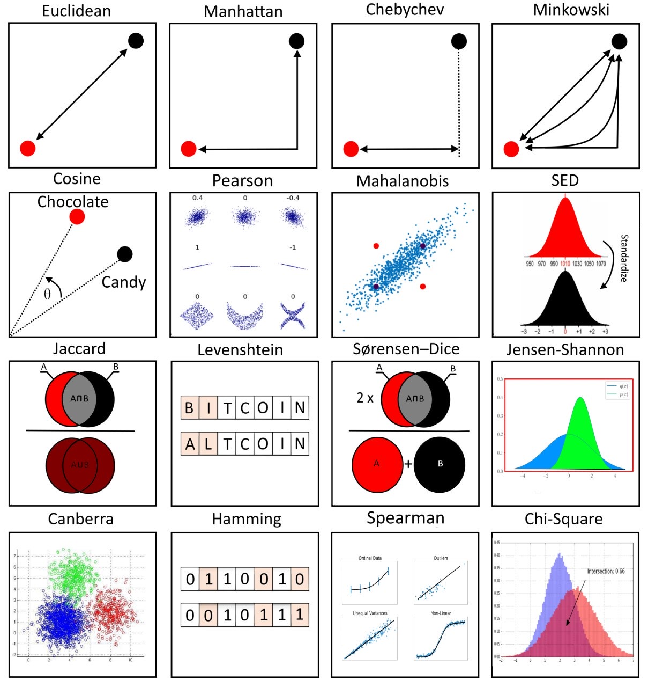
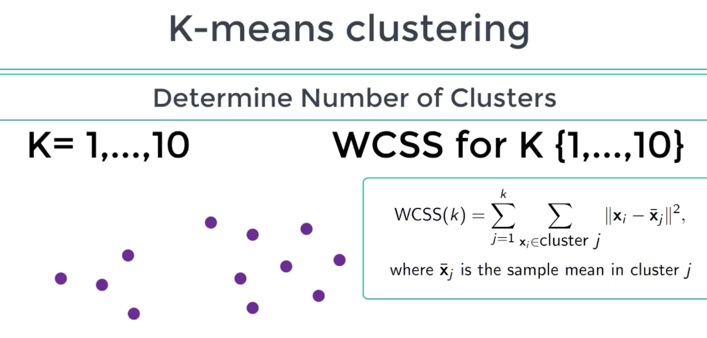
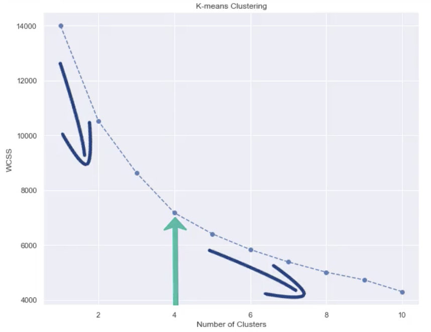
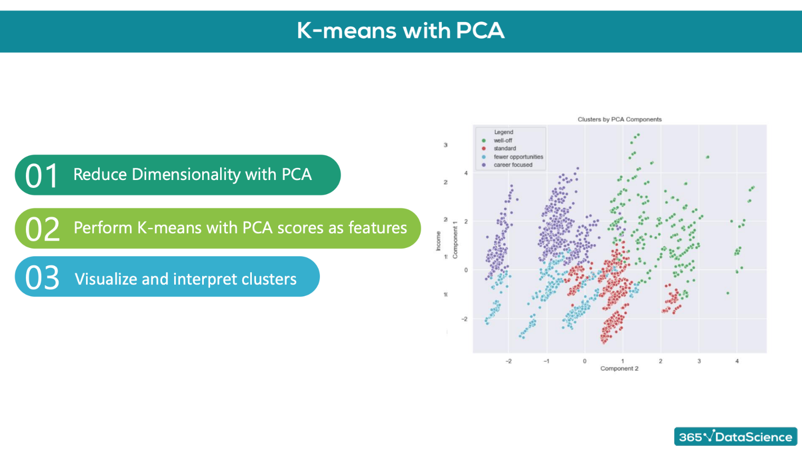

# Intro

Created: 2020-04-10 01:42:33 +0500

Modified: 2021-12-20 23:59:34 +0500

---

**Fundamental marketing theory**
-   STP - Segmentation, Targeting, Positioning
-   Marketing mix
-   Price elasticity
-   Neural networks

**Customer Analytics**

The first part of the course focuses on how to perform customer segmentation, using a hands-on approach. It involves the application of hierarchical and flat clustering techniques for dividing customers into groups. It also features applying the PCA to reduce the dimensionality of the problem, as well as combining PCA and K-means for an even more professional customer segmentation

**Purchase Analytics**

The second part of the course explores both the descriptive and predictive analysis of the purchase behavior of customers, including models for purchase incidence, branch choice, and purchase quantity. Not only that, but it also covers the application of state-of-the-art deep learning techniques to make predictions using real-world data

**STP Framework**

STP is a fundamental marketing framework. It can be applied to all areas of business and marketing activities
-   Segmentation
-   Targeting
-   Positioning

**Segmentation**
-   The process of dividing a population of customers into groups that share similar characteristics
-   Observations within the same group would have comparable purchasing behavior
-   Observations within the same group would respond similarly to different marketing activities

-   Divide customers into segments based on age, income, gender
-   Consumer data
    -   Demographic
    -   Geographic
    -   Psychographic
    -   Behavioral
        -   Purchase frequency
        -   Time of purchase
        -   Purchase quantity
        -   Product ratings

**Targeting**
-   The process of evaluating potential profits from each segment and deciding which segments to focus on
-   Selecting ways to promote your products. You can target one segment on TV and another online
-   Examining customers' perception. (Involves psychology and usually budget constraints)

-   Consideration factors
    -   Segment size
    -   Expected growth
    -   Competitors' offerings

**Positioning**
-   What product characteristics do the customers from a certain segment need?
-   Shows how a product should be **presented** to the customers and through what **channel**
-   In fact, this process is so important, that it has a framework of its own called: **Marketing Mix**

**Marketing Mix**

Develop the **best** product or service and offer it at the **right price** through the **right channels**
-   Purchase probability
-   Brand choice probability
-   Purchase quantity

**4 Ps of Marketing**
-   **Product**
    -   Product features; Branding; Packaging
-   **Price**
    -   Product cost; Long term price changes
-   **Promotion**
    -   Price reduction, display and feature
-   **Place**
    -   Distribution: intensive, selective, exclusive

**Physical and Online Retailers**

![Retailers Characteristics Location Data Returns Purchase history Brand choice Ratings and reviews Physical Many locations, returning customers. Fewer customers at a particular store, due to the physical restriction. ++ In physical stores, customers can see the product itself. Returns are less likely. Gather information through loyalty cards. Unavailable in physical stores. We assume the customer has considered all competitor brands. Unavailable in physical stores. Online One location, many customers. ++ More data points and more diverse customer information. Products are returned more often, as customers cannot see and test an item. Database with all past purchases of customers. ++ We may have data for all products that the customer has looked at and which competing products a customer has considered. ++ Different items could be reviewed and rated (significant features for predictive modeling). ](media/Customer-Analytics-in-Python_Intro-image1.jpg)

**Price elasticity is:** the percentage change in an economic outcome of interest with respect to one percent change in a respective price

It is expected that: units sold from a brand would increase if the unit price of the brand decreases and would increase if the unit price of a competitor brand increases

-   Price elasticity of purchase probability
-   Price elasticity of brand choice probability
-   Price elasticity of purchase quantity

**Pearson Correlation**
-   Linear dependency between variables

df_segmentation.corr()
-   Ranges from -1 to 1

**Standardization**

#Forstandardizingfeatures.We'llusetheStandardScalermodule.

fromsklearn.preprocessingimportStandardScaler

#Standardizingdata,sothatallfeatureshaveequalweight.Thisisimportantformodelling.

#Otherwise,inourcaseIncomewouldbeconsideredmuchmoreimportantthanEducationforInstance.

#Wedonotknowifthisisthecase,sowewouldnotliketointroduceittoourmodel.

#Thisiswhatisalsoreferedtoasbias.

scaler=StandardScaler()

segmentation_std=scaler.fit_transform(df_segmentation)

**Types of Clustering**
-   **Hierarchical**
-   **Flat**
-   Flat clustering are way faster than hierarchical

**Hierarchical Clustering**
-   Ex - Taxonomy of Animal kingdom
-   Types of Hierarchical clustering
    -   Divisive (Top down)
    -   Agglomerative (Bottom up) (easier to solve mathematically)
    -   Should reach same results
-   How do we measure the distances between observations?
    -   Euclidean distance
    -   Manhattan distance
    -   Maximum distance

-   Segmentation between clusters
    -   Ward method (|A-B|^2)/n~scale~

#HierarchicalclusteringwiththeSciPylibrary.We'llusethedendrogramandlinkagemodules.

fromscipy.cluster.hierarchyimportdendrogram,linkage

#PerformHierarchicalClustering.Theresultsarereturnedasalinkagematrix.

hier_clust=linkage(segmentation_std,method='ward')

#WeplottheresultsfromtheHierarchicalClusteringusingaDendrogram.

#Wetruncatethedendrogramforbetterreadability.Thelevelpshowsonlythelastpmergedclusters

#Wealsoomitshowingthelabelsforeachpoint.

plt.figure(figsize=(12,9))

plt.title('HierarchicalClusteringDendrogram')

plt.xlabel('Observations')

plt.ylabel('Distance')

dendrogram(hier_clust,

truncate_mode='level',

p=5,

show_leaf_counts=False,

no_labels=True)

plt.show()

**Finding a cluster**
-   We need to find a horizontal line on the dendogram on which to cut
-   Rule of thumb: We find the longest vertical line unintercepted by a horizontal line from the dendrogram. This is where we should make the cut

**K-means Clustering**
-   Most commonly used method in clustering because of its simplicity
-   K-means is perfect for segmentation data

1.  Choose the number of clusters we want to identify. K in K-means means number of clusters

2.  Specify cluster seeds

    a.  Based on Euclidean squared distance add points to one of the cluster

3.  Calculate the centroid (geometrical center)

4.  Repeat until the centroids stop changing

Problems
-   The squared Euclidean distance is quite sensitive to outliers (solved by k-median clustering)
-   Choose number of clusters before hand
-   K-means enforces spherical clusters

**Within Cluster Sum of Squares (WCSS)** is used to determine best clustering solution

Choosing number of clusters - Elbow method

**Purchase Analytics**

**Price elasticity of purchase probability**

% change in purchase probability in response to a 1% change in price

We have a product, which costs $2.40-. We have obtained the price elasticity of purchase probability to be -0.79. The customer at this price point is: inelastic

We have a product, which costs $3.50. We have obtained the price elasticity of purchase probability to be -2.1. The customer at this point is: elastic

We have a product, which costs $2.00. Using a logistic regression model, we have obtained the coefficient for price to be -2.3. In addition, we have estimated the purchase probability at this price point to be 0.3. Using the price elasticity formula from the lecture, what is the price elasticity? -3.22

A company has a product with a price of 2.3 dollars on the market. They have estimated that the price elasticity of purchase probability at this price point is -0.9. If you are an adviser for the marketing team of the company what would you recommend: The company should increase the price of the product, without fear of losing too many customers.

The purchase probability of a client at a price point is 0.7, while their price elasticity: -1.56. If we raise the price of the product by 1%, the new probability of purchase of the client will be: 68.44%

The purchase probability of a client at $2.56 is 0.7, while their price elasticity: -1.22. If we lower the price of the product by $0.02, the new probability of purchase of the client will be: 70.95%

**Multnomial Logistic Regression -** For a multiclass scenario

![Z Z 0 0 Hidden layer 1 Hidden layer 2 Hidden layer 3 Input layer The width Of a layer is the numberofunits in that layer The width of the net is the Output layer number of units of the biggest layer. The depth ofthe net is equal to the number Of layers or the number Of hidden layers. The term has different Width definitions. More often than not, we are interested in the number Of hidden layers (as there are always input and output layers). The width and the depth Of the called net are hyperparameters. They are values we manually Chose When creating the net. Depth 365%'DataScience ](media/Customer-Analytics-in-Python_Intro-image12.png)

![The Business Case Deep Neural Net Our neural network has 10 features; therefore the input layer size is 10. The hidden layer size is a hyperparameter. We can adjust it during the learning process. In the lectures we start from 50 nodes, but its size could be any integer number. The output layer contains the two possibilities for the targets (O and 1), therefore it has a size of 2. How to approach similar problems? 10 2. 3. Preprocess the data a. Balance the dataset b. Create train, validation and test sets c. Save the data in a tensor-friendly format Train the model a. Outline the model (create or envision a diagram like the one on the right) b. Create the actual network and choose appropriate starting hyperparameters c. Optimize the model by fiddling with the hyperparameters d. Test the model Save the model and deploy it where needed 2 365%'DataScience ](media/Customer-Analytics-in-Python_Intro-image13.png)

**Deep Learning**

**Training the deep learning model**
-   Keras was built into the core TensorFlow, so most TensorFlow 2.0 methods are not referenced as 'TensorFlow', but rather Keras methods
-   **tf.keras.Sequential(layers)** function that is laying down the model (used to 'stack layers')
-   **tf.keras.layers.Dense(output layer size, activation function)** takes the inputs provided from the last layer, calculates their dot product with the weights and adds the bias. Also applies an activation function.
-   Activation functions
    -   relu
    -   sigmoid
    -   tanh
    -   softmax
-   **model.compile(optimizer, loss)** configures the model for training
    -   Optimizers
        -   Adaptive Moment Estimation (ADAM)
    -   loss
        -   sparse_categorical_crossentropy
            -   applies one-hot encoding to the targets
-   **tf.keras.callbacks.EarlyStopping(patience)** ensures that the model stops traning after the validation loss has started increasing. When patience=0, it will stop after the first validation increase. patience = 2
-   **fit()**
-   **evaluate()** returns the loss value and metrics values for the model in 'test mode'
-   **predict()**
-   **argmax -** Arguments of the maxima

