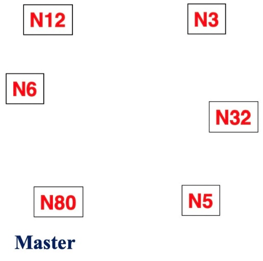
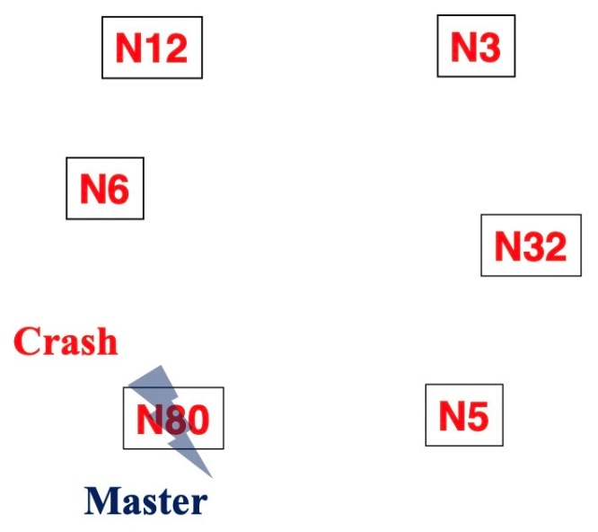

# Design of Zookeeper

Created: 2019-03-17 17:51:15 +0500

Modified: 2021-09-04 21:18:02 +0500

---

Zookeeper - Service for coordinating processes of distributed applications
-   Fundamentals
-   Design goals
-   Architecture
-   Applications

**Classic Distributed System**

-   Most of the system like HDFS have one Master and couple of slave nodes and these slave nodes report to the master.

**Fault Tolerant Distributed System**

-   Real distributed fault tolerant system have Coordination service, Master and backup master
-   If primary failed then backup works for it

![What is Coordination ? How would Email Processors avoid reading same emails? Suppose, there is an inbox from which we need to index emails. Indexing is a heavy process and might take a lot of time. Here, we have multiple machine which are indexing the emails. Every email has an id. You can not delete any email. You can only read an email and mark it read or unread. Now how would you handle the coordination between multiple indexer processes so that every email is indexed? Big Data Computing popMmap Email I Email 2 Email 3 Design of Zookeeper ](media/Big-Data_Design-of-Zookeeper-image5.png)

![What is Coordination ? • If indexers were running as multiple threads of a single process, it was easier by the way of using synchronization Of constructs programming language. since there are multiple • But running on multiple processes machines which need to coordinate, we need a central storage. • This central storage should be safe from all concurrency related problems. • This central storage is exactly the role of Zookeeper. Big Data Computing Central Storage Email Id- Time stamp- Subject -Status Email I Email 2 Email 3 Design of Zookeeper ](media/Big-Data_Design-of-Zookeeper-image6.png)

**What is Coordination?**
-   Group membership: Set of datanodes (tasks) belong to same group
-   Leader election: Electing a leader between primary and backup
-   Dynamic Configuration: Multiple services are joining, communicating and leaving (Service lookup registry)
-   Status monitoring: Monitoring various processes and services in a cluster
-   Queuing: One process is embedding and other is using
-   Barriers: All the processes showing the barrier and leaving the barrier
-   Critical sections: Which process will go to the critical section and when?

**What is ZooKeeper?**
-   ZooKeeper is a highly reliable distributed coordination kernel, which can be used for distributed locking, configuration management, leadership election, work queues
-   Zookeeper is a replicated service that holds the metadata of distributed applications
-   Key attributed of such data
    -   Small size
    -   Performance sensitive
    -   Dynamic
    -   Critical
-   In very simple words, it is a central store of key-value using which distributed systems can coordinate. Since it needs to be able to handle the load, ZooKeeper itself runs on many machines
-   Exposes a simple set of primitives
-   Very easy to program
-   Uses a data model like directory tree
-   Used for
    -   Synchronisation
    -   Locking
    -   Maintaining Configuration
-   Coordination service that does not suffer from
    -   Race Conditions
    -   Dead locks

**Design Goals**

1.  **Simple**
    -   **A shared hierarchal namespace looks like standard file system**
    -   **The namespace has data nodes - znodes (similar to files/dirs)**
    -   **Data is kept in-memory**
    -   **Achieve high throughput and low latency numbers**
    -   **High performance**
        -   **Used in large, distributed systems**
    -   **Highly available**
        -   **No single point of failure**
    -   **Strictly ordered access**
        -   **Synchronisation**

2.  **Replicated**
    -   **All servers have a copy of the state in memory**
    -   **A leader is elected at startup**
    -   **Followers service clients, all updates go through leader**
    -   **Update responses are sent when a majority of servers have persisted the change**
    -   **We need 2f+1 machines to tolerate f failures**

3.  **Ordered**
    -   **Zookeeper stamps each update with a number**
    -   **The number:**
        -   **Reflects the order of transactions**
        -   **Used implement higher-level abstractions, such as synchronization primitives**

4.  **Fast**
    -   **Performs best where reads are more common than writes, at ratios of around 10:1**

**Data Model**
-   The way you store data in any store is called data model
-   Think of it as highly available file system
-   Znode: we store data in an entity called znode
-   JSON data: The data that we store should be in JSON format
-   No append operation: The znode can only be updated. It does not support append operations
-   Data access (read/write) is atomic: The read or write is atomic operation meaning either it will be full or would throw an error if failed. There is no intermediate state like half written
-   Znode: Can have children
-   So znodes inside znodes make a tree like hierarchy
-   The top level znode is "/"
-   The znode "/zoo" is child of "/" which top level znode
-   duck is child znode of zoo. It is denoted as /zoo/duck
-   Though "." or ".." are invalid characters as opposed to the file system

**Data model - Znode - Types**
-   **Persistent**

Such kind of znodes remain in zookeeper until deleted. This is the default type of znode. To create such node you can use the command: create /name_of_myznode "mydata"
-   **Ephemeral**
    -   Ephermal node gets deleted if the session in which the node was created has disconnected. Though it is tied to client's session but it is visible to the other users.
    -   An ephermal node can not have children not even ephermal children

**Architecture**
-   Zookeeper can run in two nodes
    -   Standalone
        -   In standalone mode, it is just running on one machine and for practical purposes we do not use standalone mode
        -   This is only for testing purposes
        -   It doesn't have high availability
    -   Replicated
        -   Run on cluster of machines called an ensemble
        -   High availability
        -   Tolerates as long as majority

**Architecture: Phase 1**

Phase 1: Leader election (Paxos Algorithm)
-   The machines elect a distinguished member - leader
-   The others are termed followers
-   The phase is finished when majority sync their state with leader
-   If leader fails, the remaining machines hold election takes 200ms
-   If the majority of the machines aren't available at any point of time the leader automatically steps down

**Architecture: Phase 2**

**Phase 2: Atomic broadcast**
-   All write requests are forwarded to the leader
-   Leader broadcasts the update to the followers
-   When a majority have persisted the change
    -   The leader commits the up-date
    -   The client gets success response
-   The protocol for achieving consensus is atomic like two-phase commit
-   Machines write to disk before in-memory

**Election in Zookeeper**
-   Centralized service for maintaining configuration information
-   Uses a **variant of Paxos called Zab (Zookeeper Atomic Broadcast)**
-   Needs to keep a leader elected at all times
-   Each server creates a new sequence number for itself
    -   Let's say the sequence number are ids
    -   Gets highers id so far (from ZK file system), creates next-higher id, writes it into ZK file system
-   Elect the highest-id server as leader

-   Failures:
    -   One option: everyone monitors current master (directly or via a failure detector)
        -   On failure, initiate election
        -   Leads to a flood of elections
        -   Too many messages

-   Second option: (implemented in Zookeeper)
    -   Each process monitors its next-higher id process
    -   **if** that successor was the leader and it has failed
        -   Become the new leader
    -   **else**
        -   wait for a timeout, and check your successor again

-   What about id conflicts? What if leader fails during election?
-   To address this, Zookeeper uses a two-phase commit (run after the sequence/id) protocol to commit the leader
    -   Leader sends NEW_LEADER message to all
    -   Each process responds with ACK to at most one leader, i.e., one with highest process id
    -   Leader waits for a majority of ACKs, and then sends COMMIT to all
    -   On receiving COMMIT, process updates its leader variable
-   Ensures that safety is still maintained

**Election Demo**
-   If you have three nodes A, B, C with A as Leader. And A dies. Will someone become leader?

-   If you have three nodes A, B, C and A and B die. Will C become Leader?

**Why do we need majority?**
-   Imagine: We have an ensemble spread over two data centres.

-   Imagine: The network between data centres got disconnected. If we did not need majority for electing Leader
-   What will happen?

-   Each data centre will have their own Leader. No Consistency and utter Chaos. That is why it requires majority.

**Sessions**
-   Let's try to understand how do the zookeeper decides to delete ephermals nodes and takes care of session management.
    -   A client has list of servers in the ensemble
    -   It tries each until successful
    -   Server creates a new session for the client
    -   A session has a timeout period - decided by caller
    -   If the server hasn't received a request within the timeout period, it may expire the session
    -   On session expire, ephermal nodes are lost
    -   To keep sessions alive client sends pings (heartbeats)
    -   Client library takes care of heartbeats
    -   Sessions are still valid on switching to another server
    -   Failover is handled automatically by the client
    -   Application can't remain agnostic of server reconnections because the operations will fail during disconnection

![Use Case: Many Servers How do they Coordinate? • Lets take a case of two servers and a client. The two server duck and cow created their ephermal nodes under "/servers" znode. The client would simply discover the alive servers cow and duck using command Is [servers. • Say, a server called "duck" is down, the ephermal node will disappear from /servers znode and hence next time the client comes and queries it would only get "cow". So, the coordinations has been made heavily simplified and made efficient of because ZooKee er. Big Data Computing Connect(host, timeout, Watcher handle) okay. Iwill call you when needed. duck ephermal node); createC'fservers ow'. ephermal node); Duc rver Killed Is Iservers du: tow 5 seconds Islse rs tow Design of Zookeeper ](media/Big-Data_Design-of-Zookeeper-image25.png)

**Multi Update**
-   Batches together multiple operations together
-   Either all fail or succeed in entirely
-   Possible to implement transactions
-   Others never observe any inconsistent state

**Watches**
-   Clients to get notifications when a znode changes in some way
-   Watchers are triggered only once
-   For multiple notifications, re-register

**ACLs - Access Control Lists**

ACL determines who can perform certain operations on it
-   ACL is the combination
    -   authentication scheme
    -   an identity for that scheme
    -   and a set of permissions
-   Authentication Scheme
    -   **digest -** The client is authenticated by a username & password
    -   **sasl -** The client is authenticated using Kerberos
    -   **ip -** The client is authenticated by its IP address

**Use Cases**

**Building a reliable configuration service**
-   A Distributed lock service

Only single process may hold the lock

**When not to use?**

1.  To store big data because:
    -   The number of copies == number of nodes
    -   All data is loaded in RAM too
    -   Network load of transferring all data to all Nodes

2.  Extermely strong consistency

![ZooKeeper Applications: The Fetching Service • The Fetching Service: Crawling is an important part of a search engine, and Yahoo! crawls billions of Web documents. The Fetching Service (FS) is part of the Yahoo! crawler and it is currently in production. Essentially, it has master processes that command page- fetching processes. • The master provides the fetchers with configuration, and the fetchers write back informing of their status and health. The main advantages of using ZooKeeper for FS are recovering from failures of masters, guaranteeing availability despite failures, and decoupling the clients from the servers, allowing them to direct their request to healthy servers by just reading their status from ZooKeeper. • Thus, FS uses ZooKeeper mainly to manage configuration metadata, although it also uses Zoo- Keeper to elect masters (leader election). Big Data Computing Design of Zookeeper ](media/Big-Data_Design-of-Zookeeper-image30.png)

**Katta - Lucene & more in the cloud.**

Katta is a scalable, failure tolerant, distributed, data storage for real time access.

Katta serves large, replicated, indices as shards to serve high loads and very large data sets. These indices can be of different type. Currently implementations are available for Lucene and Hadoop mapfiles.
-   Makes serving large or high load indices easy
-   Serves very large Lucene or Hadoop Mapfile indices as index shards on many servers
-   Replicate shards on different servers for performance and fault-tolerance
-   Supports pluggable network topologies
-   Master fail-over
-   Fast, lightweight, easy to integrate
-   Plays well with Hadoop clusters
-   Apache Version 2 License

<http://katta.sourceforge.net

![ZooKeeper Applications: Katta • Katta: It is a distributed indexer that uses Zoo- Keeper for coordination, and it is an example of a non- Yahoo! application. Katta divides the work of indexing using shards. • A master server assigns shards to slaves and tracks progress. Slaves can fail, so the master must redistribute load as slaves come and go. • The master can also fail, so other servers must be ready to take over in case of failure. Katta uses ZooKeeper to track the status of slave servers and the master (group membership), and to handle master failover (leader election). • Katta also uses ZooKeeper to track and propagate the assignments of shards to slaves (configuration management). Big Data Computing Design of Zookeeper ](media/Big-Data_Design-of-Zookeeper-image31.png)

![ZooKeeper Applications: Yahoo! Message Broker • Yahoo! Message Broker: (YMB) is a distributed publish- subscribe system. The system manages thousands of topics that clients can publish messages to and receive messages from. The topics are distributed among a set of servers to provide scalability. • Each topic is replicated using a primary-backup scheme that ensures messages are replicated to two machines to ensure reliable message delivery. The servers that makeup YMB use a shared-nothing distributed architecture which makes coordination essential for correct operation. • YMB uses ZooKee er to manage the distribution of topics configuration metadata chines in the em I ure detection and roup membershi and control systeraperation. Big Data Computing Design of Zookeeper ](media/Big-Data_Design-of-Zookeeper-image32.png)

![ZooKeeper Applications: Yahoo! Message Broker • Figure, shows part of the znode data layout for YMB. • Each broker domain has a znode called nodes that has an ephemeral znode for each of the active servers that compose the YMB service. • Each YMB server creates an ephemeral znode under nodes with load and status information shutdown nodes load of topics broker domain migration_prohibited topics broker_disabled primary backup hostname: providing both membership and group status information through ZooKeeper. Big Data Computing Figure: The layout of Yahoo! Message Broker (YMB) structures in ZooKeeper Design of Zookeeper ](media/Big-Data_Design-of-Zookeeper-image33.png)

![ZooKeeper Applications: Yahoo! Message Broker • The topics directory has a child znode for each topic managed by YMB. • These topic znodes have child znodes that indicate the primary and backup server for each topic along with the subscribers of that topic. • The primary and backup server znodes not only allow servers to discover the servers in charge of a topic, but they also manage leader election and server crashes. Big Data Computing shutdown nodes load of topics broker domain migration_prohibited topics broker_disabled hostname Figure: The layout of Yahoo! Message Broker (YMB) structures in ZooKeeper Design of Zookeeper ](media/Big-Data_Design-of-Zookeeper-image34.png)

![Conclusion • ZooKeeper takes a wait-free approach to the problem of coordinating processes in distributed systems, by exposing wait-free objects to clients. • ZooKeeper achieves throughput values of hundreds of thousands of operations per second for read-dominant workloads by using fast reads with watches, both of which served by local replicas. • In this lecture, we have discussed the basic fundamentals, design goals, architecture and applications of ZooKeeper. Big Data Computing Design of Zookeeper ](media/Big-Data_Design-of-Zookeeper-image36.png)

