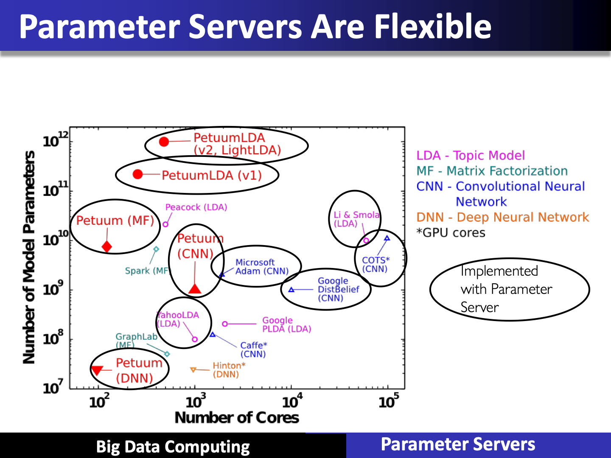
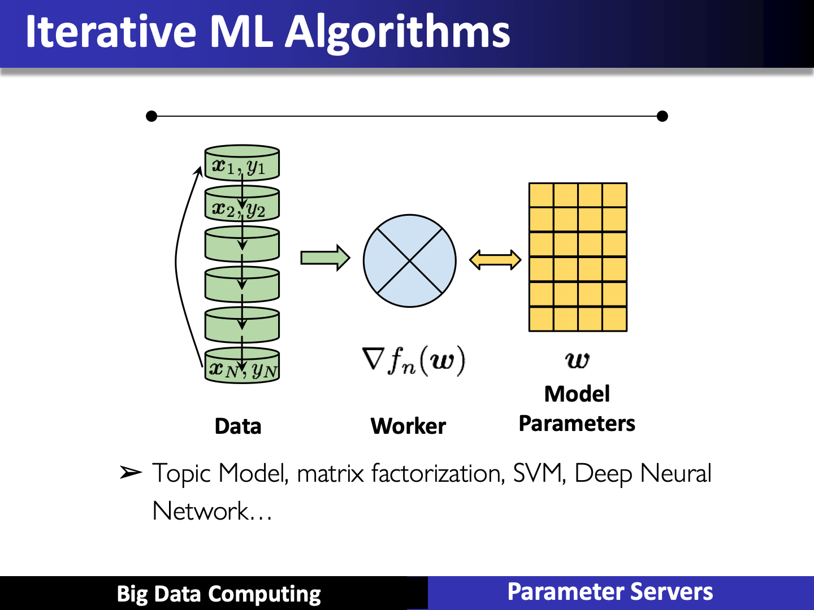

# Parameter Servers

## Parameter Servers and Stale Synchronous Parallel Model

## ML Systems

## Parameter Server

- A machine learning framework
- Distributes a model over multiple machines
- Offers two operations:
  - Pull: query parts of the model
  - Push: update parts of the model
- Machine learning update equation

W~i~ <- W~i~ + Δ

- (Stochastic) gradient descent
- Collapsed Gibbs sampling for topic modeling
- Aggregate push updates via addition (+)

## Parameter Servers

## Stale Synchronous Parallel Model

## Asynchronous Execution

- Async lacks theoretical guarantee as distributed environment can have arbitrary delays from networks & stragglers

<https://medium.com/coinmonks/parameter-server-for-distributed-machine-learning-fd79d99f84c3>
