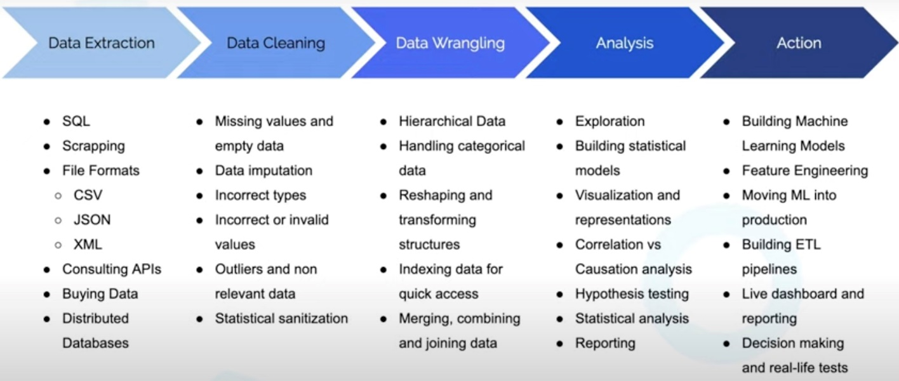

# Data Analysis

Created: 2020-03-26 17:40:07 +0500

Modified: 2021-09-28 22:26:30 +0500

---

<https://www.freecodecamp.org/learn/data-analysis-with-python>

## Data Analysis

A process of inspecting, cleansing, transforming and modeling data with the goal of **discovering useful information**, informing conclusion and supporting decision-making.

## Exploratory Data Analysis (EDA)

In[statistics](https://en.wikipedia.org/wiki/Statistics),**exploratory data analysis**(**EDA**) is an approach to[analyzing](https://en.wikipedia.org/wiki/Data_analysis)[data sets](https://en.wikipedia.org/wiki/Data_set)to summarize their main characteristics, often with visual methods. A[statistical model](https://en.wikipedia.org/wiki/Statistical_model)can be used or not, but primarily EDA is for seeing what the data can tell us beyond the formal modeling or hypothesis testing task. EDA is different from[initial data analysis (IDA)](https://en.wikipedia.org/wiki/Data_analysis#Initial_data_analysis),which focuses more narrowly on checking assumptions required for model fitting and hypothesis testing, and handling missing values and making transformations of variables as needed. EDA encompasses IDA.

- We can always use EDA to get insights on the data we are working on.
- Practice of using visual & quantitative methods to understand a dataset without making assumptions about its contents.
- Anscombe's Quartet

Anscombe's quartetcomprises four[data sets](https://en.wikipedia.org/wiki/Data_set)that have nearly identical simple[descriptive statistics](https://en.wikipedia.org/wiki/Descriptive_statistics), yet have very different[distributions](https://en.wikipedia.org/wiki/Probability_distribution)and appear very different when[graphed](https://en.wikipedia.org/wiki/Plot_(graphics)). Each dataset consists of eleven[(x,y) points](https://en.wikipedia.org/wiki/Cartesian_coordinate_system). They were constructed in 1973 by the[statistician](https://en.wikipedia.org/wiki/Statistician)[Francis Anscombe](https://en.wikipedia.org/wiki/Francis_Anscombe)to demonstrate both the importance of graphing data before analyzing it and the effect of[outliers](https://en.wikipedia.org/wiki/Outlier)and other[influential observations](https://en.wikipedia.org/wiki/Influential_observations)on statistical properties. He described the article as being intended to counter the impression among statisticians that "numerical calculations are exact, but graphs are rough."

<https://en.wikipedia.org/wiki/Anscombe%27s_quartet>

- ggplot2, The Gramer of Graphics
- We have to remove outliers, so it does not skew out classifiers.

- Maximum penetration into the data
- Identification of basic structures
- Selection of the most important variables
- Detection of deviations and anomalies
- Testing of basic hypotheses

<https://towardsdatascience.com/5-advanced-visualisation-for-exploratory-data-analysis-eda-c8eafeb0b8cb>
