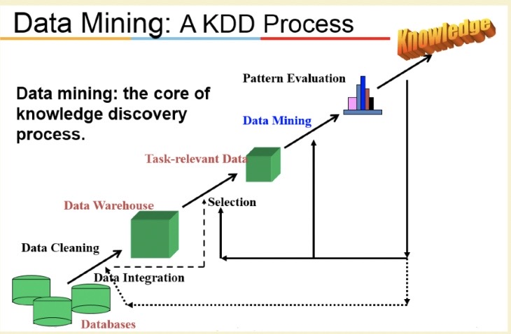
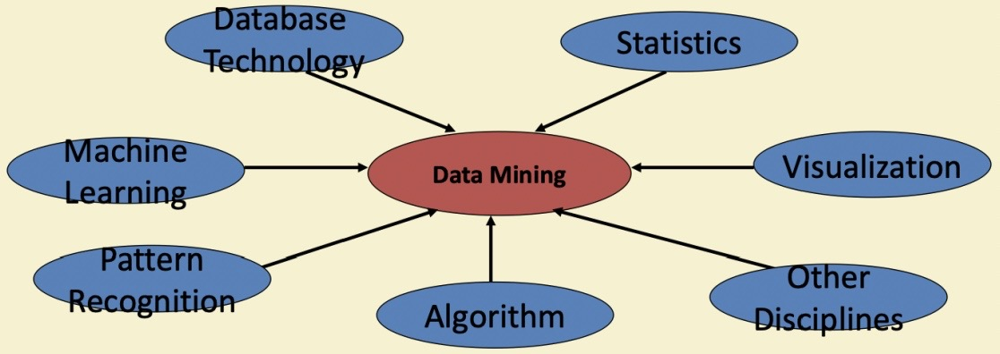
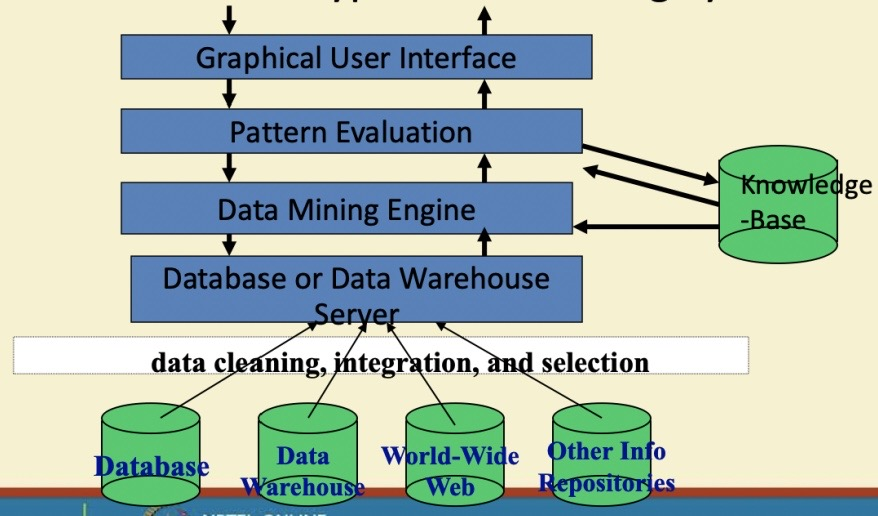

# Data Mining

Created: 2019-01-22 10:54:08 +0500

Modified: 2021-06-19 15:21:37 +0500

---

## Why data Mining
-   The explosive growth of data: from terabytes to petabytes
    -   Data collection and data availability
        -   Automated data collection tools, database systems, Web, computerized society
    -   Major sources of abundant data
        -   Business: Web, e-commerce, transactions, stocks
        -   Science: Remate sensing, bioinformatics, scientific simulation
        -   Society and everyone: news, digital cameras, YouTube
-   We are drowning in data, but starving for knowledge
-   "Necessity is the mother of investion" -- Data mining -- Automated analysis of massive data

## What is Data Mining
-   Data mining (knowledge discovery from data)
    -   Extraction of interesting (non-trivial, implicit, previously unknown and potentially useful) patterns of knowledge from huge amount of data
-   Alternative nams
    -   Knowledge discovery (mining) in databases (KDD), knowledge extraction, data/pattern analysis, data archeology, data dredging, information harvesting, business intelligence

## Data Mining: Confluence of Multiple Disciplines

## Why not traditional data analysis?
-   Tremendous amount of data
    -   Algorithms must be highly scalable to handle such terabytes of data
-   High-dimensionality of data
    -   Micro-array may have tens of thousands of dimensions
-   High complexity of data
    -   Data streams and sensor data
    -   Time-series data, temporal data, sequence data
    -   Structure data, graphs, social networks and multi-linked data
    -   Heterogeneous dtabases and legacy databases
    -   Spatial, spatiotemporal, multimedia, text and web data

## Data Mining: On what kinds of data?
-   Database-oriented data sets and applications
    -   Relational database, data warehouse, transactional database
-   Advanced data sets and advanced applications
    -   Data streams and sensor data
    -   Time-series data, temporal data, sequence data (incl. bio-sequences)
    -   Structure data, graphs, social networks and multi-linked data
    -   Object-relational databases
    -   Heterogeneous databases and legacy databases
    -   Spatial data and spatiotemporal data
    -   Multimedia database
    -   Text databases
    -   The world-wide web

## Data Mining Functionalities
-   Multidimensional concept description: Characterization and discrimination
    -   Generalize, summarize, and contrast data characteristics e.g. dry vs wet regions
-   Frequent patterns, association, correlation vs causality
    -   Tea -> Sugar [0.5%, 75%] (Correlation or causality?)
-   Classification and prediction
    -   Contruct models (functions) that describe and distinguish classes or concepts for future prediction
        -   Eg. Classify countries based on (climate), or classify cars based on (gas mileage)
    -   Predict some unknown or missing numerical values
-   Cluster analysis
    -   Class label is unknown: Group data to form new classes, e.g., cluster houses to find distribution patterns
    -   Maximizing intra-class similarity & minimizing interclass similarity
-   Outlier analysis
    -   Outlier: Data object that does not comply with the general behavior of the data
    -   Noise or exception? Useful in fraud detection, rare events analysis
-   Trend and evolution analysis
    -   Trend and deviation: e.g. regression analysis
    -   Sequential pattern mining: e.g., digital camera -> large SD memory
    -   Periodicity analysis
    -   Similarity-based analysis
-   Other pattern-directed or statistical analysis

## Major Issues in Data Mining
-   **Mining methodology**
    -   Mining different kinds of knowledge from diverse data types, e.g., bio, stream, web
    -   Performance: efficiency, effectiveness, and scalability
    -   Pattern evaluation: the interestingness problem
    -   Incorporation of background knowledge
    -   Handling noise and incomplete data
    -   Parallel, distributed and incremental mining methods
    -   Integration of the discovered knowledge with existing one: knowledge fusion
-   **User interaction**
    -   Data mining query languages and ad-hoc mining
    -   Expression and visualization of data mining results
    -   Interactive mining of knowledge at multiple levels of abstraction
-   **Applications and social impacts**
    -   Domain-specific data mining & invisible data mining
    -   Protection of data security, integrity and privacy

## Architecture: Typical Data Mining System

## KDD Process: Summary
-   Learning the application domain
    -   Relevant prior knowledge and goals of application
-   Creating a target data set: data selection
-   Data cleaning and preprocessing
-   Data reduction and transformation
    -   Find useful features, dimensionality/variable reduction, invariant representation
-   Choosing functions of data mining
    -   Summarization, classification, regression, association, clustering
-   Choosing the mining algorithm(s)
-   Data mining: search for patterns of interest
-   Pattern evaluation and knowledge presentation
    -   Visualization, transformation, removing redundant patterns
-   Use of discovered knowledge

## Components of Data Mining Algorithms
-   Model Representation
    -   Determining the nature and structure of the representation to be used
-   Score function
    -   Measuring how well different representations fit the data
-   Search / Optimization method
    -   An algorithm to optimize the score function
-   Data management
    -   Deciding what principles of data management are required to implement the algorithms efficiently

## Steps of Data Mining Algorithm

Task > Representation > Score Function > Search/Optimization > Data Management > Models, Parameters
