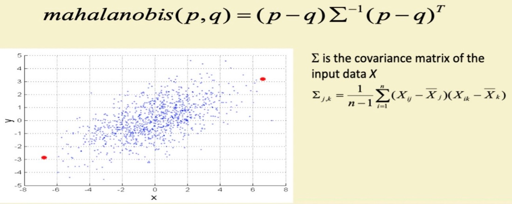
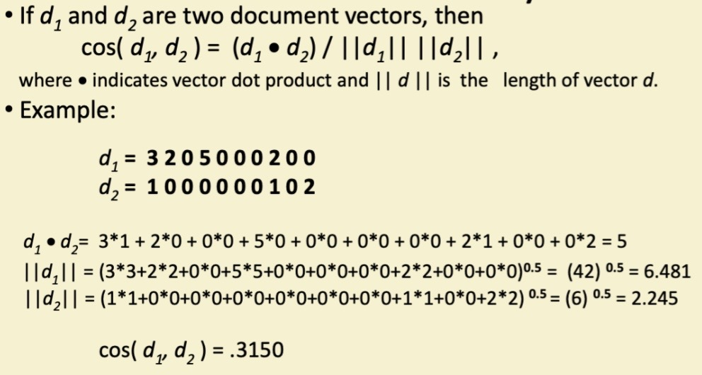
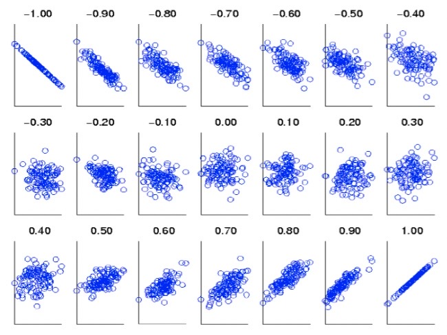

# Data Preprocessing

Created: 2021-06-19 14:00:22 +0500

Modified: 2021-10-02 14:33:44 +0500

---

## Data Quality

- What kinds of data quality problems?
- How can we detect problems with the data?
- What can we do about these problems?
- Examples of data quality problems:
  - Noise and outliers
  - Missing values
  - Duplicate data

## Noise

- Noise refers to modification of original values
  - Examples: distortion of a person's voice when talking on a poor phone and "snow" on television screen

## Outliers

- Outliers are data objects with characteristics that are considerably different than most of the other data objects in the data set

## Missing Values

- **Reasons for missing values**
  - Information is not collected (e.g., people decline to give their age and weight)
  - Attributes may not be applicable to all cases (e.g., annual income is not applicable to children)
- **Handling missing values**
  - Eliminate data objects
  - Estimate missing values
  - Ignore the missing value during analysis
  - Replace with all possible values (weighted by their probabilities)

## Duplicate Data

- Data set may include data objects that are duplicates, or almost duplicates of one another
  - Major issue when merging data from heterogenous sources
- Examples:
  - Same person with multiple email addresses
- Data cleaning
  - Process of deaing with duplicate data issues

## Data Preprocessing

1. Aggregation

2. Attribute Transformation

3. Dimensionality Reduction

4. Discretization and Binarization

5. Feature creation

6. Feature subset selection

7. Sampling

## Aggregation

- Combining two or more attributes (or objects) into a single attribute (or object)
- Purpose
  - Data reduction
    - Reduce the number of attributes or objects
  - Change of scale
    - Cities aggregated into regions, states, countries, etc
  - More stable data
    - Aggregated data tends to have less variability

## Discretization

## Attribute Transformation

- A function that maps the entire set of values of a given attribute to a new set of replacement values such that each old value can be identified with one of the new values
  - Simple functions: x^k^, log(x), e^x^, |x|
  - Standardization and Normalization

## Similarity and Dissimilarity

- Similarity
  - Numerical measure of how alike two data objects are
  - Is higher when objects are more alike
  - Often falls in the range [0,1]
- Dissimilarity
  - Numerical measure of how different are two data objects
  - Lower when objects are more alike
  - Minimum dissimilarity is often 0
  - Upper limit varies
- Proximity refers to a similarity or dissimilarity

## Similarity/Dissimilarity for Simple Attributes

p and q are the attribute values for two data objects

## Euclidean Distance

- Where n is the number of dimensions (attributes) and p~k~ and q~k~ are, respectively, the k^th^ attributes (components) or data objects p and q.
- Standardization is necessary, if scales differ

## Mahalanobis Distance

- For red points, the Euclidean distance is 14.7, Mahalanobis distance is 6

## Cosine Similarity

## Similarity Between Binary Vectors

## Correlation

- Correlation measures the linear relationship between objects
- To compute correlation, we standardize data objects, p and q, and then take their dot product

## Visually Evaluating Correlation

- Scatter plots showing the similarity from -1 to 1

## Tidy Data

<https://vita.had.co.nz/papers/tidy-data.pdf>

<https://cran.r-project.org/web/packages/tidyr/vignettes/tidy-data.html>
