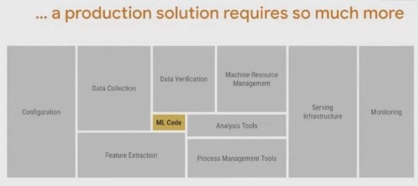

# ML Model Deployment

Created: 2021-05-12 14:56:54 +0500

Modified: 2021-08-05 23:55:30 +0500

---

**Offline Deployment**

The model is deployed to an offline container and run in a Spark job to generate batch predictions either on demand or on a repeating schedule.

**Online Deployment**

The model is deployed to an online prediction service cluster (generally containing hundreds of machines behind a load balancer) where clients can send individual or batched prediction requests as network RPC calls.

**Monitor predictions**

**MLOps**

**ML Lifecycle**
-   Framing ML problems from business goals
-   Access, prepare and process data for the model
-   Architect ML solution and develop ML models
-   Deploy ML models
-   Iterate - Monitor, optimize and maintain the performance of the model

<https://www.freecodecamp.org/news/what-is-mlops-machine-learning-operations-explained

