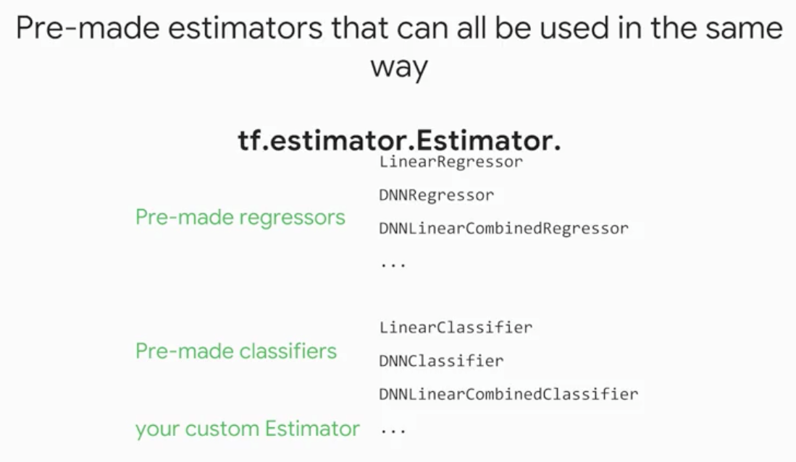
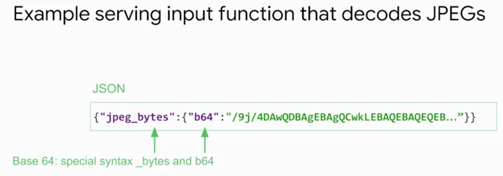
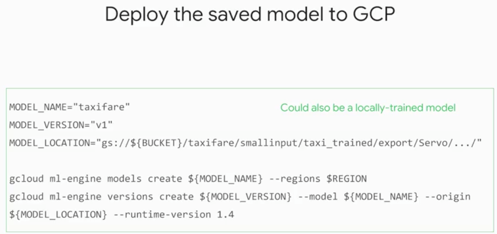

# Estimator API

Created: 2018-07-05 01:27:04 +0500

Modified: 2021-06-19 14:15:13 +0500

---
-   Estimator API - Wrapping a model in a common set of APIs
-   Create production ready machine learning models
-   Train on large datasets that doesn't fit in memory
-   Monitor your training metrics in tensorboard

# Dataset API

## All the tf. commands that we write do not actually process any data, they just build graphs

- map is used for one to one transformation (parsing a single line into features and label)
- flat_map is used for one to many transformation (to flatten all the resulting text lines into one dataset

## Data Parallelism = replicate your models on multiple workers

#

# Monitoring with TensorBoard

# Serving an ML model

## Scaling TensorFlow models with CMLE (Cloud Machine Learning Engine)

<http://onlinetutorials.today/tensorflow/tensorflow-interview-questions-and-answers
