# Artificial Neural Networks

Created: 2019-04-21 13:07:44 +0500

Modified: 2021-05-11 23:37:05 +0500

---

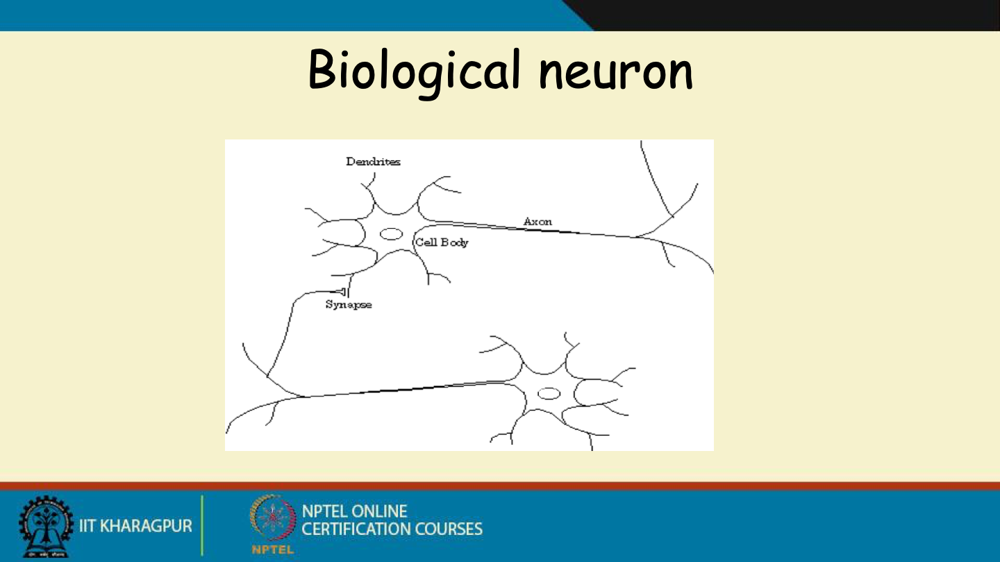

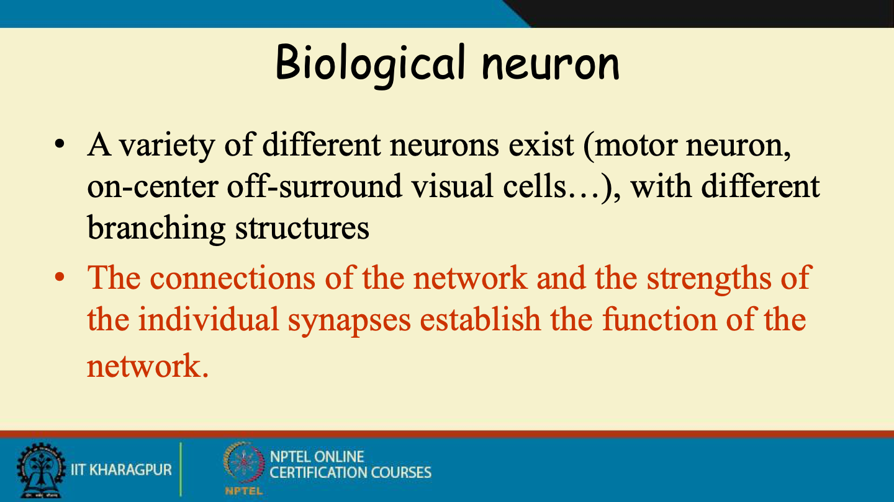

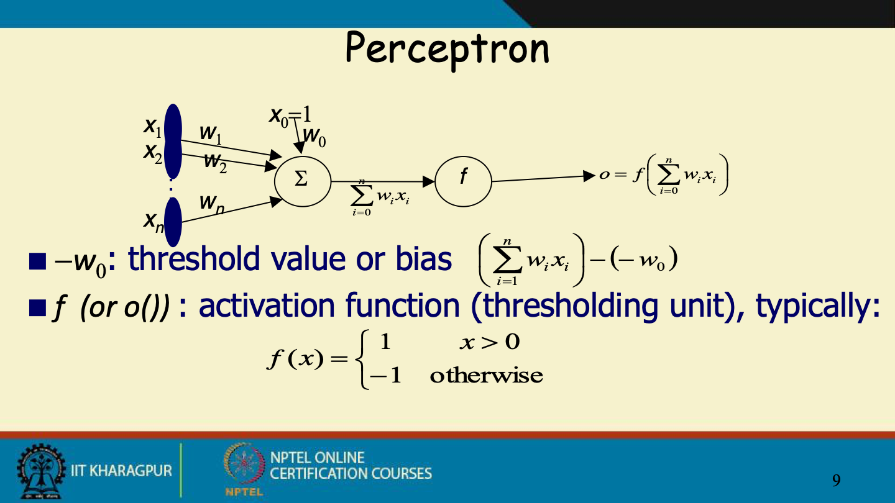

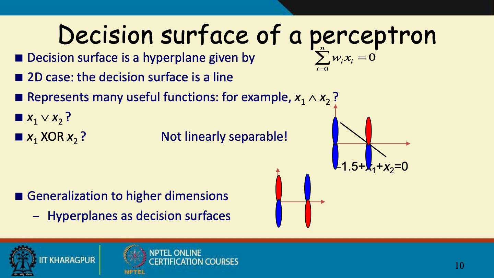

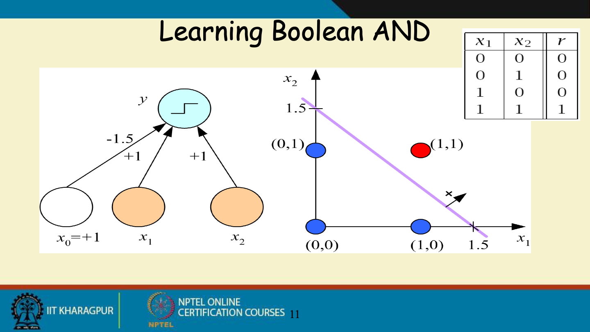

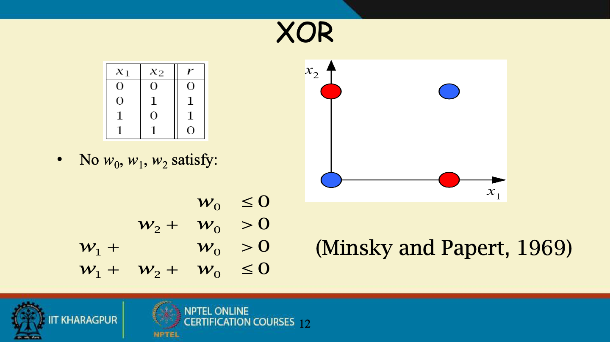

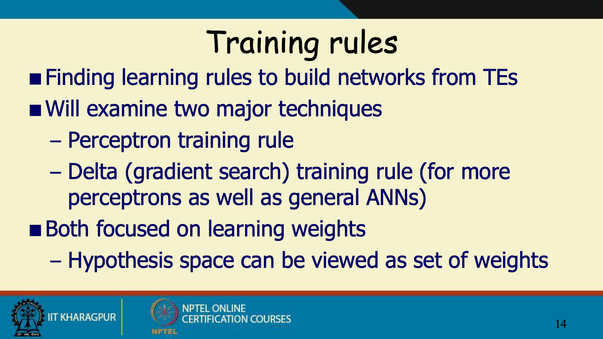

![Gradient descent Gradient "points" to the steepest increase: VE[W] = ---„/VE[W] Training rule: where is a positive constant (learning rate) Awi = ---17 ](media/Artificial-Neural-Networks-image18.png)

![Incremental (Stochastic) Gradient Desce Batch mode Gradient Descent: Repeat 1. Compute the gradient VED[W] Incremental mode Gradient Descent: Ed[w] Repeat For each training example d in D Compute the gradient V Ed [w] 1. Incremental can aooroximate batch if deD 1 2 is small eno ](media/Artificial-Neural-Networks-image21.png)

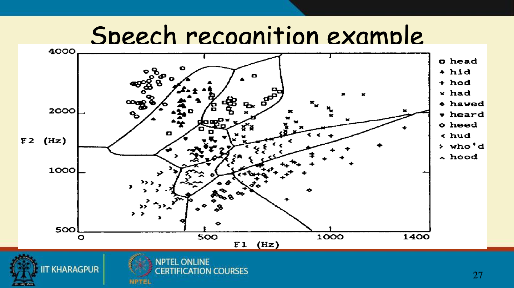

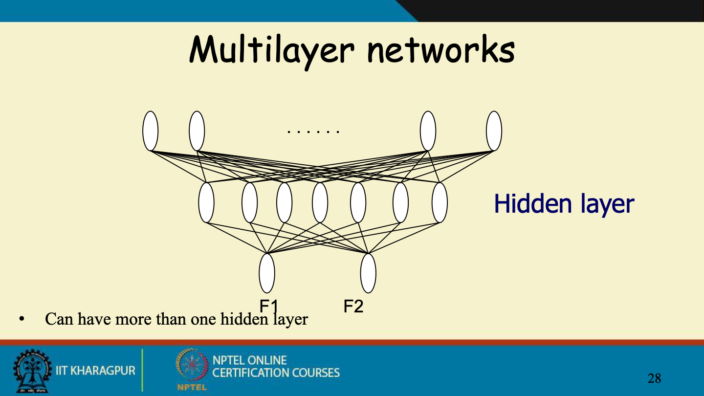

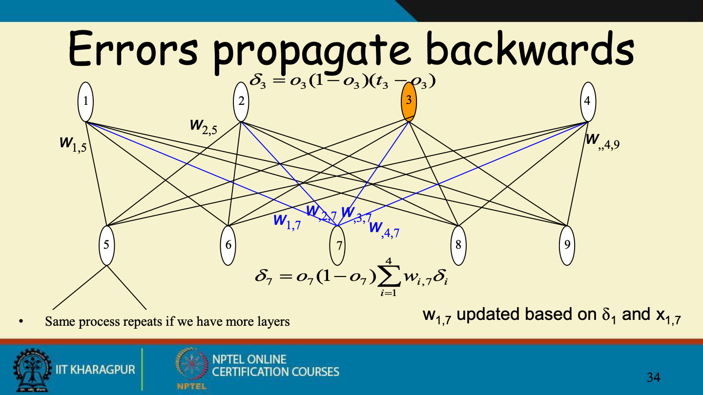

![Convergence of Backpropc Convergence Training can take thousands of iterations ---+ slow! Gradient descent over entire network weight vector Speed up using small initial values of weights: --- Linear response initially --- Generally will find local minimum Typically can find good approximation to global minimum Solutions to local minimum trap problem Stochastic gradient descent Can run multiple times --- Over different initial weights Committee of networks Can modify to find better approximation to global minimum --- include weight momentum u AWiJ(tn ) = + U Awi • (tn_l ](media/Artificial-Neural-Networks-image35.png)

![Example of face recogn Task: recognize faces from sample of --- 20 people in 32 poses --- Choose output of 4 values for direction of gaze --- 120x128 images (256 gray levels) Can compute many functions --- Identity/direction of face (used in book)/... Design issues --- Input encoding (pixels/features/?) Reduced image encoding (30x32) --- Output encoding (1 or 4 values?) Convergence to .1/.9 and not 0/1 --- Network structure (1 layer of 3 hidden units) Algorithm parameters • Eta=.3; alpha=.3; stochastic descent method ](media/Artificial-Neural-Networks-image36.png)

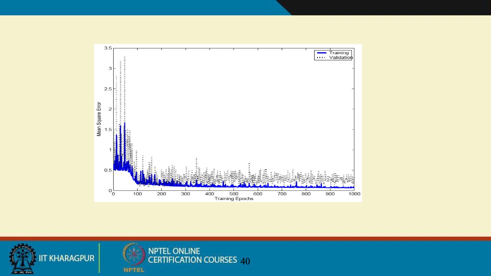

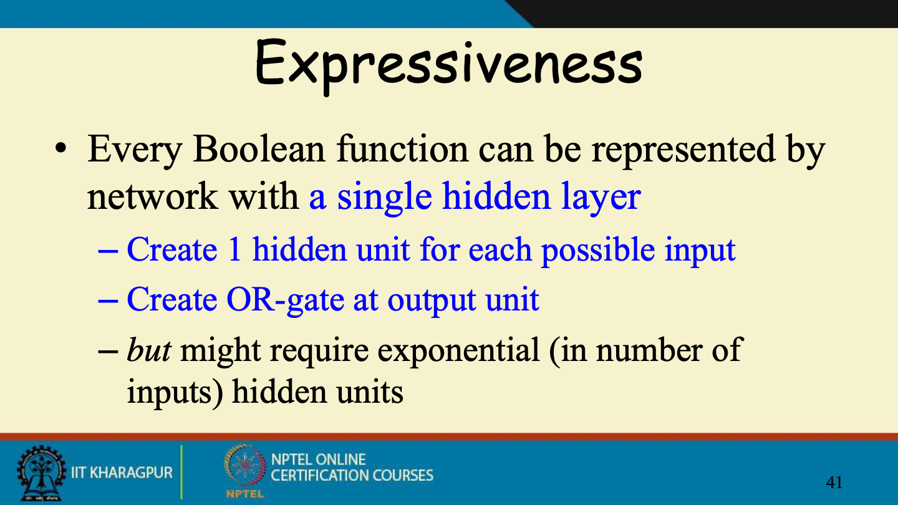

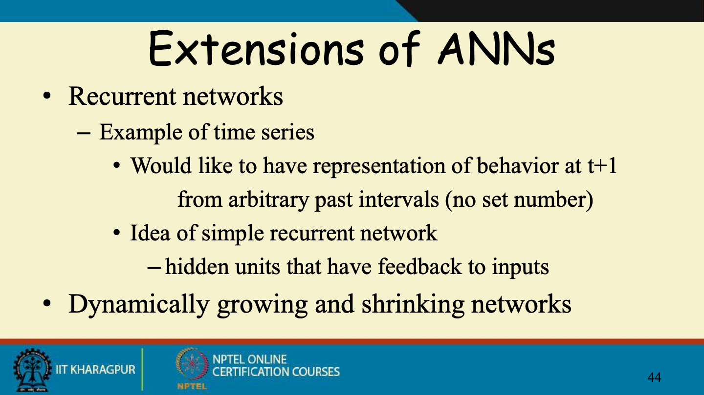

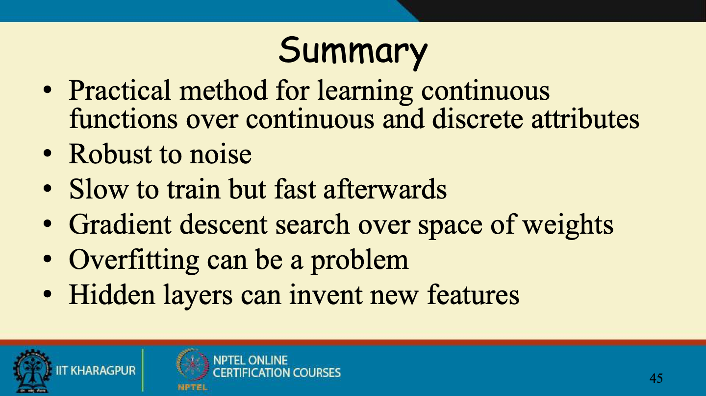

