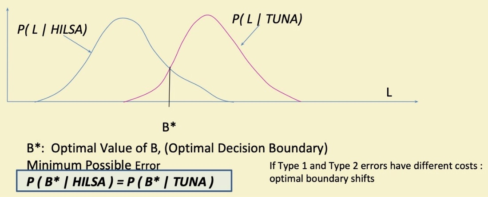
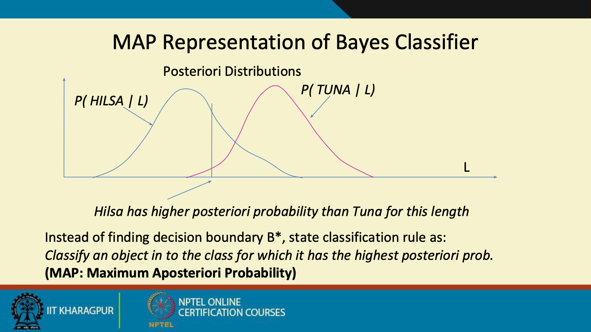
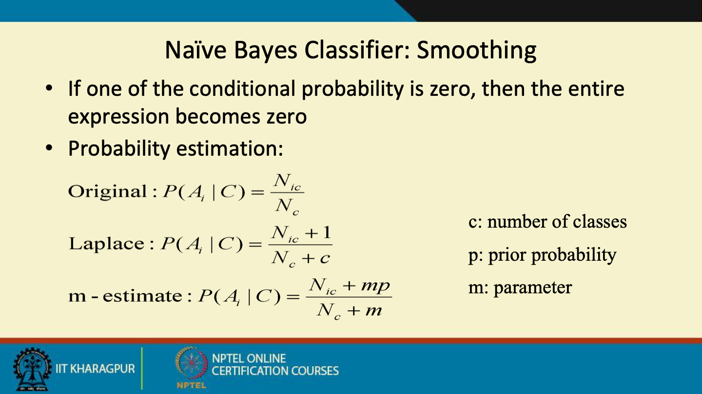

# Bayes Classification

Created: 2019-03-10 16:07:42 +0500

Modified: 2021-11-14 21:42:27 +0500

---

**Naive Bayes**

Naive Bayes is a simple but surprisingly powerful algorithm for predictive modeling.

The model is comprised of two types of probabilities that can be calculated directly from your training data:

1.  The probability of each class.

2.  The conditional probability for each class given each x value.

Once calculated, the probability model can be used to make predictions for new data using Bayes Theorem.

When your data is real-valued it is common to assume a Gaussian distribution (bell curve) so that you can easily estimate these probabilities.

Naive Bayes is called naive because it assumes that each input variable is independent. This is a strong assumption and unrealistic for real data, nevertheless, the technique is very effective on a large range of complex problems.

A simple species classification problem
-   Measure the length of a fish, and decide its class - Hilsa or Tuna
-   Collect Statistics
-   Distribution of "Fish Length"

-   Decision Rule
    -   If length L <= B
        -   Hilsa
    -   Else
        -   Tuna
    -   What should be the value of B ("boundary" length)
        -   Based on population statistics
-   Error of Decision Rule

Errors: Type 1 + Type 2

Type 1: Actually Tuna, Classified as Hilsa (area under pink curve to the left of a B)

Type 2: Actually Hilsa, Classified as Tuna (area under blue curve to the right of a B)
-   Optimal Decision Rule

-   Species Identification Problem
    -   Measure lengths of a (sizeable) population of Hilsa and Tuna fishes
    -   Estimate Class Conditional Distributions for Hilsa and Tuna classes respectively
    -   Find Optimal Decision Boundary B* from the distributions
    -   Apply Decision Rule to classify a newly caught (and measured) fish as either Hilsa or Tuna
        -   with minimum error probability
-   Location / Time of Experiment
    -   Calcutta in Monsoon
        -   More Hilsa few Tuna
    -   California in Winter
        -   More Tuna less Hilsa
    -   Even a 2ft fish is likely to be Hilsa in Calcutta a 1.5ft fish may be Tuna in California

-   If the distribution is biased, we can scale up the class conditional probability to make b* optimal.
-   We can do the scaling using Apriori Probability

**Apriori Probability**
-   Without measuring lengh what can we guess about the class of a fish
    -   Depends on location / time of experiment
        -   Calcutta: Hilsa, California: Tuna
-   Apriori probability: P(HILSA), P(TUNA)
    -   Property of the frequency of classes during experiment
        -   Not a property of length of the fish
    -   Calcutta: P(Hilsa) = 0.90, P(Tuna) = 0.10
    -   California: P(Tuna) = 0.95, P(Hilsa) = 0.05
    -   London: P(Tuna) = 0.50, P(Hilsa) = 0.50
-   Also a determining factor in class decision along with class conditional probability

-   We multiply the class conditional curve by the Apriori Probability

![Classification Decision • We consider the product of Apriori and Class probability factors Posteriori probability (Bayes rule) P(HILSA / L = 2ft) = P(HILSA) x / HILSA) / --- Posteriori z Apriori x Class conditional --- denominator is constant for all classes Apriori: Without any measurement - based on just location/time --- what ca class membership (estimated frm size of class populations) Class conditional: Given the fish belongs to a particular class what is the prc length is L=2ft (estimated from population) Posteriori: Given the measurement that the length of the fish is L=2ft whal that the fish belongs to a Darticular class (obtained using Baves rule from al ](media/Bayes-Classification-image5.png)

-   Also called Bayes Optimal Classifier
-   and B* is called Bayes Optimal Boundary

![Example of Bayes Classifier Name human python salmon whale frog ko mod o bat pigeon cat leopard shark turtle porcupine salamander gila monster platypus owl dolphin Give Birth ves no no yes no no yes no yes yes no no no no no no no no Can Fly Live in Water Have Legs no no yes sornetimes no no no no ves sometimes sornetimes no sometimes no no no yes no yes yes yes yes C lass mammals no n-mammals no n-mammals mammals no n-mammals no n-mammals mammals no n-mammals mammals non-mammals non-mammals no n-mammals mammals non-mammals non-mammals non-mammals mammals non-mammals mammals non-mammals A: attribul M: mamrr N: non-m ](media/Bayes-Classification-image19.png)

![Example of Naive Bayes Classif Name human python salmon whale frog ko mod o bat pigeon cat leopard shark turtle porcupine salamander gila monster platypus owl dolphin Give Birth ves no no yes no no yes no yes yes no no no no no no no no Can Fly Live in Water Have Legs no no yes sornetimes no no no no ves sometimes sornetimes no sometimes no no no yes no yes yes yes yes C lass mammals no n-mammals no n-mammals mammals no n-mammals no n-mammals mammals no n-mammals mammals non-mammals non-mammals no n-mammals mammals non-mammals non-mammals non-mammals mammals non-mammals mammals non-mammals A: attribul M: mamrr 1 13 ](media/Bayes-Classification-image22.png)

![Example Let the two events be the probabilities of persons A and B getti time for dinner, and the third event is the fact that a snow storn While both A and B have a lower probability of getting home in the lower probabilities will still be independent of each other. Tl knowledge that A is late does not tell you whether B will be late living in different neighborhoods, traveling different distances, different modes of transportation.) However, if you have inform live in the same neighborhood, use the same transportation, ar same place, then the two events are NOT conditionallv indepel ](media/Bayes-Classification-image26.png)

**Summary**
-   **Advantages**
    -   Robust to isolated noise points
    -   Handle missing values by ignoring the instance during probability estimate calculations
    -   Robus to irrelevant attributes
-   **Drawback**
    -   Independence assumption may not hold for some attributes
        -   Lenght and weight of a fish are not independent
        -   Conditional Independence

