# Clustering

Created: 2019-04-21 13:08:10 +0500

Modified: 2022-09-09 12:20:13 +0500

---

<https://www.toptal.com/clustering/clustering-metrics-for-comparison>

**Clustering**
-   Unsupervised method
-   Exploratory Data Analysis
-   Useful in many applications like market segment analysis

**What is clustering?**
-   Organizing data into classes such that there is
    -   high intra-class similarity
    -   low inter-class similarity
-   Finding the class labels and the number of classes directly from the data (in contrast to classification)
-   More informally, finding natural groupings among objects

**What is similarity?**

The quality or state of being similar; likeness; resemblance; as, a similarity of features

**Two types of clustering**
-   **Partitional algorithms:** Construct various partitions and then evaluate them by some criterion
-   **Hierarchical algorithms:** Create a hierarchical decomposition of the set of objects using some criterion

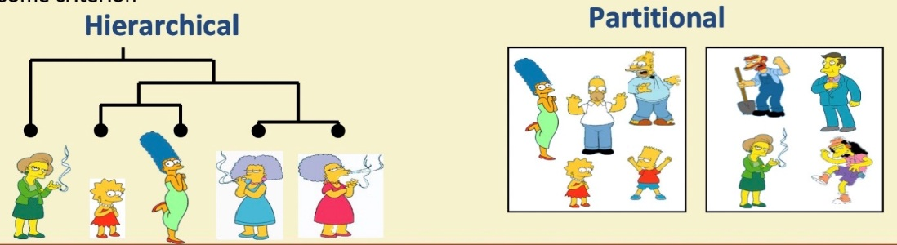

**Desirable properties of clustering algorithm**
-   Scalability (in terms of both time and space)
-   Ability to deal with different data types
-   Minimal requirements for domain knowledge to determine input parameters
-   Able to deal with noise and outliers
-   Insensitive to order of input records
-   Incorporation of user-specified constraints
-   Interpretability and usabilty

**Summarizing similarity measurements**

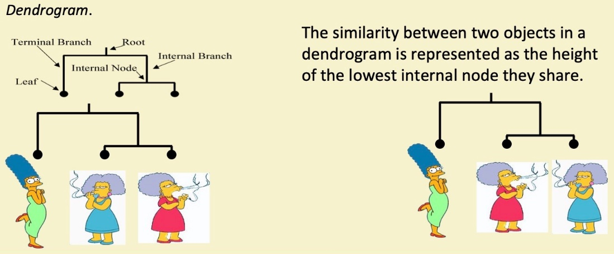

**Hierarchical Clustering**

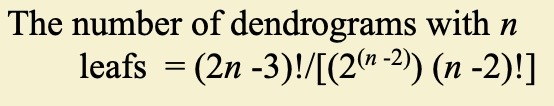

-   **Bottom-Up (agglomerative):** Starting with each item in its own cluster, find the best pair to merge into a new cluster. Repeat until all clusters are fused together
-   **Top-Down (divisive):** Starting with all the data in a single cluster, consider every possible way to divide the cluster into two. Choose the best division and recursively operate on both sides

**Extending distance measure to clusters**

The distance between two objects, defining the distance between an object and a cluster, or defining the distance between two clusters:
-   **Single linkage (nearest neighbor):** In this method the distance between two clusters is determined by the distance of the two closest objects (nearest neighbors) in the different clusters
-   **Complete linkage (farthest neighbor):** In this method, the distances between clusters are determined by the greatest distance between any two objects in the different clusters (i.e. by the "furthest neighbors")
-   **Group average linkage:** In this method, the distance between two clusters is calculated as the average distance between all pairs of objects in the two different clusters

**Summary of hierarchal clustering**
-   No need to specify the number of clusters in advance
-   Hierarchal nature maps nicely onto human intuition for some domains
-   They do not scale well: time complexity of at least O(n^2), where n is the number of total objects

**Partitional clustering**
-   Nonhierarchical, each instance is placed in exactly one of K non-overlapping clusters
-   Since only one set of clusters is output, the user normally has to input the desired number of clusters K

**k-means**

1.  Decide on a value for k

2.  Initialize the k cluster centers (randomly, if necessary)

3.  Decide the class memberships of the N objects by assigning them to the nearest cluster center

4.  Re-estimate the k cluster centers, by assuming the membership found above are correct

5.  If none of the N objects changed membership in the last iteration, exit. Otherwise goto 3

**K-means clustering**

**Step 1**

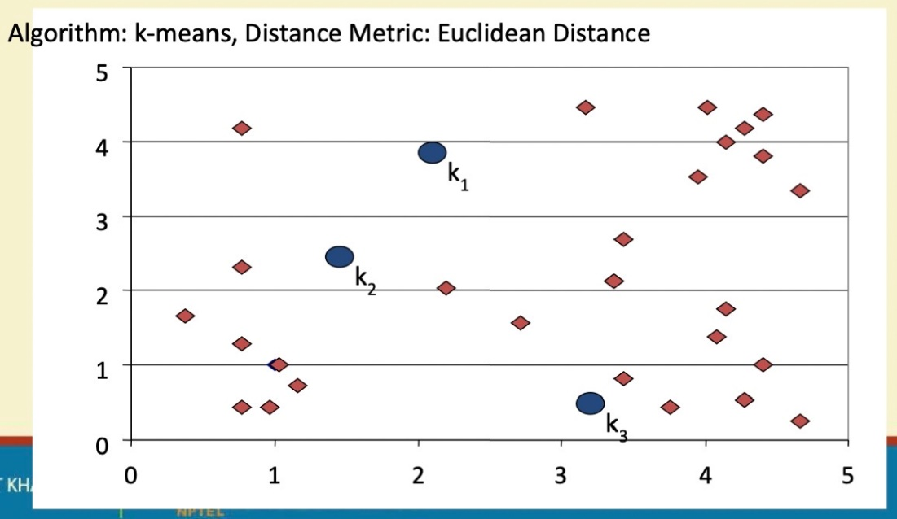

**Step 2**

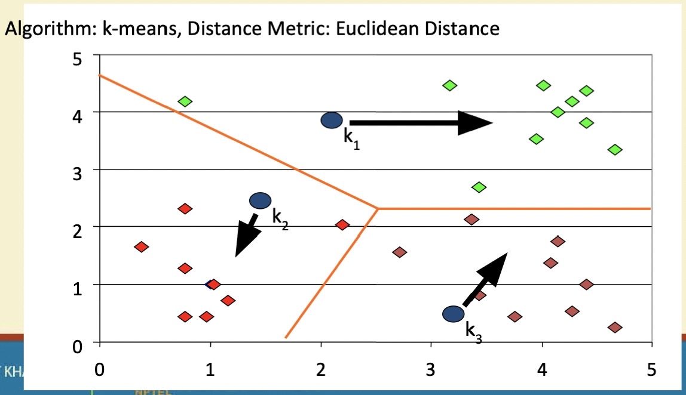

**Step 3**

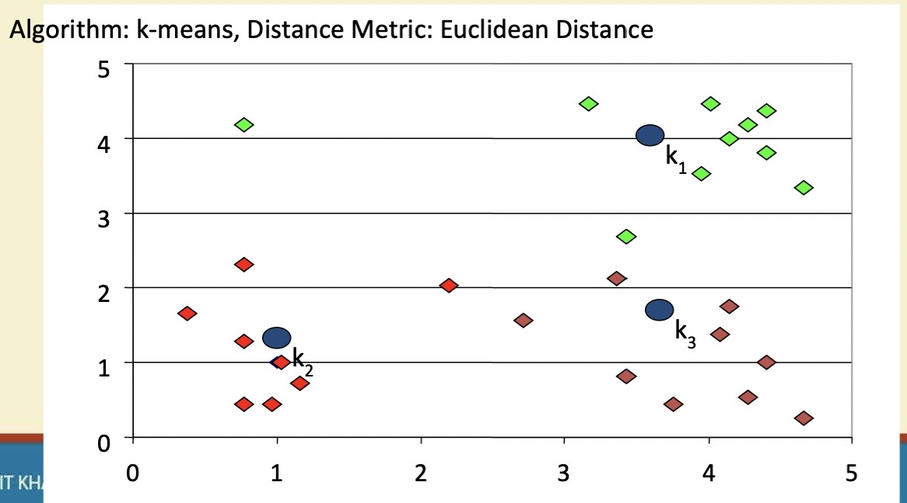

**Step 4**

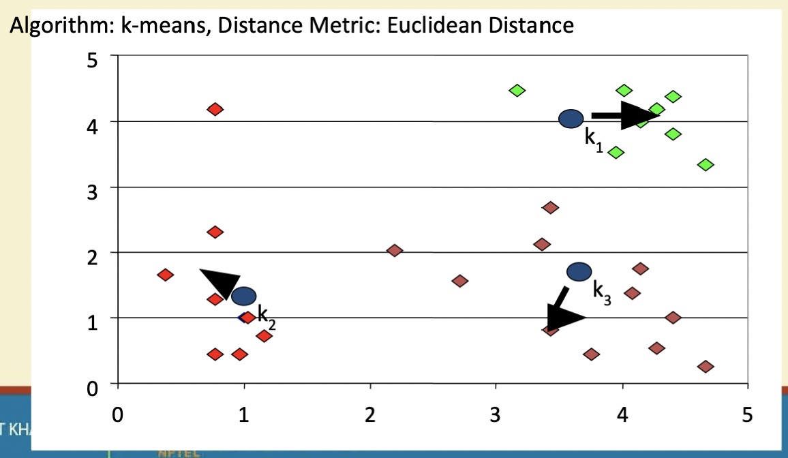

**Step 5**

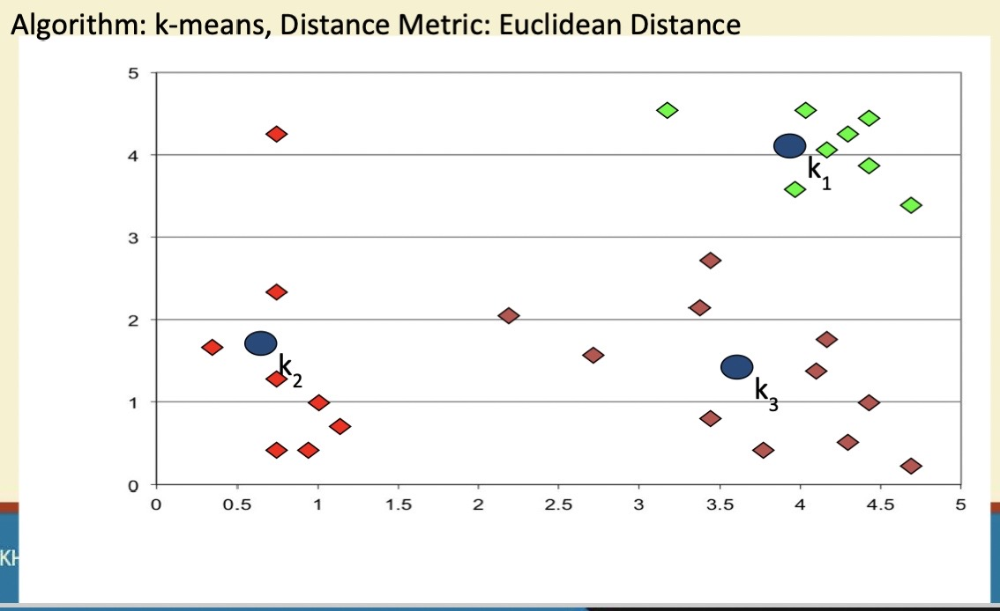

**Evaluation of K-means**
-   **Strength**
    -   Relatively efficient: O(tkn), where. n is # objects, k is # clusters, and t is # iterations. Normally, k, t << n
    -   Often terminates at a *local optimum*. The *global optimum* may be found using techniques such as: *deterministic annealing and genetic algorithms.*
-   **Weakness**
    -   Applicable only when mean is defined, then what about categorical data?
    -   Need to specify k, the number of clusters, in advance
    -   Unable to handle noisy data and outliers
    -   Not suitable for clusters with *non-convex shapes*

**DBSCAN**
-   DBSCAN is a density-based algorithm
    -   Density = number of points within a specified radius (Eps)
    -   A point is a **core point** if it has more than a specified number of points (MinPts) within. Eps
        -   These are points that are at the interior of a cluster
    -   A **border point** has fewer than MinPts within Eps, but is in the neighborhood of a core point
    -   A **noise point** is any point that is not a core point or a border point

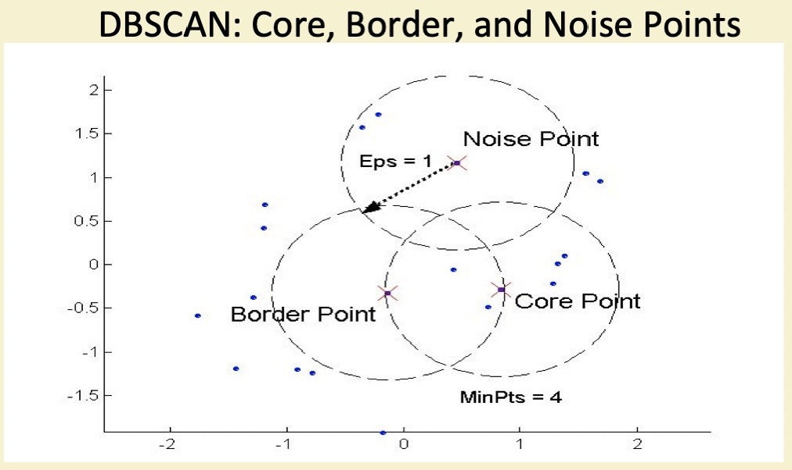

**DBSCAN Algorithm**
-   Eliminate noise points
-   Perform clustering on the remaining points

**Summary of Clustering Algorithms**
-   K-means - Fast, works only for data where mean can be defined, generates spherical clusters, robust to noise
-   Single linkage - produces non-convex clusters, slow for large data sets, sensitive to noise
-   Complete linkage - produces non-convex clusters, very sensitive to noise, very slow for large data sets
-   DBSCAN - produces arbitrary shaped clusters - works only for low dimensional data

**Cluster Validity**
-   For supervised classification we have a variety of measures to evalute how good our model is
    -   Accuracy, precision, recall
-   For cluster analysis, the analogous question is how to evaluate the "goodness" of the resulting clusters?
-   But "clusters are in the eye of the beholder"
-   Then why do we want to evaluate them?
    -   To avoid finding patterns in noise
    -   To compare clustering algorithms
    -   To compare two sets of clusters
    -   To compare two clusters

**Different Aspects of Cluster Validation**

1.  Detemining the **clustering tendency** of a set of data, i.e., distinguishing whether non-random structure actually exists in the data

2.  Comparing the results of a cluster analysis to externally known results, e.g., to externally given class labels

3.  Evaluating how well the results of a cluster analysis fit the data without reference to external information
    -   Use only the data

4.  Comparing the results of two different sets of cluster analysis to determine which is better

5.  Determining the "correct" number of clusters

**Measures of Cluster Validity**
-   Numerical measures that are applied to judge various aspects of cluster validity, are classified into the following 3 types -
    -   **External Index:** Used to measure the extent to which cluster labels match externally supplied class labels.
        -   Entropy
    -   **Internal Index:** Used to measure the goodness of a clustering structure without respect to external information
        -   Sum of Squared Error (SSE)
    -   **Relative Index:** Used to compare two different clusterings or clusters
        -   Often an external or internal index is used for this function, e.g., SSE or entropy

**Scatter Coefficient**
-   Cluster evaluation index
-   Ratio of average intra-cluster distances to intra-cluster distances (Sum Squared Error)

**Internal Measures: Cohesion and Separation**
-   **Cluster Cohesion:** Measures how closely related are objects in a cluster (Ex - SSE)
-   **Cluster Separation:** Measure how distinct or well-separated a cluster is from other clusters (Ex - Squared Error)
    -   Cohesion is measured by the within cluster sum of squares (SSE)

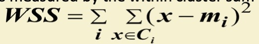
-   Separation is measured by the between cluster sum of squares

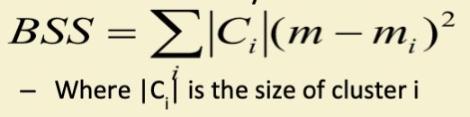

-   Example SSE
    -   BSS + WSS = constant

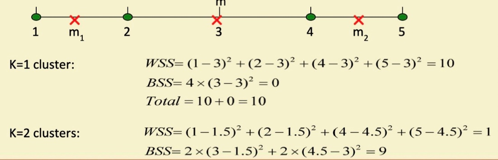

-   A proximity graph based approach can also be used for cohesion and separation
    -   Cluster cohesion is the sum of the weight of all links within a cluster
    -   Cluster separation is the sum of the weights between nodes in the cluster and nodes outside the cluster

**Internal Measures: Silhouette Coefficient**
-   Silhouette Coefficient combine ideas of both cohesion and separation, but for individual points, as well as clusters and clusterings
-   For an individual point, i
    -   Calculate a = average distance of i to the points in its cluster
    -   Calculate b = min (average distance of i to points in another cluster)
    -   The silhouette coefficient for a point is then given by

s = 1 - a/b if a < b, (or s = b/a -1, if a >= b, not the usual case)
-   Typically between 0 and 1
-   The closer to 1 the better

-   Can calculate the Average Silhouette width for a cluster or a clustering

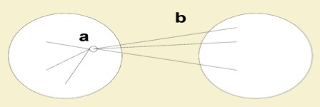

**External Measures of Cluster Validity: Entropy and Purity**

![Table 5.9. K-means Clustering Results for LA Document Data Set Cluster 1 3 Total Entertainrnent 3 1 10 331 354 Financial Foreign Metro National Sports 5 1 162 22 358 555 40 280 1 3 5 12 341 506 29 7 119 70 212 943 96 39 4 73 13 48 273 27 2 671 2 23 13 738 Entropy 1.2270 1.1472 0.1813 1.7487 1.3976 1.5523 1.1450 Purity 0.7474 0.7756 o .9796 0.4390 0.7134 0.5525 0.7203 entropy For each cluster, the class distribution Of the data is calculated first, i.e., for cluster j we cornpute Pi 5, the 'probability' that a rnernber of cluster j belongs to class i as follows: , where rn • is the nurnber of values in cluster 3 and rrziå is the nurnber of values of class i in cluster j . Then using this class distribution, the entropy of each cluster j is Ei_l log.2 Pi, • , where the L is the nurnber of calculated using the sta.nda.rd forrnula % classes. The total entropy for a set of clusters is calculated as the surn of the entropies of each K where is the size of cluster cluster weighted by the size of each cluster, i.e., e --- j, K is the nurnber of clusters, and ern is the total nurnber of data points. purity Using the terrninology derived for entropy, the purity of cluster j, is given by purityj rxxaxpiå and the overall purity of a clustering by purity purity 5 . ](media/Clustering-image17.jpg)

**Outliers Detection**
-   Important in many applications like anomaly detection
-   Outliers are points not belonging to any cluster
-   Many outlier detection algorithms available

