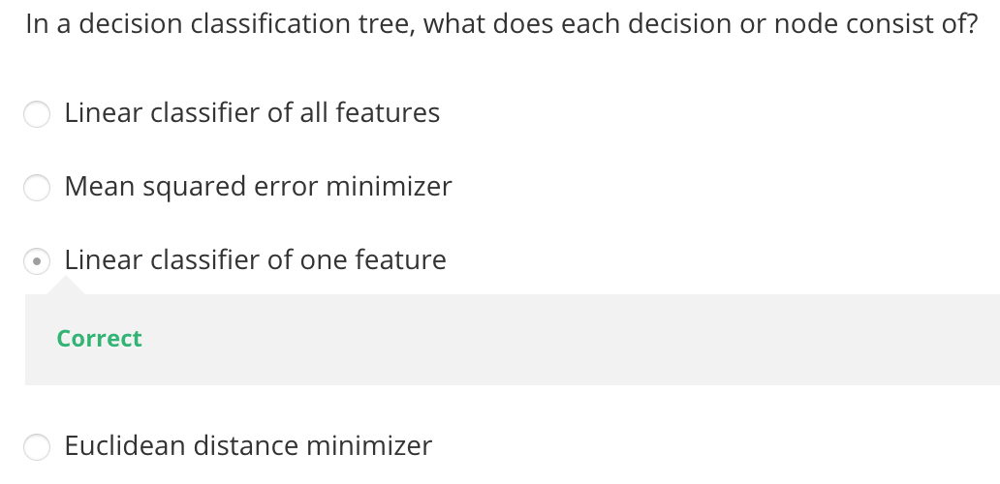

# Decision Tree

Created: 2019-04-21 13:03:15 +0500

Modified: 2022-08-06 22:36:24 +0500

---

**Decision Tree for Big Data Analytics**

Hi, decision Trees are an important type of algorithm for predictive modeling machine learning.

The representation of the decision treemodel is a binary tree. Each node represents a single input variable (x) and a split point on that variable (assuming the variable is numeric).

The leaf nodes of the tree contain an output variable (y) which is used to make a prediction.

Predictions are made by walking the splits of the tree until arriving at a leaf node and output the class value at that leaf node.

Trees are fast to learn and very fast for making predictions. They are also often accurate for a broad range of problems and do not require any special preparation for your data.

Decision trees have a high variance and canyield more accurate predictions when used in an ensemble.

**Explain the Decision Tree algorithm**

Machine learning makes use of decision trees to predict the direction of the input using a tree-like structure. They are generally binary trees with a single question node followed by two sub-nodes according to the question. Once it reaches the leaf nodes, we can make an accurate prediction of the input.

**Preface**
-   In this lecture, we will discuss Decision Trees for Big Data Analytics and also discuss a case study of medical application using a Decision Tree in Spark ML

**Decision Trees**

![Predict if Sachin will play cric Training examples: 9 yes Consider the following data set our task is to predict if Sachin is going to play cricket on a given day. We have observed Sachin over a number days and recorded various things that might influence his decision to play cricket so we looked at what kind of weather it is. Is it sunny or is it raining humidity is it high as normal is it windy So this is our training set and these are the examples that we are going Day DI D4 DIO Dil D12 D13 D14 Out 00k Sunny Sunny Overcast Rain Rain Rain Overcast Sunny Sunny Rain Sunny Overcast Overcast Rain Hul Hig Hig Hig Hig NOI NOI NOI Hig NOI NOI NOI Hig NOI Hig ](media/Decision-Tree-image3.png)

**ID3 Algorithm**
-   In decision tree learning, ID3 (Iterative Dichotomiser 3) is an algorithm invented by Ross Quinlan used to generate a decision tree from a dataset. ID3 is the precursor to the C4.5 algorithm, and is typically used in the machine learning and natural language processing domains
-   Split (node, {examples}):

    1.  A <- the best attribute for splitting the {examples}

    2.  Decision attribute for this node <- A

    3.  For each value of A, create new child node

    4.  Split training {examples} to child nodes

    5.  For each child node/subset:

        i.  if subset is pure: STOP

        ii. else: Split (child_node, {subset})
-   Ross Quinlan (ID3: 1986), (C4.5: 1993)
-   Breimanetal (CaRT: 1984) from statistics

<https://towardsdatascience.com/entropy-and-information-gain-in-decision-trees-c7db67a3a293>

**Decision Trees for Regression**

**How to grow a decision tree**
-   The tree is built greedily from top to bottom
-   Each split is selected to maximize information gain (IG)

-   Given a training set: Z= {(X1, Y1),...., (Xn, Yn)}

yi-real values
-   Goal is to find f(x) (a tree) such that

-   How to grow a decision tree for regression?

![Find the best split (Xk < t) • What happens if you make some split by a condition xk < t? For some part of training objects ZL, you have x_k < t. For other part ZR holds xk t. • The error consists of two parts for ZL and ZR respectively. So here we need to find simultaneously k, t, aL and aR. • We can calculate the optimal aL and aR exactly the same way as we did for the case without a split. We can easily prove that the optimal aL min k, t, aL,aR i€Zl, Values in leaves 1 ieZ1, IZ I - number of elemel IZR I - number of eleme ](media/Decision-Tree-image19.png)

**Stopping rule**
-   The node depth is equal to the maxDepth training parameter
-   No split candidate leads to an information gain greater than mininfoGain
-   No split candidate produces child nodes which have at least minInstancesPerNode training instances (|ZL|, |ZR| < minInstancesPerNode) each

**Summary: Decision Trees**
-   **Automatically handling interactions of features**

The benefits of decision tree is that this algorithm can automatically handle interactions or features because it can combine several different features in a single decision tree. It can build complex functions involving multiple splitting criteria
-   **Computational scalability**

The second property is a computational scalability. There exists effect of algorithms for building decision trees for the verfy large data sets with many features
-   **Predictive power**

Single decision tree actually is not a very good predictor. The prediction power of a single tree is typically not so good
-   **Interpretability**

You can visualize the decision tree and analyze this splitting criteria in nodes, the values in leaves, and so one. Sometimes it might be helpful

**Building a tree using MapReduce**

**PLANET (Parallel Learner for Assembling Numerous Ensemble Trees)**
-   A sequence of MapReduce jobs that build a decision tree

**Attribute Instance Matrix**

-   Binary Classification Problem
-   K-class problem

-   Classification problem is a part of Supervised learning algorithm

when p+ = 1 and p- = 0 or p+ = 0 and p- = 1, i.e. pure classes then the entropy is lowest i.e. 0

When p+ = 0.5 and p- = 0.5, i.e. even split between classes, then entropy is highest

![Avoiding Overfitting • Two basic approaches - Prepruning: Stop growing the tree at some point during construction when it is determined that there is not enough data to make reliable choices. - Postpruning: Grow the full tree and then remove nodes that seem not to have sufficient evidence. (more popular) • Methods for evaluating subtrees to prune: - Cross-validation: Reserve hold-out set to evaluate utility (more popular) - Statistical testing: Test if the observed regularity can be dismissed as likely to be occur by chance Minimum Description Length: Is the additional complexity of the hypothesis smaller than remembering the exceptions ? ](media/Decision-Tree-image49.png)

CHAID Algorithm - Chi-Squared Automatic Interaction Detection

CART Algorithm - Classification and Regression Tree

**When are Decision Trees useful?**
-   Advantages
    -   Very fast: can handle very large datasets with many attributes
    -   Flexible: serveral attribute types, classification and regression problems, missing values
    -   Interpretability: provide rules and attribute importance
-   Disadvantages
    -   Instability of the trees (high variance)
    -   Not always competitive with other algorithms in terms of accuracy

**Summary**
-   Decision trees are practical for concept learning
-   Basic information measure and gain function for best first search of space of DTs
-   ID3 procedure
    -   Search space is complete
    -   Preference for shorter trees
-   Overfitting is an important issue with various solutions
-   Many variations and extensions possible

**Software**
-   In R: packages tree and rpart
-   C4.5
-   Weka

<https://medium.com/@rishabhjain_22692/decision-trees-it-begins-here-93ff54ef134>

# Decision Trees

Decision tree for titanic dataset for who lived and who died

![Decision Trees Is sex male? samples = 1309 values = [500, 8091 Died Yes Is class < 1.5? samples = 843 values = [1 61, 682) 1000/0 Yes Is age > 17.5? samples = 179 values = [61, 1181 Died 13 Died samples = 11 values = [6, 5] Survived Is class < 2.5? samples = 466 values = [339, 1271 Survived Is age > 17.5? samples = 664 values = [1 00, 5641 Died Yes samples = 168 values = [55, 1131 Died 1% Yes samples = 569 values = [73, 496] Died samples = 95 values = [27, 681 Died 7% ](media/Decision-Tree-image57.png)

<https://towardsdatascience.com/decision-tree-ba64f977f7c3>

[**Intro to XGBoost Models (decision-tree-based ensemble ML algorithms)**](https://www.youtube.com/watch?v=0ikyjpaUDFQ&ab_channel=CodingTech)

**XGBoost (eXtreme Gradient Boosted trees)**
-   Boosting is an ensemble method
    -   Each tree boosts attributes that led to misclassifications of previous tree
-   It is amazing
    -   Routinely wins Kaggle competitions
    -   Easy to use
    -   Fast
    -   A good choice for an algorithm to start with

**Decision Trees**

**Example**

**How Decision Tree works**

**Random Forests**

**Ensemble Learning**

![• Random Forests uses bagging (bootstrap aggregating) to implement ensemble learning • Many models are built by training on randomly-drawn subsets of the data • Boosting is an alternate technique where each subsequent model in the ensemble boosts attributes that address data mis•classified by the previous model • A bucket of models trains several different models using training data, and picks the one that works best with the test data • Stacking runs multiple models at once on the data, and combines the results together • This is how the Netflix prize was won! ](media/Decision-Tree-image65.jpeg)

**Features of XGBoost**

![And follow through.. Folding (Rolling) back a decision tree: If you have a o complete decision tree, with probabilities attached to event branches, and outcomes following from the end of each decision branch, you can roll back the decision tree, by Estimating the expected value of each branch, starting with the right and working towards the left, using the probabilities and payoffs. Compute an expected value for the entire tree, across branches. If there is a time lag across the branches, and/or risk involved in the process, you can incorporate those elements into a decision tree as well in the form of a discount rate that you use discount payoffs at each leg. ](media/Decision-Tree-image69.jpeg)

![3. Decision Tree: An Example Consider a pharmaceutical drug for treating Type 1 diabetes that has gone through preclinical testing and is about to enter phase 1 of the FDA approval process. o a Phase 1 is expected to cost $ 50 million and will involve 100 volunteers to determine safety and dosage; it is expected to last 1 year. There is a 70% chance that the drug will successfully complete the first phase. a In phase 2, the drug will be tested on 250 volunteers for effectiveness in treating diabetes over a two-year period. This phase will cost $ 100 million and the drug will have to show a statistically significant impact on the disease to move on to the next phase. There is only a 30% chance that the drug will prove successful in treating type 1 diabetes but there is a 10% chance that it will be successful in treating both type 1 and type 2 diabetes and a 10% chance that it will succeed only in treating type 2 diabetes. a In phase 3, the testing will expand to 4,000 volunteers to determine the long-term consequences of taking the drug. If the drug is tested on only type 1 or type 2 diabetes patients, this phase will last 4 years and cost $ 250 million; there is an 80% chance of success. If it is tested on both types, the phase will last 4 years and cost $ 300 million; there is a 75% chance of success. If the drug passes through all 3 phases, the costs and annual cash flows are below: Disease treatment Type 1 diabetes only Type 2 diabetes only Type 1 and 2 diabetes Cost of Develo ment $ 500 million $ 500 million $ 600 million Annual Cash Flow $ 300 million for 15 years $ 125 million for 15 years $ 400 million for 15 years ](media/Decision-Tree-image70.jpeg)

