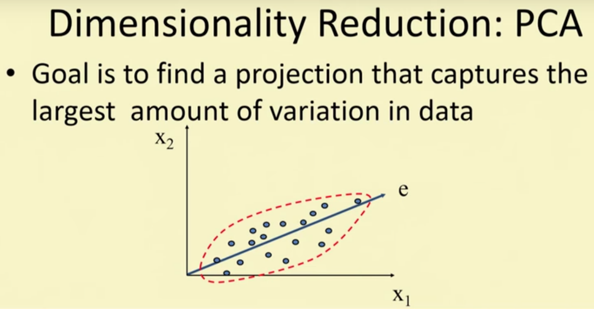
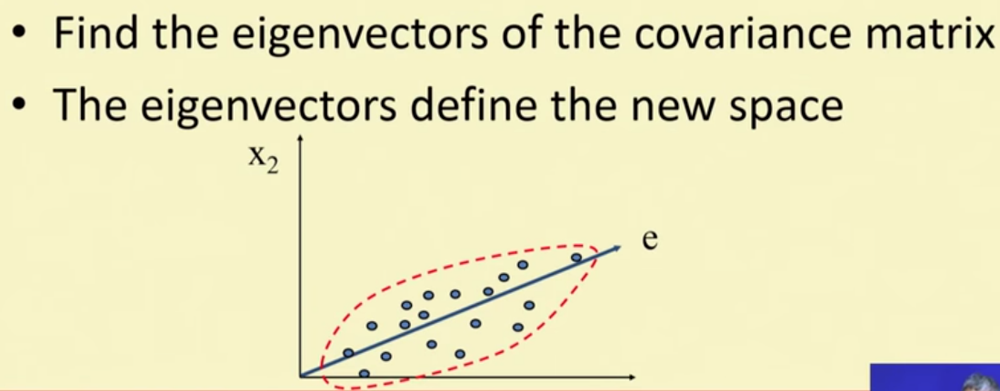
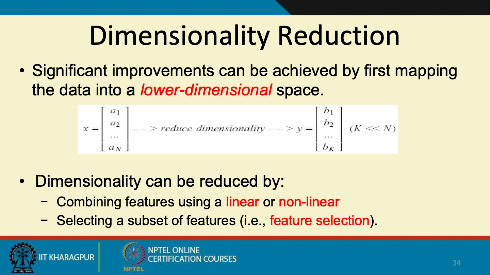
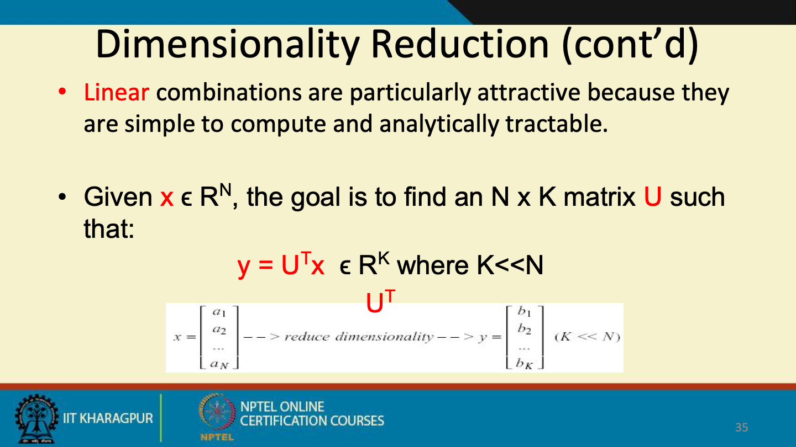
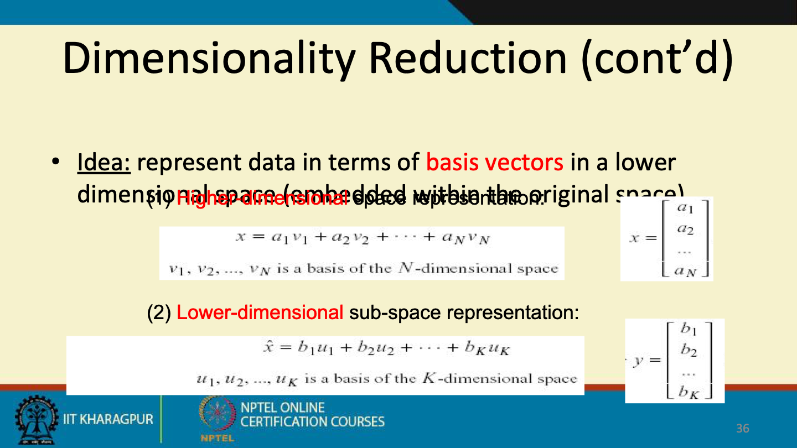
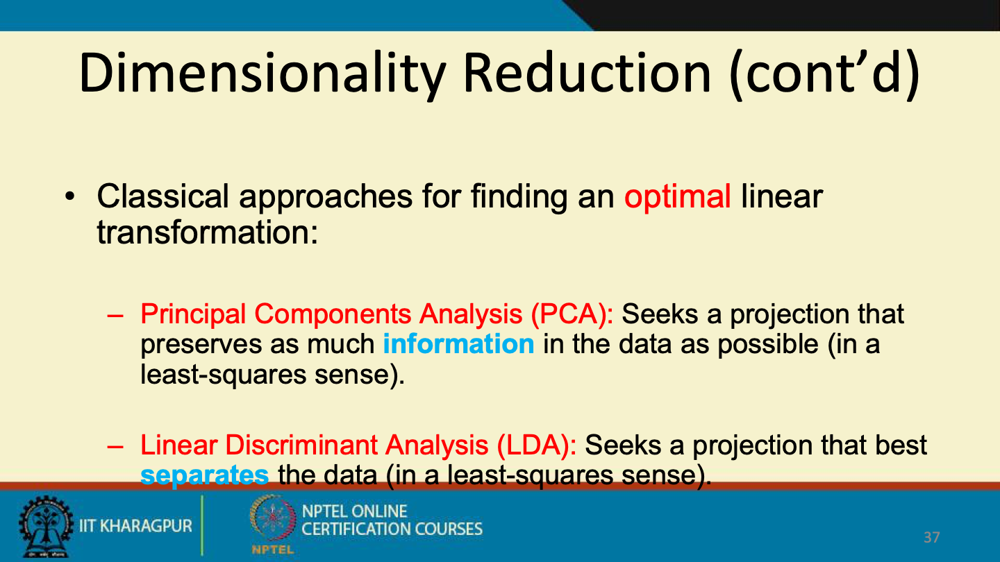
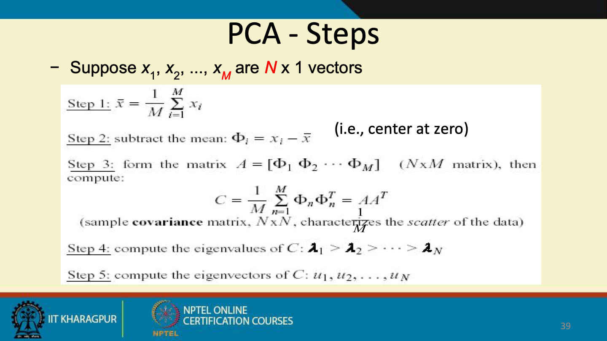
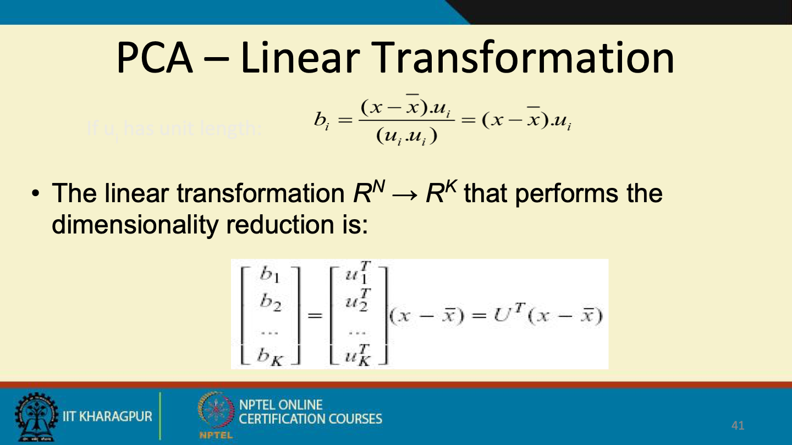
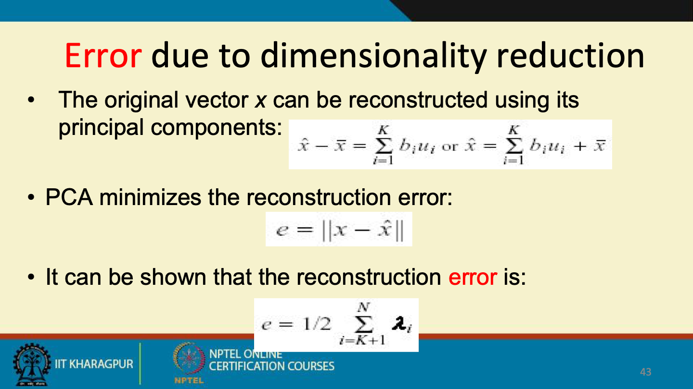

# Dimensionality Reduction

Created: 2021-06-19 15:19:58 +0500

Modified: 2021-09-28 22:23:17 +0500

---

**Dimensionality Reduction**
-   Purpose
    -   Avoid curse of dimensionality
    -   Reduce amount of time and memory required by data mining algorithms
    -   Allow data to be more easily visualized
    -   May help to eliminate irrelevant features or reduce noise
-   Techniques
    -   Principle Component Analysis
    -   Singular Value Decomposition
    -   Others: supervised and non-linear techniques

**Data Dimensionaity**
-   From a theoretical point of view, increasing the number of features should lead to better performance
-   In practice, the inclusion of more features leads to worse performance (i.e., curse of dimensionality)
-   The number of training examples required increases exponentially with dimensionality

**Curse of Dimensionality**
-   When dimensionality increases, data becomes increasingly sparse in the space that it occupies
-   Definitions of density and distance between points, which is critical for clustering and outlier detection, become less meaningful

**Dimensionality Reduction**
-   Purpose
    -   Avoid curse of dimensionality
    -   Reduce amount of time and memory required by data mining algorithms
    -   Allow data to be more easily visualized
    -   May help to eliminate irrelevant features or reduce noise
-   Techniques
    -   Principle Component Analysis
    -   Single Value Decomposition
    -   Others: Supervised and non-linear techniques

<https://www.datacamp.com/community/tutorials/principal-component-analysis-in-python>

**Feature Subset Selection**
-   Another way to reduce dimensionality of data
-   Redundant features
    -   duplicate much or all of the information contained in one or more other attributes
    -   Example: purchase price of a product and the amount of sales tax paid
-   Irrelevant features
    -   contain no information that is useful for the data mining task at hand
    -   Examples: students' ID is often irrelevant to the task of predicting students' GPA

-   Evaluate a subset of feature
-   Search for the best subset

-   Techniques
    -   Brute-force approach
        -   Try all possible feature subsets as input to data mining algorithm
    -   Embedded approaches
        -   Feature selection occurs natually as part of the data mining algorithm
    -   Fiter approaches
        -   Features are selected before data mining algorithm is run
    -   Wrapper approaches
        -   Use the data mining algorithm as a black box to find best subset of attributes

