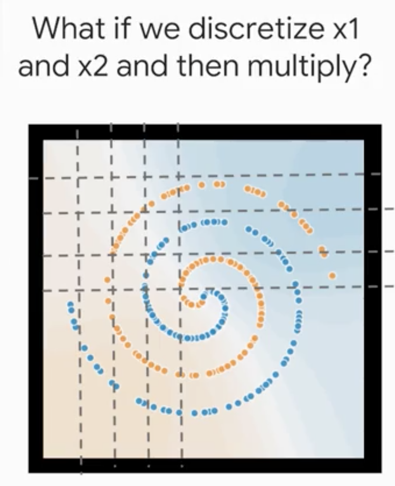
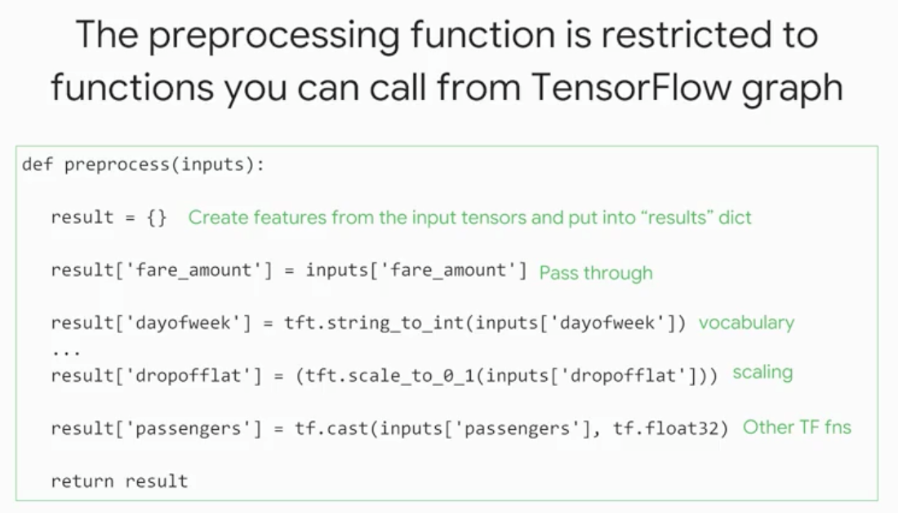

# Feature Engineering

Created: 2018-07-06 02:56:35 +0500

Modified: 2021-06-19 14:21:55 +0500

---
-   Scale to large datasets
-   Find good features
    -   Synthetic features
-   Preprocess with Cloud MLE
-   Hyperparameter tuning

## Good vs Bad features
-   **Good Feature**
    -   Be related to objective
    -   Be known at prediction-time
    -   Be numeric with meaningful magnitude
        -   Numeric features
        -   Able to do mathematical operations
    -   Have enough examples
    -   Bring human insight to problem

-   Sparse Columns
-   If don't know the list of keys, Create a Vocabulary (This is what preprocessing is)

-   The vocabulary and the mapping of the vocabulary needs to be identical at prediction time.

PS - Take care of cases where user doesn't provide a value, i.e. missing values.

ML - lot of data, keep outliers and build model for them

Statistics - I've got all the data I'll ever get, throw away outliers

# Preprocessing and Feature Creation

# 
-   Apache Beam
-   BigQuery
-   TensorFlow

# Apache Beam and Cloud Dataflow

# Preprocessing with Cloud Dataprep

# 
-   Ingesting, Transforming and Analyzing Taxi Data

# Feature Crosses

Way to bring non-linear inputs to a linear learner

A feature cross memorizes the input space

Beware - Feature cross are a temptation for a model to overfit

# Implementing Feature Crosses

By Feature Crossing the two grids.

Embeddings allow to generalize two grid cells, like all the grid cells that are on the ocean front should have a similar value.

## Feature Creation in TensorFlow

Data Type - Python Dictionary

Ex - Distance between house and metro station (public transport) is a key for house prices

Feature engineering can be done in 3 places
-   Training
-   Evaluation
-   Serving

## Using DataFlow

tf.transform allows users to define preprocessing pipelines and run these using large scale data processing frameworks, while also exporting the pipeline in a way that can be run as part of a TensorFlow graph

-   Feature cross is only useful when we have a large dataset since it's memorization so for each bucket there must be enough samples.

# TensorFlow Transform

# 

# Analysis Phase

# Transform Phase

### Summary
-   Convert raw data into features
-   Preprocess data in such a way that the preprocessing is also done during serving
-   Choose among the various feature columns in TensorFlow
-   Memorize large datasets using feature crosses and simple models
-   Simplify preprocessing pipelines using TensorFlow Transform
