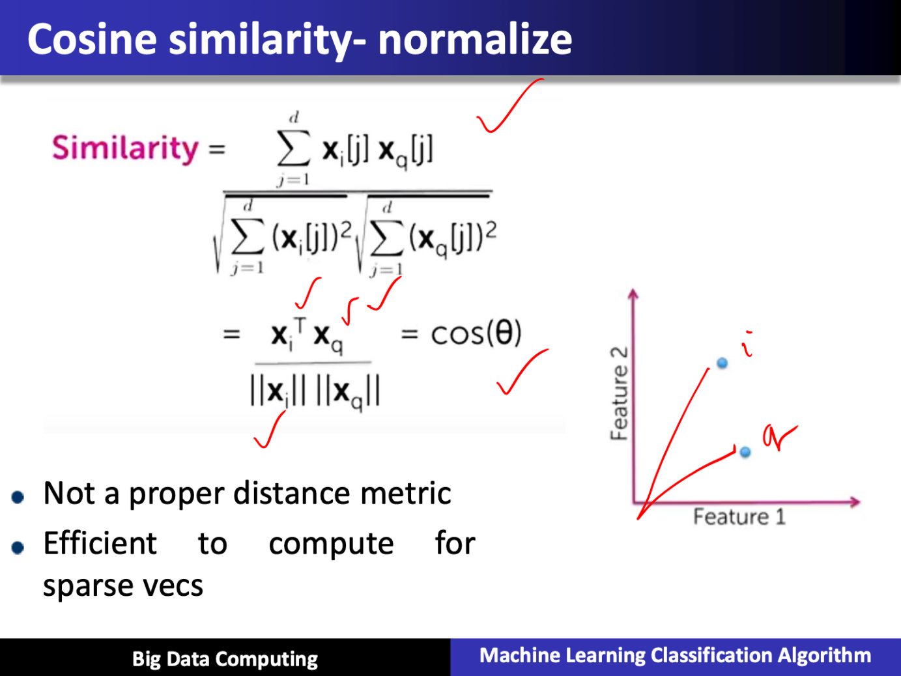

# Machine Learning Algorithm K-means using Map Reduce for Big Data Analytics

Created: 2019-04-01 20:38:21 +0500

Modified: 2021-06-13 20:20:17 +0500

---

**Preface**
-   In this lecture, we will discuss machine learning classification algorithm k-means using mapreduce for big data analytics

**Cluster Analysis (Clustering) Overview**
-   Goal: Organize similar items into groups
-   In cluster analysis, the goal is to organize similar items in given dataset into groups or clusters. By segmenting given data into clusters, we can analyze each cluster more carefully

**Applications**
-   Segment customer base into groups
-   Characterize different weather patterns for a region
-   Group news articles into topics
-   Discover crime hot spots

![Cluster Analysis Divides data into clusters: Cluster analysis divides all the samples in a data set into groups. In this diagram, we see that the red, green, and purple data points are clustered together. Which group a sample is placed in is based on some measure of similarity. Similar items are placed in same cluster: The goal of cluster analysis is to segment data so that differences between samples in the same cluster are minimized, as shown by eye ow arrow, and differences etween samples of difféFGt clusters are maximized, as shown by the orange arrow. Visually, we can think of this as getting samples in each cluster to be as close together as possible, and the samples from different clusters to be as far apart as possible. Intra-cluster differences are minimized Inter-cluster differences are maximized Big Data Computing Machine Learning Classification Algorithm ](media/Machine-Learning-Algorithm-K-means-using-Map-Reduce-for-Big-Data-Analytics-image1.png)

![Similarity Measures Cluster analysis requires some sort of metric to measure similarity between two samples. Some common similarity measures are Euclidean distance, which is the distance along a straight line between two points, A and B, as shown in this plot Euclidean Distance Manhattan distance, which is calculated on a strictly horizontal and vertical path, as shown in the right plot. To go from point A to point B, you can only step along either the x-axis or the y-axis in a two-dimensional case. So the path to calculate the Manhattan distance consists of segments along the axes instead of along a diagonal path, as with Euclidean distance. Cosine similarity measures the cosine of the angle between points A and B, as shown in the bottom plot. Since distance measures such as Euclidean distance are often used to measure similarity between samples in Manhattan Distance clustering algorithms, note that it may be necessary to Cosine Similarity normalize the input variables so that no one value dominates the similarity calculation. Big Data Computing Machine Learning Classification Algorithm ](media/Machine-Learning-Algorithm-K-means-using-Map-Reduce-for-Big-Data-Analytics-image2.png)

![Cluster Analysis Key Points Unsupervised There is no 'correct' clusterin Clusters don't come with labels u/ Cluster analysis is an unsupervised task. This means that there is no target label for any sample in the data set. In general, there is no correct clustering results. The best set of clusters is highly dependent on how the resulting clusters will be used. Clusters don't come with labels. You may end up with five different clusters at the end of a cluster analysis process, but you don't know what each cluster represents. Only by analyzing the samples in each cluster can you come out with reasonable labels for your clusters. Given all this, it is important to keep in mind that interpretation and analysis of the clusters are required to make sense of and make use of the results of cluster analysis. Interpretation a d analysis required to make sense of clusterin results! Big Data Computing Machine Learning Classification Algorithm ](media/Machine-Learning-Algorithm-K-means-using-Map-Reduce-for-Big-Data-Analytics-image9.png)

![Uses of Cluster Results • Data segmentation • Analysis of each segment can provide insights: There are several ways that the results of cluster analysis can be used. The most obvious is data segmentation and the benefits that come from that. If we segment your customer base into different types of readers, the resulting insights can be used to provide more effective marketing to the different customer groups based on their preferences. For example, analyzing each segment separately can provide valuable insights into each group's likes, dislikes and purchasing behavior, just like we see science fiction, non-fiction and children's books preferences here. Science fiction non-fiction children's Big Data Computing Machine Learning Classification Algorithm ](media/Machine-Learning-Algorithm-K-means-using-Map-Reduce-for-Big-Data-Analytics-image10.png)

![Uses of Cluster Results • Categories for classifying new data • New sample assigned to closest cluster: Clusters can also be used to classify new data samples. When a new sample is received, like the orange sample here, compute the similarity measure between it and the centers of all clusters, and assign a new sample to the closest cluster. The label of that cluster, manually determined through analysis, is then used to classify the new sample. In our book buyers' preferences example, a new customer can be classified as being either a science fiction, non-fiction or children's books customer depending on which cluster the new customer is most similar to. Label of closest cluster used to classify new sample Big Data Computing Machine Learning Classification Algorithm ](media/Machine-Learning-Algorithm-K-means-using-Map-Reduce-for-Big-Data-Analytics-image11.png)

![Uses of Cluster Results • Labeled data for classification • Cluster samples used as labeled data: once cluster labels have been determined, samples in each cluster can be used as labeled data for a classification task. The samples would be the input to the classification model. And the cluster label would be the target class for each sample. This process can be used to provide much needed labeled data for classification. Big Data Computing Label of closest cluster used to classify new sample Labeled samples for science fiction customers Machine Learning Classification Algorithm ](media/Machine-Learning-Algorithm-K-means-using-Map-Reduce-for-Big-Data-Analytics-image12.png)

![Uses of Cluster Results • Basis for anomaly detection • Cluster outliers are anomalies: Yet another use of cluster results is as a basis for anomaly detection. If a sample is very far away, or very different from any of the cluster centers, like the yellow sample here, then that sample is a cluster outlier and can be flagged as an appmaly. However, these anomalies require further analysis. Depending on the application, these anomalies can be considered noise, and should be removed from the data set. An example of this would be a sample with a value of 150 for age. 3 Big Data Computing Anomalies that require further analysis Machine Learning Classification Algorithm ](media/Machine-Learning-Algorithm-K-means-using-Map-Reduce-for-Big-Data-Analytics-image13.png)

**Cluster Analysis Summary**
-   Organize similar items into groups
-   Analyzing clusters often leads to useful insights about data
-   Clusters require analysis and interpretation

**Chossing Initial Centroids**
-   Issue:

Final clusters are sensitive to initial centroids
-   Solution:

Run k-means multiple times with different random intitial centroids, and choose best results

![Choosing Value for k Approaches: Choosing the optimal value for k is always a big question in using k-means. There are several methods to determine the value for k. Visualization: Visualization techniques can be used to determine the dataset to see if there are natural groupings of the samples. Scatter plots and the use of dimensionality reduction are useful here, to visualize the data. Application-Dependent: A good value for k is application-dependent. So domain knowledge of the application can drive the selection for the value of k. For example, if you want to cluster the types of products customers are purchasing, a natural choice for k might be the number of product categories that you offer. Or k might be selected to represent the geographical locations of respondents to a survey. In which case, a good value for k would be the number of regions your interested in analyzing. Data-Driven: There are also data-driven method for determining the value of k. These methods calculate symmetric for different values of k to determine the best selections of k. One such method is the elbow method. Big Data Computing Machine Learning Classification Algorithm ](media/Machine-Learning-Algorithm-K-means-using-Map-Reduce-for-Big-Data-Analytics-image18.png)

![Elbow Method for Choosing k "Elbow" suggests value for k should be 3 of Clusters (k ) The elbow method for determining the value of k is shown on this plot. As we saw in the previous slide, WSSE, or within-cluster sum of squared error, measures how much data samples deviate from their respective centroids in a set of clustering results. If we plot WSSE for different values for k, we can see how this error measure changes as a value of k changes as seen in the plot. The bend in this error curve indicates a drop in gain by adding more clusters. So this elbow in the curve provides a suggestion for a good value of k. Note that the elbow can not always be unambiguously determined, especially for complex data. And in many cases, the error curve will not have a clear suggestion for one value, but for multiple values. This can be used as a guideline for the range of values to try for k. Big Data Computing Machine Learning Classification Algorithm ](media/Machine-Learning-Algorithm-K-means-using-Map-Reduce-for-Big-Data-Analytics-image19.png)

![Stopping Criteria When to stop iterating ? No changes to centroids: How do you know when to stop iterating when using k-means? One obviously stopping criterion is when there are no changes to the centroids. This means that no samples would change cluster assignments. And recalculating the centroids will not result in any changes. So additional iterations will not bring about any more changes to the cluster results. Number of samples changing clusters is below threshold: The stopping criterion can be relaxed to the second stopping criterion: which is when the number of sample changing clusters is below a certain threshold, say 1% for example. At this point, the clusters are changing by only a few samples, resulting in only minimal changes to the final cluster results. So the algorithm can be stopped here. Big Data Computing Machine Learning Classification Algorithm ](media/Machine-Learning-Algorithm-K-means-using-Map-Reduce-for-Big-Data-Analytics-image20.png)

![Interpreting Results Examine cluster centroids HOW are clusters different ? At the end ofk-meanswe have a setof clusters, each with a centroid. Each centroid is the mean of the samples assigned to that cluster. You can think of the centroid as a representative sample for that cluster. So to interpret the cluster analysis results, we can examine the cluster centroids. Comparing the values of the variables between the centroids will reveal how different or alike clusters are and provide insights into what each cluster represents. For example, if the value for age is different for different customer clusters, this indicates that the clusters are encoding different customer segments by age, among other variables. Big Data Computing Compare centroids to see how clusters are different Machine Learning Classification Algorithm ](media/Machine-Learning-Algorithm-K-means-using-Map-Reduce-for-Big-Data-Analytics-image21.png)

**K-Means summary**
-   Classic algorithm for cluster analysis
-   Simple to understand and implement and is efficient
-   Value of k must be specified
-   Final clusters are sensitive to initial centroids

