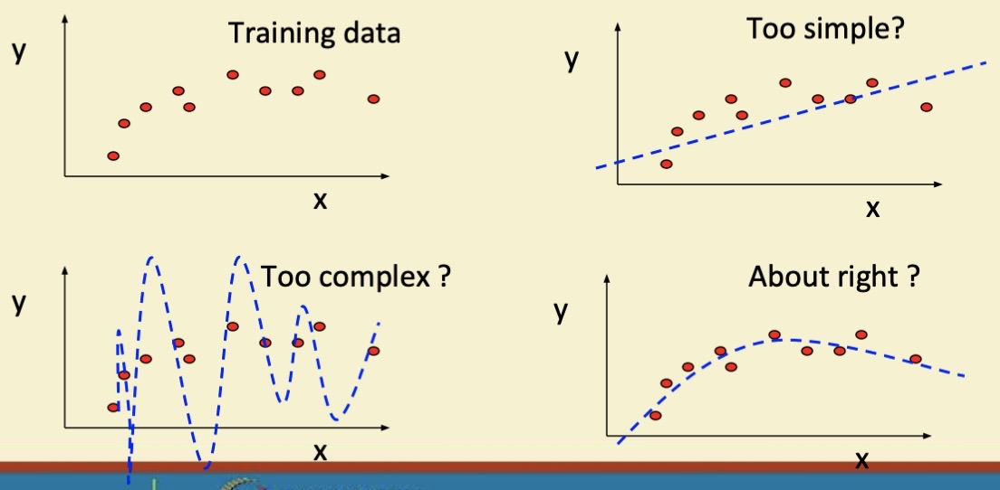
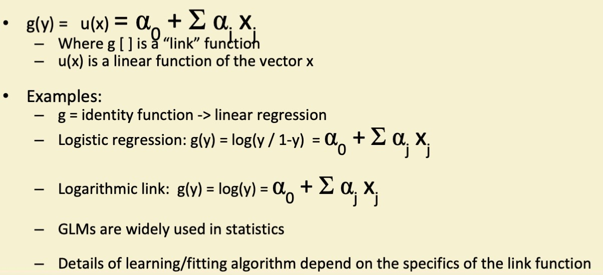

# Non linear regression

---

## Non-linear Regression

- We can generalize further to models that are nonlinear:

where the g's are non-linear functions

- In statistics this is referred to as a generalized linear regression
- Closed form (analytical) solutions are rare
- We have a multivariate non-linear optimization problem

## Optimization in the Non-Linear Case

- We seek the minimum of a function in d dimensions, where d is the number of parameters (d could be large)
- There are a multitude of heuristic search techniques
  - Steepest descent (follow the gradient)
  - Newton methods (use 2nd derivative information)
  - Conjugate gradient
  - Line search
  - Stochastic search
  - Genetic algorithms
- Two cases
  - Convex (nice -> means a single global optimum)
  - Non-convex (multiple local optima -> need multiple starts)

## Other non-linear models

- Splines
  - Patch together different low-order polynomials over different parts of the x-space
  - Works well in 1 dimension, less well in higher dimensions
- Memory-based models

- Local linear regression

## Complexity vs Goodness of Fit

## Generalized Linear Models (GLMs)

## Tree-Structured Regression

- Functional form of model is a "regression tree"
  - Univariate thresholds at internal nodes
  - Constant or linear surfaces at the leaf nodes
  - Yields piecewise constant (or linear) surface
  - (like classification tree, but for regression)
- Very crude functional form... but
  - Can be very useful in high-dimensional problems
  - Can useful for interpretation
  - Can handle combinations of real and categorical variables
- Search problem
  - Finding the optimal tree is intractable
  - Practice: greedy algorithms

## Model Averaging / Ensembles

- Can average over parameters and models
  - E.g., weighted linear combination of predictions from multiple models

y = Σ w~k~ y~y~

- Why? Any predictions from a point estimate of parameters or a single model has only a small chance of the being the best
- Averaging makes our predictions more stable and less sensitive to random variations data set (good for less stable models like trees)
