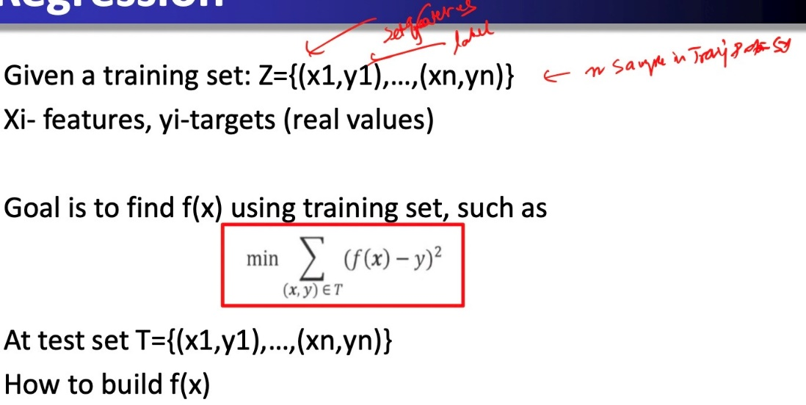
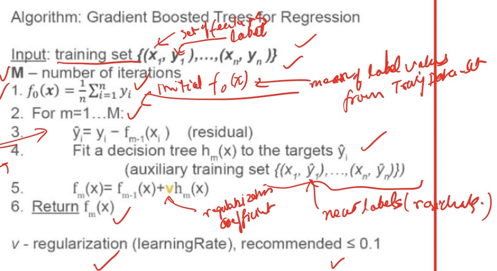
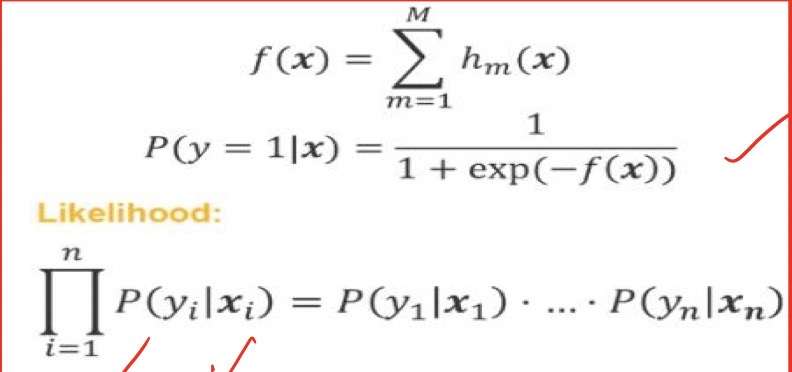
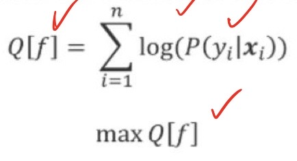

# Predictive Analytics 2

Created: 2019-04-21 13:04:28 +0500

Modified: 2021-10-12 21:14:23 +0500

---

## Gradient Boosted Decision Trees - Regression

## Boosting
-   It is a method for combining outputs of many weak classifiers to produce a powerful ensemble
-   There are several variants of boosting algorithms, AdaBoost, BrownBoost, LogitBoost, and Gradient Boosting

## Big Data
-   Large number of training examples
-   Large number of features describing objects
-   In this situation, it is very natural to assume that you would like to train a really complex model, even having such a great amount of data and hopefully, this model will be accurate.
-   There are two basic ways, in machine learning, to build complex models.
-   The first way is to start with a complex model from the very beginning, and fit its parmeters. This is exactly the way how neural network operates
-   And the second way is to build a complex model iteratively. You can build a complex model iteratively, where each step requires training of a simple model. In context of boosting, these models are called weak classifiers, or base classifiers

## Regression

## Gradient Boosted Trees for Regression

How to build such f(x)?

In boosting, our goals is to build the function f(x) iteratively. We suppose that this function f(x) is just a sum of other simple functions, hm(x)

And particular, you assume that each function h,(x) is a decision tree

## Algorithm: Gradient Boosted Trees for Regression

## Optimization Theory
-   You may have noticed that **gradient boosting is somewhat similar to the gradient descent in the optimization theory.** If we want to minimize a function in the optimization theory using the gradient descent, we make a small step in the direction opposite to the gradient.
-   Gradient of the function, by definition, is a vector which points to the direction with the fastest increase. Since we want to minimize the function, we must move to the direction opposite to the gradient. To ensure convergence, we must make very small steps. So you're multiplying each gradient by small constant, which is called step size. It is very similar to what we do in gradient boosting
-   And gradient boosting is considered to be a minimization in the functional space

## Summary
-   **Boosting** is a method for combining outputs of manu weak classifiers or regressors to produce a powerful ensemble
-   **Gradient Boosting** is a gradient descent minimization of the target function in the functional space
-   **Gradient Boosting with Decision Trees** is considered to be the best algorithm for general purpose classification or regression problems

## Gradient Boosted Decision Trees

## Classification

## Gradient Boosted Trees for Classification

How we are going to build such the function, f(x)?

We use a probabilistic model by using the following expression

We model the probability of belonging of an object to the first class. And here inside the exp, there is the sum of hm(x), and each hm(x) is a decision tree.

We can easily check that such expression for probability will be always between zero and one, so it is normal regular probability

## Sigmoid Function

This function is called the sigmoid function, which maps all the real values into the range between zero and one

Let us denote the sum of all hm(x) by f(x). It is an ensemble of decision trees. Then you can write the probability of belonging to the first class in a simple way using f(x). And the main idea which is used here is called the principle of maximum likelihood

## What is it? First of all, what is the likelihood?

Likelihood is a probability of absorbing some data given a statistical model. If we have a data set with an objects from one to, then the probability of absorbing such data set is the multiplication of probabilities for all single objects. This multiplication is called the likelikhood.

## The principle of maximum likelihood
-   Algorithm: find a function f(x) maximizing the likelihood
-   Equivalent: find a function f(x) maximizing the logarithm of the likelihood
-   (since logarithm is a monotone function)

We will denote by Q[f] the logarithm of the likelihood, and now, it is sum of all logarithms of probabilities and you are going to maximize this function

We will use shorthand for this logarithm L(yi, f(x)i). It is the logarithm of probability. And here, we emphasize that this logarithms depend actually on the true label, yi and our prediction, f(x)i, Now, Q[f] is a sum of L(yi, f(x)i)

## Algorithm: Gradient Boosted Trees for Classification

## Stochastic Boosting

## Sampling with Replacement

## Tips for Usage
-   First of all, it is important to understand how the regularization parameter works. In this figure, you can see the behavior of the gradient boosted decision trees algorithm with two variants of this parameter, 0.1 and 0.05
-   What happens here, at the initial stage of learning the variant with parameter 0.1 is better because it has lower testing error
-   At each iteration, you measure a testing error of our ensemble on the hold out data set
-   But eventually, the variant with lower regularization, 0.05, reach lower testing error. Finally, this variant turns out to be superior
-   It is a very typical behavior, and you should not stop your algorithm after several dozen iterations. You should proceed until convergence
-   Convergence happens when your testing error doesn't change a lot. The variant with lower regularization converges more slowly, but eventually it builds a better model

-   The recommended learningRate should be less or equal than 0.1
-   The bigger your data set is, the larger number of iterations should be
-   The recommended number of iterations ranges from several hundred to several thousand
-   Also, the more features you have in your data set, the deeper your decision tree should be
-   These are very general rules because the bigger your data set is, the more features you have, the more complex model you can build without overfitting

## Summary
-   It is a best method for a general purpose classification and regression problems
-   It automatically handles interactions of features, because in the core, it is based on decision trees, which can combine several features in a single tree
-   But also, this algorithm is computationally scalable. It can be effectively executed in the distributed environment, for example, in Spark. So it can be executed at the top of the Spark cluster
-   But also, this algorithm has a very good predictive power. But unfortunately, the models are not interpretable
-   The final ensemble effects is very large and cannot be analyzed by a human expert
-   There is always a tradeoff in ML, between predictive power and interpretability, because the more complex and accurate your model is, the harder is the analysis of this model by a human
