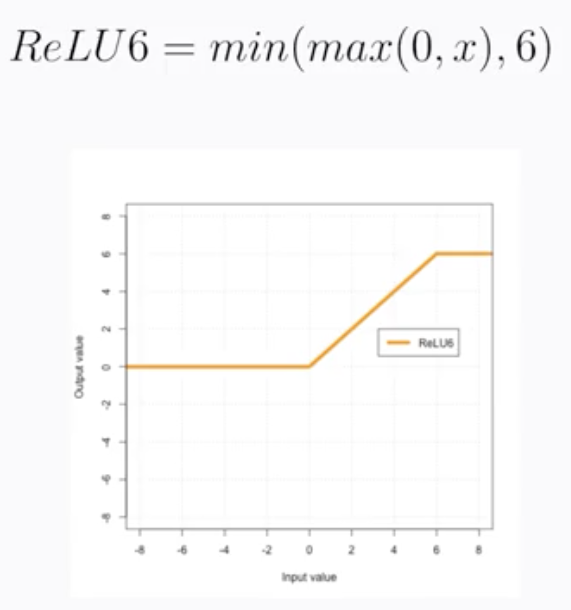

# Regularization

Created: 2018-07-13 01:44:47 +0500

Modified: 2021-07-05 09:41:19 +0500

---

**Regularization** - Techniques used to generalize a model

**Methods**
-   Early Stopping
-   Parameter Norm Penalties
    -   L1 regularization
    -   L2 regularization
    -   Max-norm regularization
-   Dataset Augmentation
-   Noise Robustness
-   Sparse Representations

We use regularization method that penalize model complexity

Both L1 and L2 regularization techniques represent the model complexity as the magnitude of the weight vector, and try to keep that in check.

Magnitude of a vector is represented by the norm function

Here lambda, is a simple scalar value that allows us to control how much emphasis we want to put on model simplicity over minimizing training error.

# Learning Rate and Batch Size

By properly shuffling the dataset, you'll ensure each batch is representative of the entire dataset. Remember, the gradient are computed within the batch. If the batch is not representative, the loss will jump around too much from batch to batch.

![How to change optimizer, learning rate, batchsize train_fn = tf.estimator.inputs.pandas_input_fn( batch_size=10) myopt = tf.train. model = tf.estimator. LinearRegressor( optimizer=myopt) model. train(input_fn=train_fn, steps=1ØOØ0) 1. 2. 3. 4. 5. Control batch size via the input function Control learning rate via the optimizer passed into model Set up regularization in the optimizer Adjust number of steps based on batch _ size, learning rate Set number of steps, not number of epochs because distributed training doesn't play nicely with epochs. ](media/Regularization-image11.png)

![Learning Rate and Batch Size Quiz, 5 questions Congratulations! You passed! 5/5 points (100.00%) Next Item points points points points points 1. 2. 3. 4. 5. What is the key reason that we want to penalize models for over-complexity? Overly-complex models may not be generalizable to real-world scenarios on unseen data Correct Correct. This is just another way of saying that overly complex models have a greater tendency to overfit. O O Overly-complex models are slower to train Overly-complex models are harder to implement or maintain in production environments. If your learning rate is too small, your loss function will: O Converge very slowly Correct O Converge very fast If your learning rate is too high, your loss function O Will converge rapidly to the lowest error value possible O Will converge slowly to the lowest error value possible O Will converge rapidly, but then start to increase again (D Will converge rapidly, but not reach the lowest error value possible Correct If your batch size is too high, your loss function will O Converge slowly Correct O Oscillate wildly If your batch size is too low, your loss function will: O Oscillate wildly Correct O Converge slowly 0 ](media/Regularization-image12.png)

# Hyperparameter Tuning
-   Differentiate between parameters and hyperparameters
-   Think beyond simple grid search algorithms

Parameter - real valued variable that changes during model training like all weights and biases

Hyperparameter - is a setting that we set before training and it doesn't change afterwards
-   learning rate
-   regularization rate
-   batch size
-   number of hidden layers in neural net
-   number of neurons in each layer

There are a variety of model parameters too
-   Size of model
-   Number of hash buckets
-   Embedding size

Wouldn't it be nice to have the NN training loop do meta-training across all these parameters

How to use Cloud ML Engine for hyperparameter tuning

1.  Make the parameter a command-line argument

2.  Make sure outputs don't clobber each other

3.  Supply hyperparameters to training job

![1. Make the hyperparameters as command-line arguments parser. add_argument ( ' --nbuckets' , help = 'Number of buckets into which to discretize lats and Ions' , default = 10, type = int parser. add ar ument ' --hidden units', help = 'List of hidden layer sizes to use for DNN feature columns' , nargs = [128, 32, 4] default = ](media/Regularization-image17.png)

![3. Supply hyperparameters to training job %writefile hyperparam.yaml traininglnput : scaleTier: STANDARD 1 hyperparameters : oal: MINIMIZE hyperparameterMetricTag: rms max r a s: maxPara11e1Tria1s: 1 params : - parameterName: train_batch type: INTEGER minVa1ue: 64 maxVa1ue: 512 scaleType: - parameterName: nbuckets type: INTEGER minVa1ue: 10 maxVa1ue: 20 size scaleType: UNIT_LINEAR SCALE - parameterName: hidden_units type: CATEGORICAL categoricalVa1ues: ["128 64 32", " 256 128 gcloud ml-engine jobs submit training $JOBNAME  --region=$REGION  --module-name=trainer.task  - -config-hyperparam.yaml  16", "512 128 64") ](media/Regularization-image19.png)

![Hyperparameter Tuning Quiz, 4 questions Congratulations! You passed! 4/4 points (100.00%) Next Item points points points points 2. 3. 4. If searching among a large number of hyperparameters, you should do a systematic grid search rather than start from random values, so that you are not relying on chance. True or False? True O False Correct Correct. Because you don't know which hyperparamerters are more important than others, use a smart algorithm that can choose the direction and granularity of your search. In such a smart algorithm, it is a good idea to start with well- distributed, random initial starting points. It is a good idea to use the training loss itself as the hyperparameter tuning metric. True or False? True (O) False Correct Correct, you want to use an eval-metric as your hyperparameter tuning metric so that you are not rewarding models that overfit. Hyperparameter tuning in Cloud ML Engine involves adding the appropriate TensorFIow function call to your model code. True or False? O True (O False Correct Correct. Often, it is simply a matter of submitting a training job with an additional configuration setting You are creating a model to predict the outcome (final score difference) of a basketball game between Team A and Team B. Your initial model is a neural network with [64, 32] nodes, learning_rate = 0.05, batch_size = 32. The input features include whether the game was played "at home" for Team A, the fraction of the last 7 games that Team A won, the average number of points scored by Team A in its last 7 games, the average score of Team A's opponents in its last 7 games, etc. Which of these are hyperparameters to the model? The number of nodes in each layer of the DNN Correct The number of previous games that the input features are averaged over Correct Correct. It is possible that we need to look back only 3 games, or that we have to look back 15 games. We don't know before hand what the right number is. Because this is the creation of the input feature itself, formulating it as a hyperparameter is a little tricky. However, this is a hyperparameter, and in practice, you do want to experiment. he batch size Correct The number of layers in the DNN Correct The learning rate Correct 0 ](media/Regularization-image20.png)

-   Regularization for sparsity
-   Logistic regression
-   Introduction to Neural Networks
-   Training Neural Networks

# Regularization for Sparsity

Some other norms or the L0 norm that we already covered which is the count of the non-zero values in a vector, and the L infinity norm which is the maximum absolute value of any value in a vector. In practice though, usually the L2-norm provides more generalizable models and the L1 norm. However, we will end up with much more complex heavy models if we use L2 instead of L1. This happens because often features have high correlation with each other,and L1 regularization which use one of them and throw the other away,whereas L2 regularization will keep both features and keep their weight magnitudes small.So with L1, you can end up with a smaller model but it may be less predictive.Is there any way to get the best of both worlds?

[The elastic net is just a linear combination of the L1 and L2 regularizing penalties.]{.underline}This way, you get the benefits of sparsity for really poor predictive features whilealso keeping decent and great featureswith smaller weights to provide a good generalization.The only trade off now is there aretwo instead of one hyper parameters totune with the two different Lambda regularization parameters.

<https://goo.gl/281mPF>

Question

1.  Which type of regularization is more likely to lead to zero weights? **- L1**

2.  Which type of regularization penalizes large weight values more? **- L2**

# Logistic Regression

# Introduction to Neural Networks

![Û ıv15 ıv18 1114 1117 ıx3 [IVII ili] ıx3 3x3 1112 1118 3x3 1116 1119 12 3xı 12 13 3xı ](media/Regularization-image42.png)

#  

Parametric ReLU

Exponential Linear Unit

Neural networks can be arbitrarily complex,there can be many layers,neurons per layer, outputs, inputs,different types activation functions et cetra.

What does the purpose of multiple layers?Each layer I add,adds the complexity of the functions I can create.Each subsequent layer is a composition of the previous functions.Since we are using nonlinear activation functions in my hidden layers,I'm creating a stack of data transformations that rotate,stretch and squeeze my data.Remember, the purpose of doing all of this isto transfer my data in such a way that can nicelyfit hyper plane to it for regression orseparate my data with a hyper planes for classification.We are mapping from the original feature space to some new convoluted feature space.

What does adding additional neurons to a layer do?Each neuron I add, adds a new dimension to my vector space.If I begin with three input neurons,I start in R3 vector space.But if my next layer has four neurons that I moved to an R4 vector space.Back when we talked about Kernel methods in our previous course,we had a data set that couldn't be easily separatedwith a hyper plane in the original input vector space.But, by adding the dimension and then transformthe data to fill that new dimension in just the right way,we were then easily able to make a clean slice between the classes of data.The same applies here with neural networks.

What might having multiple output nodes do?Having multiple output nodes allows you tocompare to multiple labels and then propagate the corresponding areas backwards.You can imagine doing image classification where there aremultiple entities or classes within each image.We can't just predict one class because there maybe many,so having this flexibility is great.

# 

# Training Neural Networks

![DNNRegressor usage is similar to LinearRegressor = tf.train.AdamOptimizer(1earning_rate=Ø.Ø1) myopt = tf.estimator.DNNRegressor(mode1_dir=outdir model hidden 50, 20], feature columns-INPUT COLS, optimizer-myopt; dropout-e. 1) (100 * len(traindf)) / BATCH_SIZE NSTEPS = model. train(input_fn=train_input_fn, steps=NSTEPS) Use momentum-based optimizers e.g. Adagrad (the default) or Adam. Specify number of hidden nodes. Optionally, can also regularize using dropout ](media/Regularization-image56.png)

![There are benefits if feature values are 1 Roughly zero-centered, [-1, 1] range often works well numbers Small magnitudes help gradient descent converge and avoid NaN trap Avoiding outlier values helps with generalization ](media/Regularization-image58.png)

# 

![Dropout acts as another form of . It forces data to flow down paths so that there is a more even spread. It also simulates learning. Don't forget to scale the dropout activations by the inverse Of the We remove dropout during A. B. C. D. E. F. G. Hyperparameter tuning, similar, deep, drop probability, training Hyperparameter tuning, multiple, deep, drop probability, inference Regularization, multiple, ensemble, keep probability, training Regularization, multiple, ensemble, drop probability, inference Regularization, multiple, ensemble, keep probability, inference Hyperparameter tuning, multiple, deep, keep probability, inference Regularization, similar, ensemble, keep probability, inference ](media/Regularization-image64.png)

![Training Neural Networks Quiz, 4 questions Congratulations! You passed! 4/4 points (100.00%) Next Item points points points points 1. 2. 3. 4. Which of these is a common way that neural network training can fail? Entire layers can die with all their weights becoming zero Correct Gradients can vanish, making it harder to train networks the deeper they are Correct Classification networks can yield outputs greater than 1.0 Un-selected is correct Gradients can explode if the learning rate is too high Correct If you see a dead layer (fraction of zero weights close to 1), what is a reasonable thing to try? O Increase the learning rate O Lower the learning rate Correct I am training a classification neural network with 5 hidden layers, sigmoid activation function, and [1 28, 64, 32, 16, 8] with learning_rate=0.05 and batch_size=32. I notice from TensorBoard that gradients in the third layer are near-zero. Is this a problem? Yes Correct If the gradients are near-zero, then gradient descent will not be able to optimize the weights well. No I am training a classification neural network with 5 hidden layers, sigmoid activation function, and [1 28, 64, 32, 1 6, 8] with learning_rate=0.05 and batch_size=32. I notice from TensorBoard that gradients in the third layer are near-zero. What would you try to fix this? O Increase the learning rate O Try using ReLU activation function Correct Correct. A ReLU will tend not to get taught in diminishing returns, the way a sigmoid can. O Add more layers to the DNN 0 ](media/Regularization-image65.png)

# Multi-Class Neural Networks

![Use one softmax loss for all possible classes = tf.matmul( logits labels = logits for each output - > shape [batch _ size, one-hot encoding in [e, - > shape - [batch _ size, _entropy_with_10gits_v2( node num _ classes] num_classes) num_classes] loss = tf.reduce tf. nn. softmax mean( cross logits, labels) -Y shape [batch _ size] ](media/Regularization-image71.png)

![2. If you have a classification problem with multiple labels, how does the neural network architecture change? O Instead of a logistic layer, use a softmax layer (O Have a logistic layer for each label, and send the outputs of the logistic layer to a softmax layer Correct If you have thousands of classes, computing the cross-entropy loss can be very slow. Which of these is a way to help address that problem? O Use a noise-contrastive loss function Correct O Combine the categories hierarchically and train multi-stage neural networks ](media/Regularization-image76.png)

