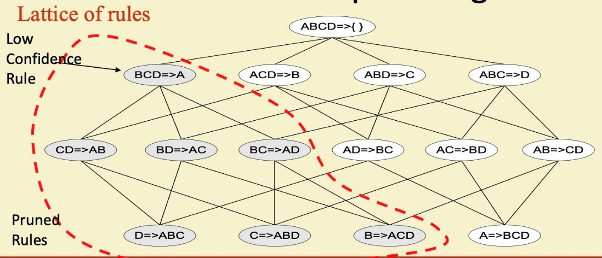

# Rule generation & Pattern Evaluation

Created: 2019-03-10 13:27:38 +0500

Modified: 2021-11-14 21:17:37 +0500

---

monotone - a continuing sound, especially of a person's voice, that is unchanging in pitch and without intonation.

Ex - "he sat and answered the questionsin a monotone"

According to wikipedia.. a monotonic function is a function that is either increasing or decreasing.. if a function is increasing and decreasing then its not a monotonic function or its an anti-monotonic .

In data mining, what would be a monotonic function would be the support function of an itemset (its frequency in the transaction database). But when "frequent" (i.e sup(X) > supmin) is our criteria : "if a set is frequent, then all of its subset are frequent too",*and also*"if a set is infrequent then all of its superset are also infrequent." The combination of both means the anti-monotonicity in this context.

**Rule Generation**
-   How to efficiently generate rules from frequent itemsets?
    -   In general, confidence does not have an anti-monotone property
    -   But confidence of rules generated from the same itemset has an anti-monotone property
    -   e.g., L = {A,B,C,D}

c (ABC -> D) >= c(AB -> CD) >= c(A -> BCD)
-   Confidence is anti-monotone w.r.t. number of items on the RHS of the rule

Confidence(X -> Y) - Measures how often transactions Y apper in transactions that contain X

c(ABC -> D) = |ABCD| / |ABC|

Therefore

|ABCD| / |ABC| >= |ABCD| / |AB| >= |ABCD| / |A|

Since,

|ABC| <= |AB| <= |A|

**Rule Generation for Apriori Algorithm**

-   Candidate rule is generated by merging two rules that share the same prefix in the rule consequent
-   join (CD => AB, BD => AC) would produce the candidate rule D => ABC
-   Prune rule D => ABC if its subset AB => BC does not have high confidence

![There are lots of measures proposed in the literature Some measures are good for certain applications, but not for others What criteria should we use to determine whether a measure is I 2 3 4 5 6 7 8 9 10 11 12 13 14 Measure 4-coeffci«rt Goodxna.n-KM1ßEi.1's (A) Odds ratio (a) Yule's Q Yule's Y Kappa (K) Mutual Inforxnation (M) J-Measure (J) Gini index (G) Support (s) C,anfidence (e) Laplace (L) Cc:rnriction (V) I-nterest (I) Forxnu-la IOS rna.x (P(A, B) ) + pc u P(A, B) log(5tB) + P(A, B) IA), P(AIB)) P(B) p_1Ä) P(AB) P(UA) ](media/Rule-generation-&-Pattern-Evaluation-image9.png)

