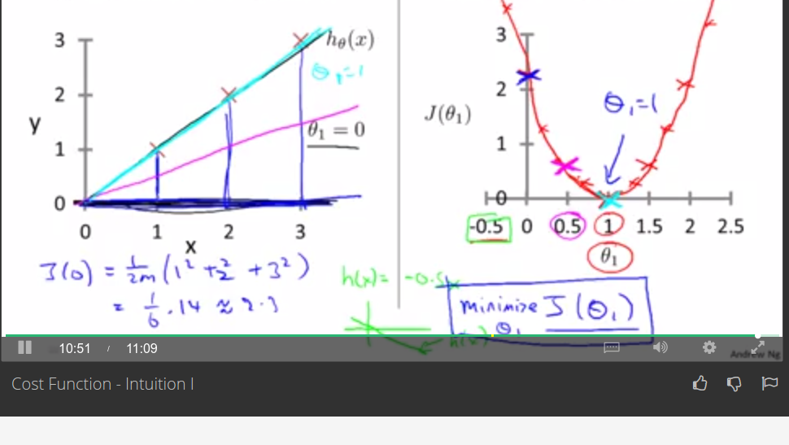
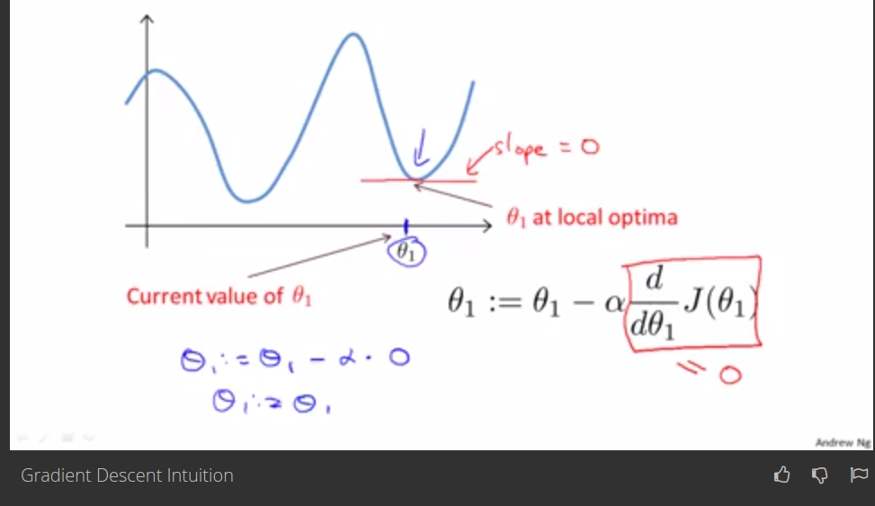

# Andrew NG

Created: 2017-11-16 14:18:32 +0500

Modified: 2021-07-05 09:50:57 +0500

---

**Model and cost function:**

1.  Model representation - Linear regression using Training set

m - number of training examples

x's - input variables / features

y's - output variable / "target" variable

(x,y) - one training example

**2. Cost function**

Cost function intuition -

Octave
-   **Singular Value Decomposition (SVD)**

Every nxm matrix can be written as a product of three smaller matrices.

-   SVD appreas in lots of places
    -   Statistics (PCA)
    -   Chemical physics
    -   Image processing
    -   Genomics
    -   Robotics
    -   Quantum physics (entanglement)
    -   Data embeddings / vector embeddings

**Gradient Descent for Linear regression with one variable**

Gradient descent intuition

**Derivative term**

**Alpha**

**Gradient Descent for Linear Regression**

Gradient descent is a convex function (Global minimum)

Also called (Batch gradient descent) becauses look at all training sample.

![09:04 Which of the following are true statements? Select all that apply. To make gradient descent converge, we must slowly decrease a over time. Correct Response Gradient descent is guaranteed to find the global minimum for any function J(BO , 91 ). Correct Response Gradient descent can converge even if a is kept fixed. (But a cannot be too large, or else it may fai to converge.) Correct Response For the specific choice of cost function J(BO , 91) used in linear regression, there are no local optima (other than the global optimum). Correct Response Continue 10:20 ](media/Andrew-NG-image18.png)

Linear Algebra Review

Matrix - Rectangular array of numbers.

Dimension of matrix : number of rows * number of columns

Vector - is a matrix with one column (n*1 matrix)

Uppercase for matrices

Lower case for others variables, vectors, etc.

Addition and Scalar Multiplication

Scalar multiplication is 3* matrix (n*matrix).

Scalar division is ⅓ * matrix

Matrix Vector Multiplication

Calculating hypothesis using matrix-vector multiplication in octave its easy

Matrix - Matrix multiplication

If we have 3 hypothesis with 4 houses then,

Multiplication Properties
-   Multiplication is not commutative ( A*B not equal to B*A)
-   Multiplication is Associative ( a*(b*c) = (a*b)*c)
-   Identity matrix (A.I = I.A = A)

Matrix Inverse and Transpose

Matrix Inverse:
-   0 does not have an inverse.
-   3 inverse is 3-1
-   Matrix inverse ( A * A-1 = Identity)
-   Matrix that don't have an inverse are singular or degenerate matrix
-   Ex- 0 matrix doesn't have inverse.

Matrix Transpose:

