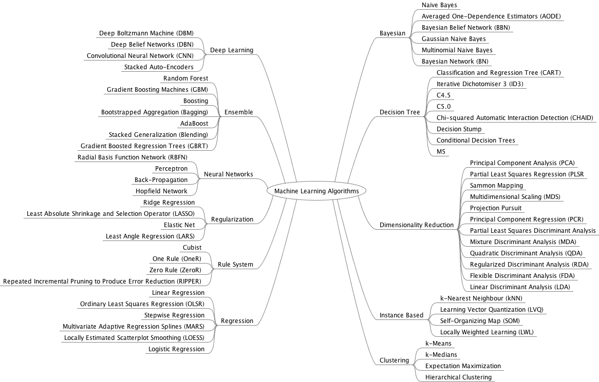
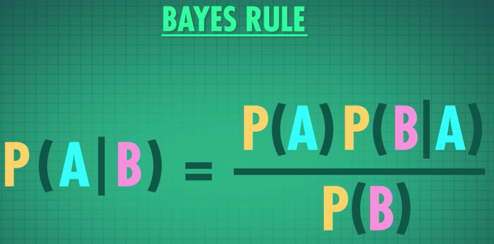
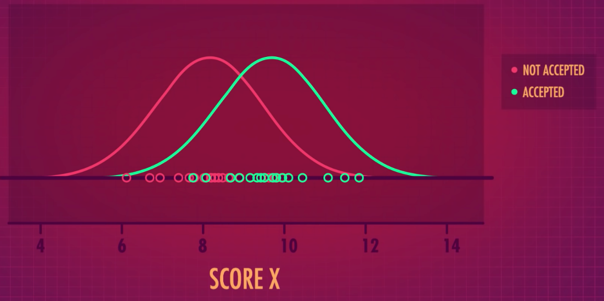
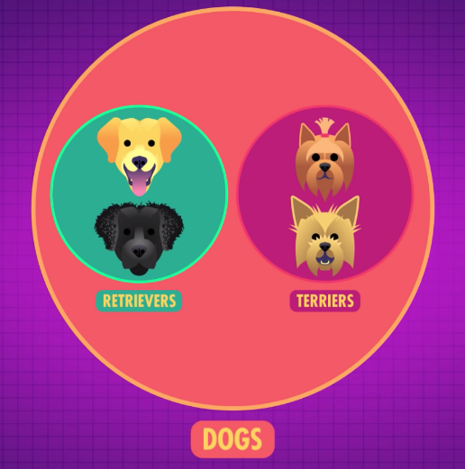
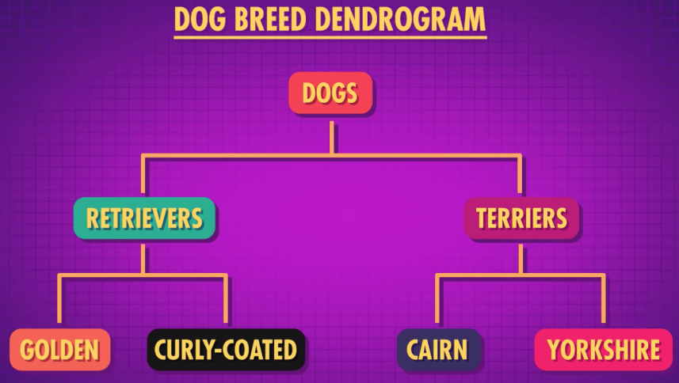

# ML Classification

## Types of ML Algorithms

1. Parametric Machine Learning Algorithms
    - Algorithms that simplify the function to a known form
    - The algorithms involve two steps

        1. Select a form for the function

        2. Learn the coefficients for the function from the training data
    - Examples
        - Linear Regression
        - Logistic Regression

2. Non-Parametric Machine Learning Algorithms

Algorithms that do not make strong assumptions about the form of the mapping function. By not making assumptions, they are free to learn any functional form from the training data. Non-parametric methods are often more flexible, achieve better accuracy but require a lot more data and training time.

Examples

- Support Vector Machines (SVM)
- Neural Networks
- Decision Trees

3. Linear Algorithms
    - Linear Regression
    - Logistic Regression
    - Linear Discriminant Analysis (LDA)

4. Non-Linear Algorithms
    - Classification and Regression Trees
    - Naive Bayes
    - K-Nearest Neighbor
    - Learning Vector Quantization (LVQ)
    - Support Vector Machines

5. Ensemble Algorithms
    - Bagging with Decision Tree
    - Boosting with AdaBoost

## Kinds of ML problems

Machine learning tasks are typically classified into two broad categories, depending on whether there is a learning "signal" or "feedback" available to a learning system

## Supervised Learning

The computer is presented with example inputs and their desired outputs, given by a "teacher", and the goal is to learn a general rule that [maps](https://en.wikipedia.org/wiki/Map_(mathematics)) inputs to outputs. As special cases, the input signal can be only partially available, or restricted to special feedback: (Discrete number of values / classes)

- **Regression Problem**
  - Predict continuous valued output (price)
  - Right answer were given (ex- to sell the house at highest price) either use linear function or use quadratic function. Maximize the profit to the use by trying to learn by experimenting and learning.
- **Classification Problem**
  - Classify the problem, according to its category.
  - Like cancer, benign or malignant using tumor size.
  - Discrete valued output.
  - Give the probability of what the subject is (either benign or malignant)
  - Number of features (variables or attributes) can increase (tumor size + age)
- **Tagging**

The problem of learning to predict classes that are not mutually exclusive is called**multi-label classification.** Auto-tagging problems are typically best described as multi-label classification problems. Think of the tags people might apply to posts on a technical blog, e.g., "machine learning", "technology", "gadgets", "programming languages", "Linux", "cloud computing", "AWS". A typical article might have 5--10 tags applied because these concepts are correlated. Posts about "cloud computing" are likely to mention "AWS" and posts about "machine learning" could also deal with "programming languages".

- **Search**
- **Recommender Systems**
- **Sequence Learning**

**sequence learning** require a model to either ingest sequences of inputs or to emit sequences of outputs (or both). Specifically, **sequence to sequence learning considers problems where input and output are both variable-length sequences, such as machine translation and transcribing text from the spoken speech

- Tagging and Parsing
- Automatic Speech Recognition
- Text to Speech
- Machine Translation

## Unsupervised Learning

No labels are given to the learning algorithm, leaving it on its own to find structure in its input. Unsupervised learning can be a goal in itself (discovering hidden patterns in data) or a means towards an end ([feature learning](https://en.wikipedia.org/wiki/Feature_learning)).

- Given the data set find some structure in the data.
- **Clustering algorithm**
  - Google news uses clustering algorithm to group in cohesive stories. Different news source with same news are group into one story.
  - DNA are clustered according to genes (one type of gene are grouped together) (or group people according to the gene present)
  - We are not giving answer to the algorithm so it's unsupervised learning.
    - Organize computing clusters in data centers to group together servers together to increase performance.
    - Social network analysis
    - Market segmentation
    - Astronomical data analysis
- **Cocktail Party Problem**
  - 2 speakers, 2 microphones different distance from each user, unsupervised learning algorithm will separate the two overlapping voices and remove the background voice.
  - Use OCTAVE

- [Semi-supervised learning](https://en.wikipedia.org/wiki/Semi-supervised_learning): the computer is given only an incomplete training signal: a training set with some (often many) of the target outputs missing.

- [Active learning](https://en.wikipedia.org/wiki/Active_learning_(machine_learning)): the computer can only obtain training labels for a limited set of instances (based on a budget), and also has to optimize its choice of objects to acquire labels for. When used interactively, these can be presented to the user for labeling.

- [Reinforcement learning](https://en.wikipedia.org/wiki/Reinforcement_learning): training data (in form of rewards and punishments) is given only as feedback to the program's actions in a dynamic environment, such as [driving a vehicle](https://en.wikipedia.org/wiki/Autonomous_car) or playing a game against an opponent.

- Predictive Modelling or predictive analytics: learn the mapping Y = f(X) to make predictions of Y for new X.

## Categories of ML Techniques

- Classification
- Regression
- Cluster Analysis
- Association Analysis

## Classification

Goal: predict category

- In classification, the goal is to predict the category of the input data. An example of this is predicting the weather as being sunny, rainy, windy, or cloudy

## Regression

- When your model has to predict a numeric value instead of a category, then the task becomes a regression problem
- Ex: predict the price of a stock
- The main diff between classification and regression is in classification you're predicting a category and in regression, you're predicting a numeric value

## Regression Examples

- Estimating the demand of a product based on time or season of the year
- Predicting a score on a test
- Determining the likelihood of how effective a drug will be for a particular patient
- Predicting the amount of rain for a region

## Cluster Analysis

- In cluster analysis, the goal is to organize similar items in your data set into groups. A very. common application of cluster analysis is referred to as customer segmentation. This means that you're separating your customer base into different groups or segments based on customer types
- For example it would be very beneficial to segment your customers into seniors, adults and teenagers. These groups have different likes and dislikes and have different purchasing behaviors. By segmenting your customers to different groups you can more effectively provide marketing adds targeted for each groups particular interests. Note that cluster analysis is also referred to as clustering

## Cluster Analysis Examples

- Identifying areas of similar topography, such as desert region, grassy areas, mountains
- Categorizing different types of tissues from medical images. Determining different groups of weather patterns, such as snowy, dry, monsoon
- Discovering hot spots for different types of crime from police reports

## Association Analysis

- The goal in association analysis is to come up with a set of rules to capture associations between items or events. The rules are used to determine when items or events occur together
- A common application of association analysis is known as market basket analysis. Which is used to understand customer purchasing behavior
- For example, association analysis can reveal that banking customers who have CDs, or Cetificates of Deposits, also tend to be interested in other investment vehicles such as money market accounts
- This information can be used for cross selling. If you advertise money market accounts to your customers with CDs they are likely to open such an account

## Association Analysis Examples

- Some other applications of association analysis are recommending similar items based on the purchasing behavior or browsing histories of customers
- Finding items that are often purchased together, such as garden hose and potting soil, and offer sales on these related items at the same time to drive sales of both items
- Identifying web pages that are often accessed together so that you can more efficiently offer up these related web pages at the same time

## Supervised vs Unsupervised

- **In supervised approaches** the target, which is what the model is predicting, is provided. This is referred to as having labeled data because the target is labeled for every sample that you have in your data set.
- Referring back to our example of predicting a weather category of sunny, windy, rainy or cloudy, every sample in the data set is labeled as being one of these four categories. So the data is labeled and predicting the weather categories is a supervised task. In general, classification and regression are supervised approaches.
- **In unsupervised approaches** on the other hand, the target that the model is predicting is unknown or unavailable. This means that you have unlabeled data
- Remember the cluster analysis example of segmenting customers into idfferent groups. The samples in your data are not labeled with the correct group. Instead, the segmentation is performed using a clustering technique to group items based on characteristics that they have in common
- Thus, the data is unlabeled and the task of grouping customers into different segments is an unsupervised one. In general, cluster analysis and association analysis are unsupervised approaches

## Applications

## Classification (Supervised)

Indentifying to which category an object belongs to

Applications

- Spam detection
- Computer Vision
  - Image recognition
  - Optical Character Recognition (OCR)

<https://opensource.google/projects/tesseract>

<https://github.com/tesseract-ocr/tesseract>

Algorithms

- SVM (Support Vector Machine)

Divides its input space into two regions, separated by a [linear boundary](https://en.wikipedia.org/wiki/Linear_classifier)

- Nearest neighbors
- Random forest

## Regression (Supervised)

Predicting a continuous-valued attribute associated with an object

Applications

- Drug response
- Stock prices

Algorithms

- Support Vector Regression (SVR)
- Ridge regression
- Lasso

## Clustering (Unsupervised)

Automatic grouping of similar objects into sets

Applications

- Customer segmentation
- Grouping experiment outcomes

Algorithms

- k-Means
- Spectral clustering
- Mean-shift

## Dimensionality reduction

Reducing the number of random variables to consider

Applications

- Visualization
- Increased efficiency
- Topic Modeling

[Topic modeling](https://en.wikipedia.org/wiki/Topic_modeling) is a related problem, where a program is given a list of [human language](https://en.wikipedia.org/wiki/Natural_language) documents and is tasked with finding out which documents cover similar topics.

Algorithms

- Principal Component Analysis (PCA)

<http://www.oranlooney.com/post/ml-from-scratch-part-6-pca>

- Feature selection
- Non-negative matrix factorization

## Model selection

Comparing, validating and choosing parameters and models

Goal - Improved accuracy via parameter tuning

Modules

- Grid search
- Cross validation
- Metrics

## Preprocessing

Feature extraction and normalization

Applications - Transforming input data such as text for use with machine learning algorithms

Modules

- Preprocessing
- Feature extraction

## Density Estimation

[Density estimation](https://en.wikipedia.org/wiki/Density_estimation) finds the [distribution](https://en.wikipedia.org/wiki/Probability_distribution) of inputs in some space

Among other categories of machine learning problems, [learning to learn](https://en.wikipedia.org/wiki/Meta_learning_(computer_science)) learns its own [inductive bias](https://en.wikipedia.org/wiki/Inductive_bias) based on previous experience.[Developmental learning](https://en.wikipedia.org/wiki/Developmental_robotics), elaborated for [robot learning](https://en.wikipedia.org/wiki/Robot_learning), generates its own sequences (also called curriculum) of learning situations to cumulatively acquire repertoires of novel skills through autonomous self-exploration and social interaction with human teachers and using guidance mechanisms such as active learning, maturation, motor synergies, and imitation.

- Targeted ads on mobile apps
- Sentiment analysis
- Climate monitoring
- Crime pattern detection
- Drug effectiveness analysis

## Approaches

1. **Decision tree learning**

Decision tree learning uses a [decision tree](https://en.wikipedia.org/wiki/Decision_tree) as a [predictive model](https://en.wikipedia.org/wiki/Predictive_modelling), which maps observations about an item to conclusions about the item's target value.

2. **Association rule learning**

Association rule learning is a method for discovering interesting relations between variables in large databases.

3. **Artificial neural networks**

An [artificial neural network](https://en.wikipedia.org/wiki/Artificial_neural_network)(ANN) learning algorithm, usually called "neural network" (NN), is a learning algorithm that is vaguely inspired by [biological neural networks](https://en.wikipedia.org/wiki/Biological_neural_networks). Computations are structured in terms of an interconnected group of [artificial neurons](https://en.wikipedia.org/wiki/Artificial_neuron), processing information using a [connectionist](https://en.wikipedia.org/wiki/Connectionism) approach to [computation](https://en.wikipedia.org/wiki/Computation). Modern neural networks are [non-linear](https://en.wikipedia.org/wiki/Non-linear)[statistical](https://en.wikipedia.org/wiki/Statistical)[data modeling](https://en.wikipedia.org/wiki/Data_modeling) tools. They are usually used to model complex relationships between inputs and outputs, to [find patterns](https://en.wikipedia.org/wiki/Pattern_recognition) in data, or to capture the statistical structure in an unknown [joint probability distribution](https://en.wikipedia.org/wiki/Joint_probability_distribution) between observed variables.

4. **Deep learning**

Falling hardware prices and the development of [GPUs](https://en.wikipedia.org/wiki/GPU) for personal use in the last few years have contributed to the development of the concept of [deep learning](https://en.wikipedia.org/wiki/Deep_learning) which consists of multiple hidden layers in an artificial neural network. This approach tries to model the way the human brain processes light and sound into vision and hearing. Some successful applications of deep learning are [computer vision](https://en.wikipedia.org/wiki/Computer_vision) and [speech recognition](https://en.wikipedia.org/wiki/Speech_recognition).

5. **Inductive logic programming**

Inductive logic programming (ILP) is an approach to rule learning using [logic programming](https://en.wikipedia.org/wiki/Logic_programming) as a uniform representation for input examples, background knowledge, and hypotheses. Given an encoding of the known background knowledge and a set of examples represented as a logical database of facts, an ILP system will derive a hypothesized logic program that [entails](https://en.wikipedia.org/wiki/Entailment) all positive and no negative examples.[Inductive programming](https://en.wikipedia.org/wiki/Inductive_programming) is a related field that considers any kind of programming languages for representing hypotheses (and not only logic programming), such as [functional programs](https://en.wikipedia.org/wiki/Functional_programming).

6. **Support vector machines**

Support vector machines (SVMs) are a set of related [supervised learning](https://en.wikipedia.org/wiki/Supervised_learning) methods used for [classification](https://en.wikipedia.org/wiki/Statistical_classification) and [regression](https://en.wikipedia.org/wiki/Regression_analysis). Given a set of training examples, each marked as belonging to one of two categories, a SVM training algorithm builds a model that predicts whether a new example falls into one category or the other.

7. **Clustering**

Cluster analysis is the assignment of a set of observations into subsets (called *clusters*) so that observations within the same cluster are similar according to some predesignated criteria, while observations drawn from different clusters are dissimilar. Different clustering techniques make different assumptions on the structure of the data, often defined by some *similarity metric* and evaluated for example by *internal compactness* (similarity between members of the same cluster) and *separation* between different clusters. Other methods are based on *estimated density* and *graph connectivity*. Clustering is a method of [unsupervised learning](https://en.wikipedia.org/wiki/Unsupervised_learning), and a common technique for [statistical](https://en.wikipedia.org/wiki/Statistics)[data analysis](https://en.wikipedia.org/wiki/Data_analysis).

8. **Bayesian networks**

A Bayesian network, belief network or directed acyclic graphical model is a [probabilistic graphical model](https://en.wikipedia.org/wiki/Graphical_model) that represents a set of [random variables](https://en.wikipedia.org/wiki/Random_variables) and their [conditional independencies](https://en.wikipedia.org/wiki/Conditional_independence) via a [directed acyclic graph](https://en.wikipedia.org/wiki/Directed_acyclic_graph)(DAG). For example, a Bayesian network could represent the probabilistic relationships between diseases and symptoms. Given symptoms, the network can be used to compute the probabilities of the presence of various diseases. Efficient algorithms exist that perform [inference](https://en.wikipedia.org/wiki/Inference) and learning.

9. **Reinforcement learning**

Reinforcement learning is concerned with how an *agent*ought to take *actions*in an *environment*so as to maximize some notion of long-term *reward*. Reinforcement learning algorithms attempt to find a *policy* that maps *states*of the world to the actions the agent ought to take in those states. Reinforcement learning differs from the [supervised learning](https://en.wikipedia.org/wiki/Supervised_learning) problem in that correct input/output pairs are never presented, nor sub-optimal actions explicitly corrected.

10. **Representation learning**
11. **Similarity and metric learning**
12. **Sparse dictionary learning**
13. **Genetic algorithms**
14. **Rule-based machine learning**
15. **Learning classifier systems**

## Techniques

1. **Statistics and Data Analysis**

   - Hypothesis testing

   - Exploratory Data Analysis

   - Data Manipulation

2. **Machine Learning**

   - Decision Tree

   - Clustering

   - Naive Baiyes

   - Principle Component Analysis

   - Linear Regression (Statistical Inference Technique)

   - Logistic Regression (Probability - Catagorical)

   - Telecom Churn Perdition Project

3. **Others**

   - Least squares Error Function

   - Gradient Descent

   - Multivariate Regression

   - Sigmoid Function

1. **Supervised Machine Learning**
    - Logistic Regression
        - Logistic Regression is a simple twist on Linear Regression. It gets its name from the fact that it is a regression that predicts what's called the Log Odds of an event occuring.
        - Divide data in Training data and Test data
        - Calculate the accuracy for every iteration

- **Linear Discrimant Analysis (LDA)**
  - Uses Bayes' theorem to predict the results
  - Bayes' rule

- If there are two variables (like GPA and SAT and we have to predict whether a student got admission or not) then LDA is very helpful. It creates a unified value (only one variable) which maximizes the difference between the two groups (got admission or not)

- Reducing the number of variables we have to deal with is called **Dimensionality Reduction**, and it's really important in the world of **Big Data**.

- **K Nearest Neighbors (KNN)**
  - Relies on the idea that **data points will be similar to other data points** that are near it.

- KNN Classifier - Predicts which group something will be in; It classifies it

2. **Unsupervised Machine Learning**
    - **Clustering**

       - K-means
            - Choose k random points called Centroid
            - Assign other points closest to centroid to their groups
            - Calculate the new centroid for the set of points of each group
            - Repeat the process of assigning points to group and choosing new centroid

## Silhouette score

Helps determine how well fit our clusters are, even without existing labels.

- Hierarchical clustering

Example of hierarchical clustering -

In the latest version of the diagnostic and statistical manual of mental disorders (DSM), autism, aspergers and childhood disintegrative disorder are now classified as a single disorder that has various levels of severity, hence the spectrum part of Autism Spectrum Disorder (ASD). ASD now applies to a large range of traits.

- Agglomerative Clustering

3. **Statistics in the Courts**

Prosecutor's Fallacy

- Incorrectly claims that since the evidence found is so unusual or unlikely, that the jury could assume that the accused defendent isn't innocent
- Secondly, the fact that one hypothesis is unlikely does not mean that another must be more likely

4. **Neural Networks**
    - **Looks at data and tries to figure out the function - or set of calculations - that turns the input (variables) into the output**
    - **Activation function - Takes the value and transforms it before returning an output**
    - **ReLU (Rectified Linear Unit) - Output 1 if input is positive and doesn't output anything if input is zero or negative**
    - **Feature generation - combining multiple variables to create new values**
    - **Deep learning - if there are more than 1 layer in a neural network**
    - **Feed forward neural network - feed all the data to next neuron**
    - **Recurrent neural network - feed data back into the model as input**
    - **Long short term memory network - to remember the last data it has seen**
    - **Convolutional neural network - Used for images, A pixel is affected by all pixels surrounding it. It's not simple sequential data. So, convolutional neural networks look at windows of pixels instead of one pixel at a time. Create features (called convolutions). ex- detect edges, detect eyes, faces, etc.**
    - **Pooling - take a large number of pixels and create a small number of features**
    - **Generative adversarial networks - Use sets of existing data to try to learn how to create new data. Like two neural network. First is generator, it will generate new data, and other is discriminator, it will check if the new data is valid. These two battle with each other and get good at both sides. Generator will become better in create fake inputs, and disciminator will become good in recognizing fake inputs.**
