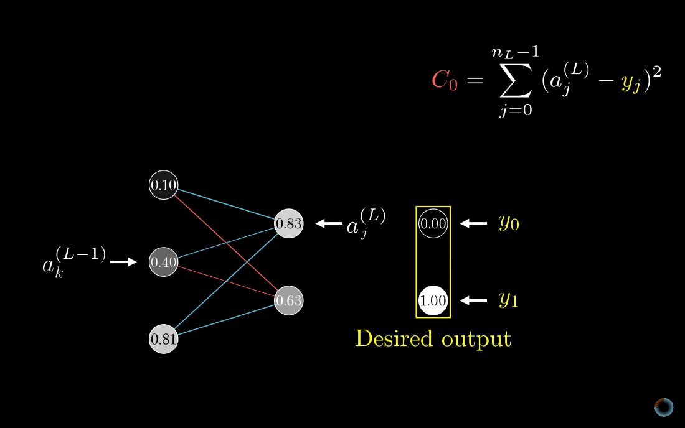

# Neural Networks 3B1B

Created: 2018-07-04 02:08:15 +0500

Modified: 2021-04-03 20:47:25 +0500

---

Mnemonic - Input, times Weight, add a Bias, Activate

# What is neural network
-   Convolutional neural network - Good for image recognition
-   Long short term memory network - Good for speech recognition
-   Multilayer perceptron (Plain vanila neural network)

Sigmoid squisification function

Sigmoid function squishes the numbers into a range between 0 and 1.

Very negative inputs end up close to 0

Very positive inputs end up close to 1

And others steadily increase around input 0

-   Weights
-   Bias

ReLU - Rectified Linear Unit used instead of Sigmoid because it's easier to train.

Sigmoid is a slow learner

ReLU (a) = max(0,a)

<https://machinelearningmastery.com/rectified-linear-activation-function-for-deep-learning-neural-networks

# Gradient Descent
-   Cost of a training example (Add all the squares of the differences between output - correct output)
-   Cost is large when the output is far from the correct values and vice-versa
-   For finding the local minima we can find slope of the function

-   Multivariable Calculus - The Gradient of a function gives you the direction of steepest ascent. Basically, which direction should you step to increase the function most quickly

# Backpropagation

Randomly subdivide the data into mini batches and compute each step with respect to a mini batch (for faster training)

Stochastic Gradient Descent

# Backpropogation Calculus

[Neural Networks from Scratch in Python](https://www.youtube.com/playlist?list=PLQVvvaa0QuDcjD5BAw2DxE6OF2tius3V3)

