# Neural Networks

---

In computer programming, humans instruct a computer to solve a problem by specifying each step using many lines of code. With machine learning and neural networks, you instead get the computer to solve the problem through examples.

A neural network is a mathematical function that can learn the expected output for a given input from training datasets.

The following figure illustrates a neural network that has been trained to output "cat" from a cat image.

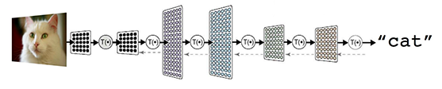

You can see that a neural network model consists of multiple layers of calculation units, in which each layer has configurable parameters. The goal of training the model is to optimize the parameters to get results with the highest accuracy. The training algorithm makes adjustments as it processes batches of training datasets through the model. If you distribute the training process to multiple computational nodes, you need a way to keep track of the changing parameters to be shared by all nodes.

# Perceptron

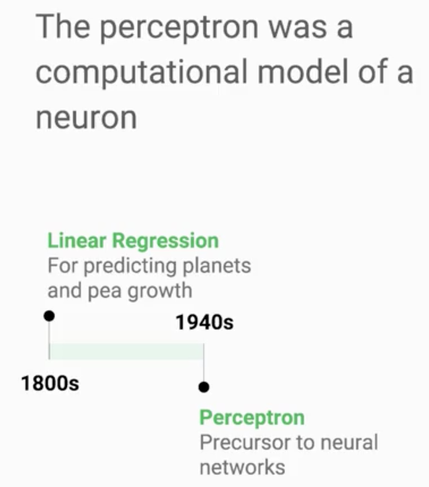

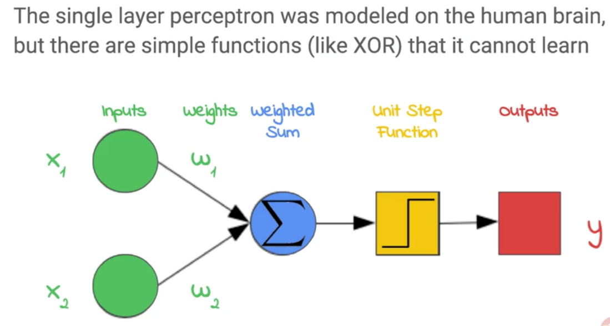

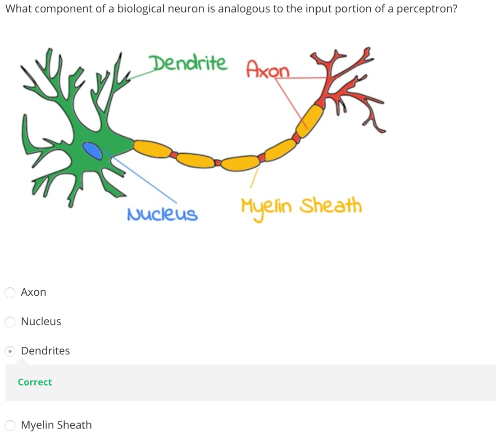

## Neural Network

Neural networks combine layers of perceptrons, making them more powerful but also harder to train effectively

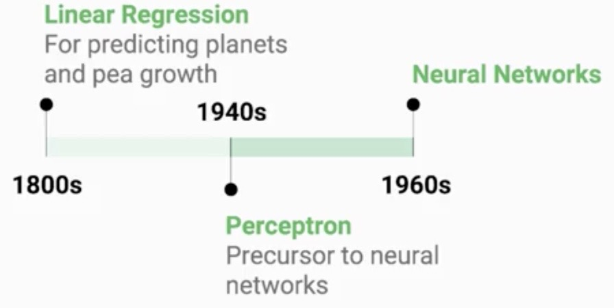

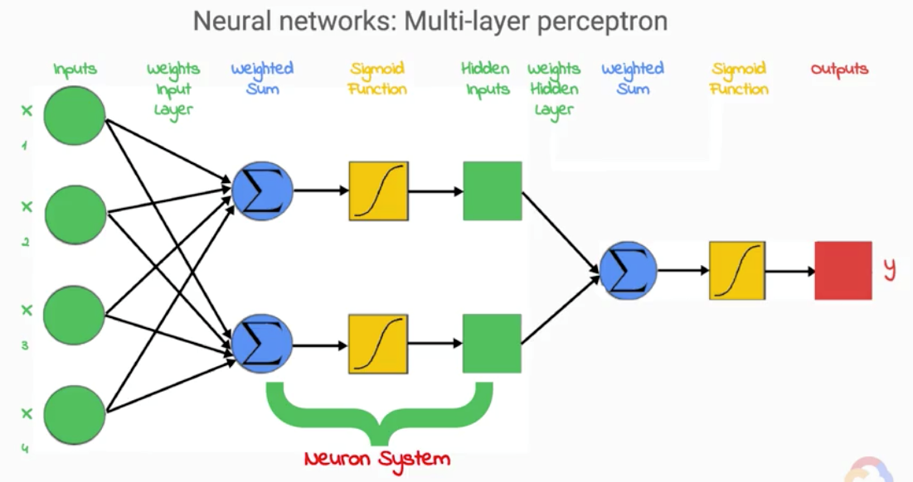

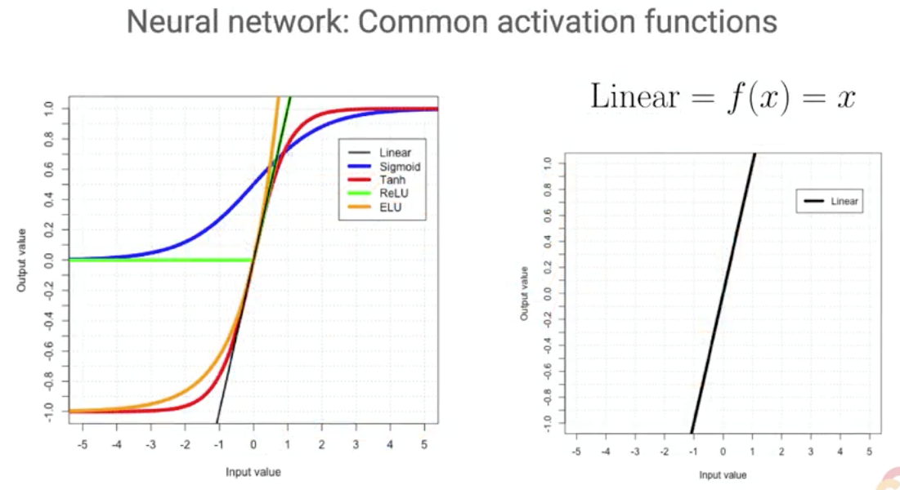

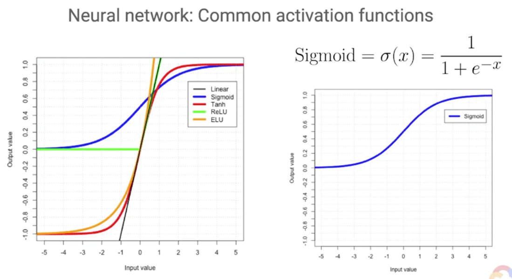

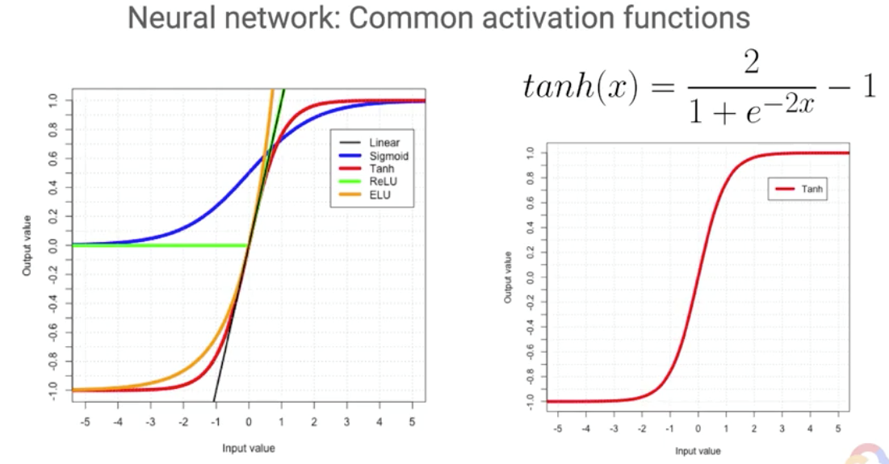

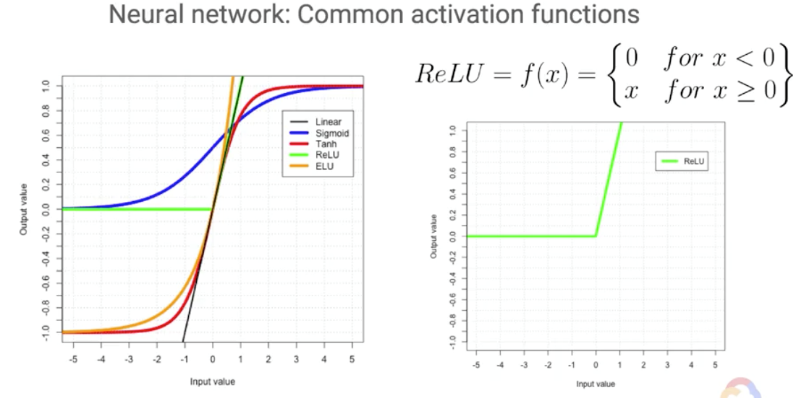

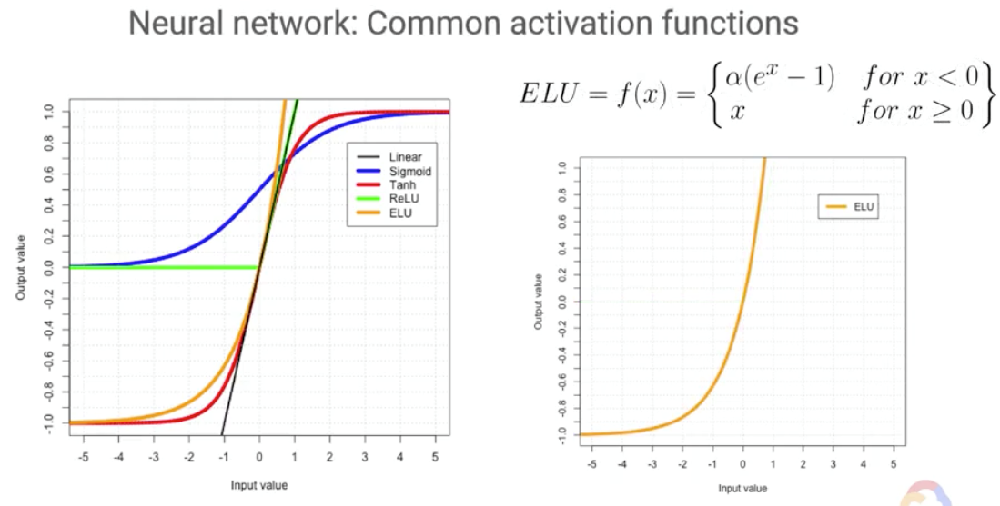

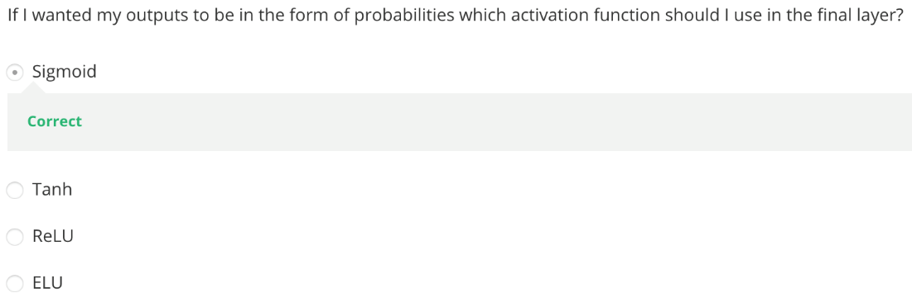

# Mordern Neural Networks

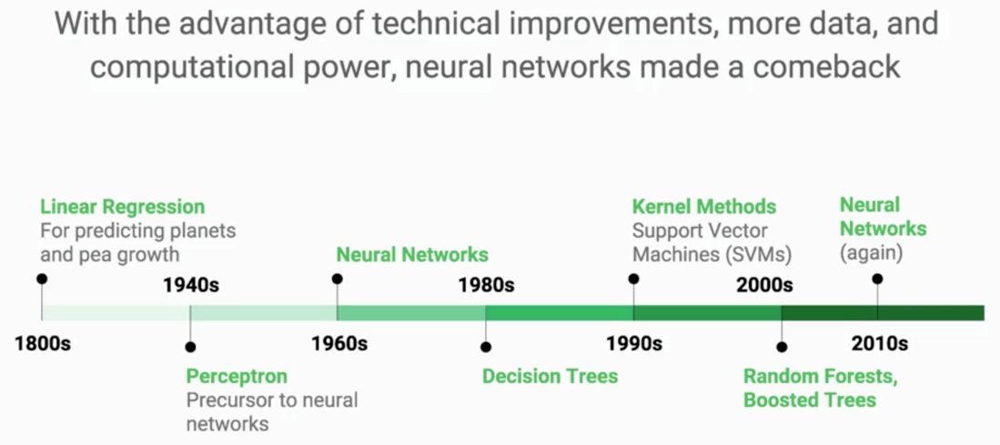

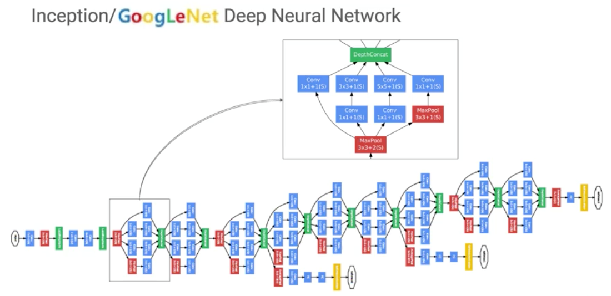

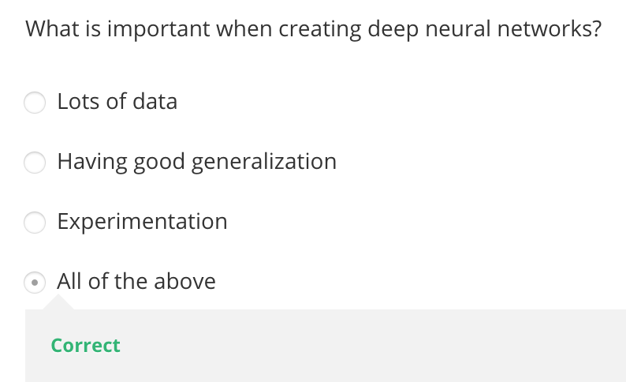

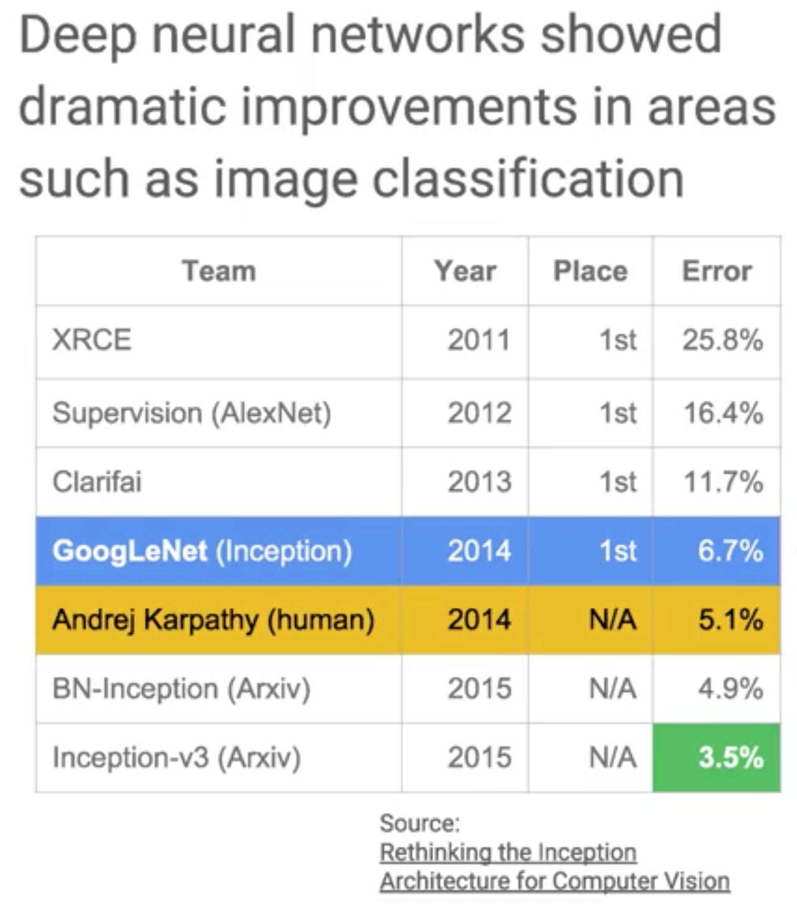

<https://www.youtube.com/watch?v=dPWYUELwIdM>

[Neural Networks Demystified](https://www.youtube.com/playlist?list=PLiaHhY2iBX9hdHaRr6b7XevZtgZRa1PoU)
