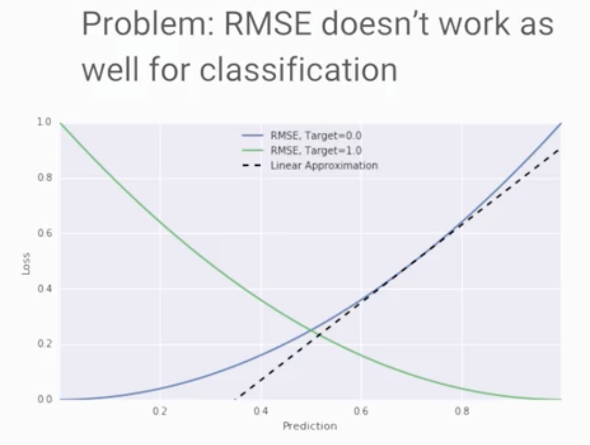

# Optimization

Created: 2018-07-02 02:31:48 +0500

Modified: 2021-06-19 14:47:58 +0500

---

## Learn how to

- Quantify model performance using loss function
- Use loss functions as the basis for an algorithm called gradient
- Optimize gradient descent to be as efficient as possible
- Use performance metrics to make business decisions

# Defining ML Models

# Loss Functions

# Gradient Descent

# TensorFlow Playground

[**https://goo.gl/EEuEGp**](https://goo.gl/EEuEGp)

[**https://goo.gl/3pmeKj**](https://goo.gl/3pmeKj)

[**https://goo.gl/ou9iMB**](https://goo.gl/ou9iMB)

# Performance Metrics

