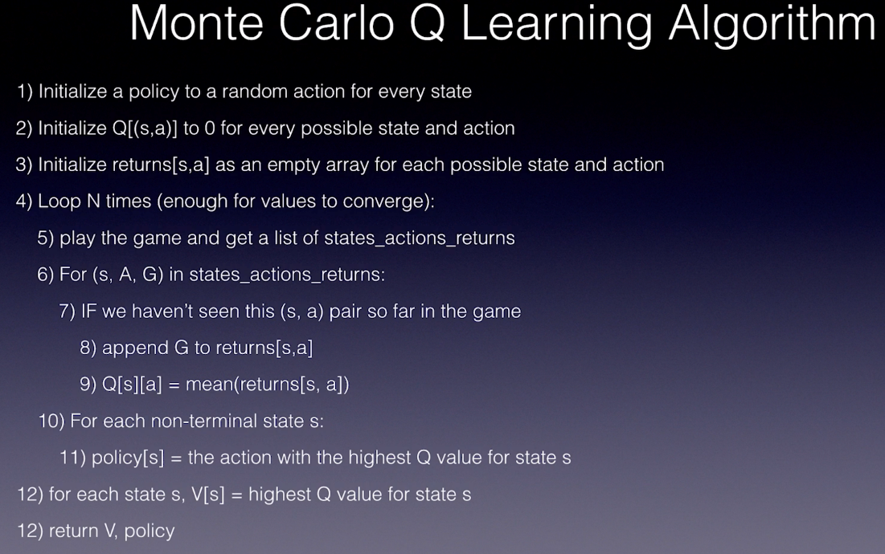
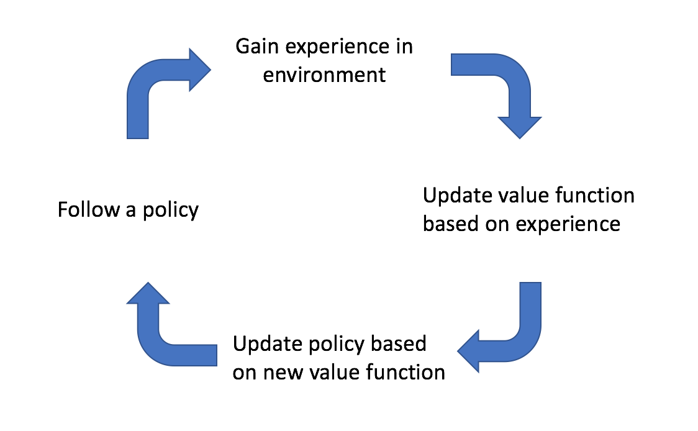

# 3. Monte Carlo Methods

# Internet of Things Optimization

- Monte Carlo vs Dynamic Programming
  - No need for a complete Markov Decision Process
  - Computationally more efficient
  - Can be used with stochastic simulations
- In model-free reinforcement learning, as opposed to model based, we don't know the reward function and the transition function beforehand we have to learn them though experience.
- A model-free learning technique called monte carlo uses repeated random sampling to obtain numerical results
- In first visite monte carlo the state value function is defined as the average of the returns following the agents first visit to S in a set of episodes

# Exploration vs Exploitation

- Example - In the context of a restaurant, we can order the same meal that we have already eaten, so **exploit** our previous knowledge to get already tested meal, vs we can **explore** new items in the hope of eating more tastier meal.
- We can do this in RL by adjusting ϵ (epsilon), to balance between exploration vs exploitation to get the maximum reward possible.
- Exploration vs Exploitation tradeoff
- Epsilon Greedy

epsilonis the fraction of times we sample a lever randomly and1- epsilonis the fraction of times we choose optimally.

- Thompson Sampling

The basic idea is toassume a simple prior distributionon the underlying parameters of the reward distribution of every lever, and at every time step, play a lever according to itsposterior probabilityof being the best arm.

- **Multi-armed bandit problem**

In [probability theory](https://en.wikipedia.org/wiki/Probability_theory), the**multi-armed bandit problem**(sometimes called the***K*-or*N*-armed bandit problem**) is a problem in which a fixed limited set of resources must be allocated between competing (alternative) choices in a way that maximizes their expected gain, when each choice's properties are only partially known at the time of allocation, and may become better understood as time passes or by allocating resources to the choice.

The name comes from imagining a [gambler](https://en.wikipedia.org/wiki/Gambler) at a row of [slot machines](https://en.wikipedia.org/wiki/Slot_machines)(sometimes known as "one-armed bandits"), who has to decide which machines to play, how many times to play each machine and in which order to play them, and whether to continue with the current machine or try a different machine.The multi-armed bandit problem also falls into the broad category of [stochastic scheduling](https://en.wikipedia.org/wiki/Stochastic_scheduling).

<https://en.wikipedia.org/wiki/Multi-armed_bandit>

- We must strike a balance between explore/exploit
- Epsilon Greedy - epsilon (a hyperparameter) is the probability that our agent will choose a random action instead of following policy
- Algorithm

    1. generate a random number p, between 0 and 1

    2. if p < (1-ε) take the action dictated by policy

    3. Otherwise take a random action
- First visit optimization
  - What happens if we visit the same state more than once
  - It's been proven the subsequent visits doesn't change the answer
  - All we need is the first visit
  - We throw rest of the data away
- Monte Carlo Q Learning Algorithm

# MC Control and MC Prediction

There are two types of tasks in reinforcement learning -- Prediction and Control.

- **Prediction**

A task that can predict expected total reward from any given state assuming the functionπ(a|s)is given. Prediction calculates the value functionVπ

e.g.:Policyevaluation (Estimate).

- **Control**

A task that can findpolicyπ(a|s)that maximizes the expected total reward from any given state. Simply if given a policyπcontrol finds an optimal policyπ*.

e.g.:Policy Improvement (Optimize).

Policy Iteration is a combination of prediction and control to find optimal policy.

There are two types of policy learning methods -

- **On policy learning**
  - This methodlearns on the job, it evaluates or improves the policy that used to make the decisions.
  - We must act based on our current policy
- **Off policy learning**
  - This method evaluates one policy while following another policy. The earlier is called target policy which may be deterministic and thelatterbehaviorpolicy is stochastic.
  - Any action is okay

### Model Free Learning

Learn a problem when not all the components are available. In model free learning we just focus on calculating the value functions directly from the interactions with the environment. Our aim here is to figureout Vfor unknown MDP assuming that we have a policy.

## MC Method - Monte Carlo Method for model free learning

There are two different types of MC.

## First-visit MC:average returns only for first time s is visited in an episode

- Incremental Mean

## Every-Visit MC:average returns for every time s is visited in an episode

Both converge asymptotically.

Monte Carlo methods for control task (Policy iteration is the base of control task)

Inmodel-free RL, we need to interact with the environment to find out the best strategy so we need to explore the entire the state space while figuring out best actions.

- Exploration:is about finding more information about the environment. In other words exploring a lot of states and actions in the environment.
- Exploitation:is about exploiting the known information to maximize the reward.

Example for exploration vs exploitation (in context of Roomba, floor cleaning robot) - When the state is in charged up mode It needs to cover maximum area in a grid world for cleaning which falls under exploration. When the state of the machine changes to low batteryitneeds to find the charging dock as soon as possible to avoid getting stuck here the robot needs to exploit rather than explore to maximize the reward.So due to the exploration problem, we cannot expect Roomba to act greedily in MC to improve policy instead we use the epsilon-greedy policy.

## Epsilon-greedy policy

Thebest-knownaction based on our experience is selected with (1-epsilon) probability and the rest of the time i.e. with epsilon probability any action is selected randomly. Initially, epsilon is 1 so we can explore more but as we do many iterations we slowly decrease the epsilon to 0( whichis exploitation → choosing the best-known action) this get us to have the value of epsilonbetween 0 and 1.

## GLIE Monte Carlo Method (Greedy in the Limit of Infinite Exploration)

GLIE Monte-Carlo is an on-policy learning method that learns from complete episodes. For each state-action pair, we keep track of how many times the pair has been visited with a simple counter function.

N(St,At) ← N(St,At) + 1

For each episode, we can update our estimated value function using an incremental mean.

Q(St,At) ← Q(St,At) + (1 / N(St,At)) (Gt--Q(St,At))

Here,Gteither represents the return from timetwhen the agent first visited the state-action pair, or the sum of returns from each timetthat the agent visited the state-action pair, depending on whether you are using first-visit or every-visit Monte Carlo.

We'll adopt aϵ-greedy policy withϵ=1/kwherekrepresents the number of episodes our agent has learned from.

## Temporal Difference Learning

The temporal difference approach approximates the value of a state-action pair by comparing estimates at two points in time (thus the name, temporal difference). The intuition behind this method is that we can formulate a better estimate for the value of a state-action pair after having observed some of the reward that our agent accumulates after having visited a state and performing a given action.

# Q-Learning for Trading

- A partially observable markov decision process is one where we don't know what the true state looks like, but we can observe a part of it.
- A Q table is one where the states and rows and actions are columns, it helps us find the best action to take for each state
- Q learning is the process of learning what this Q table is directly, without needing to learn either the transition probability or reward function
