# 4. Model Free Learning

Created: 2018-10-07 12:54:41 +0500

Modified: 2018-10-10 00:53:11 +0500

---

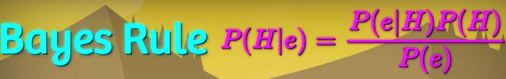

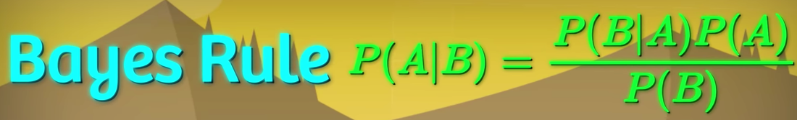

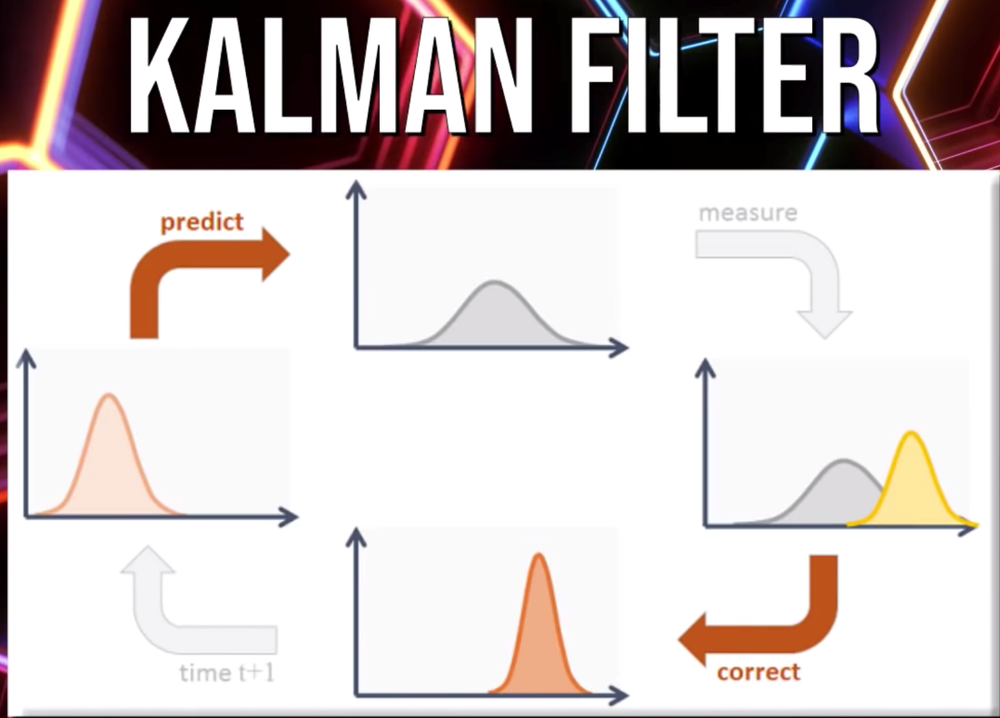

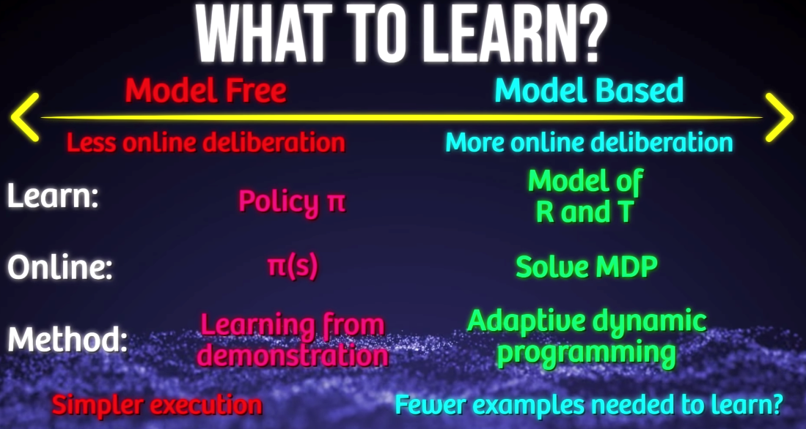

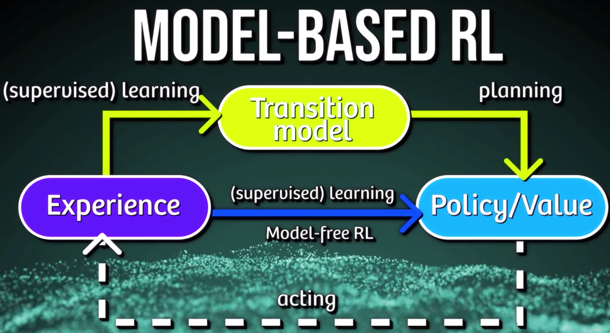

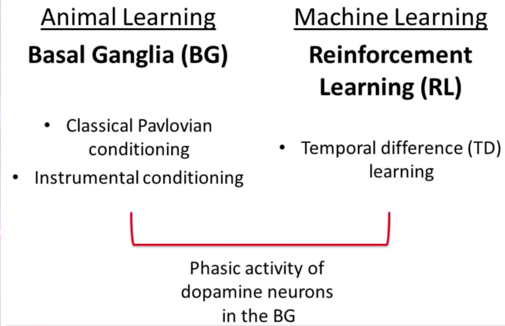

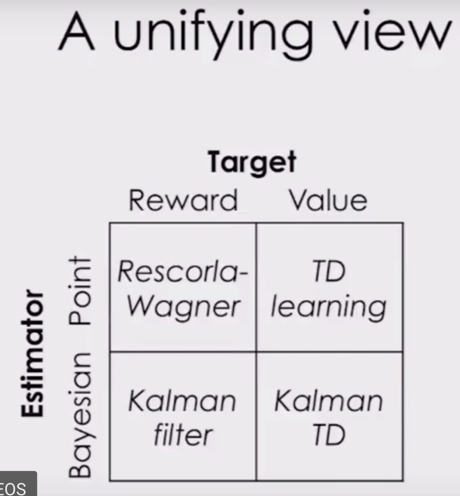

-   Associative Learning is a learning process in which a new response becomse associated with a particular stimulus
-   When we build mathematical models of learning, we can use distributions instead of single values to help represent uncertainity about the world
-   Temperal difference learning is a model free learning technique that predicts the expected value of a variable occuring at the end of a sequence of states

# Model Based vs Model Free learning

A model is basically a plan for our agent. When we have a set of defined state transition probabilities, we call that working with a model. Reinforcement learning can be applied with or without a model, or even used to define a model.

A complete model of the environment is required to do Dynamic Programming. If our agent doesn't have a complete map of what to expect, we can instead employ what is called model-free learning. In layman's terms, this is learning by trial and error.

For some board games such as chess and go, although we can accurately model the environment's dynamics, computational power constrains us from calculating the Bellman optimality equation. This is where model-free learning methods shine. We handle this situation by optimizing for a smaller subset of states that are frequently encountered, at the cost of knowing less about the infrequently visited states.

# Episodic and Continous Task

In RL problems we have two different tasks in nature

1.  Episodic Task
    -   A task which can last a finite amount of time is calledEpisodic task (an episode)
    -   Ex: Playing a game of chess (win or lose or draw)
    -   we only get the reward at the end of the task or another option is to distribute the reward evenly across all actions taken in that episode.
    -   Ex: you lost the queen (-10 points), you lost one of the rooks (-5 points) etc..

2.  Continuous Task
    -   A task which never ends is calledContinuous task
    -   Ex: Trading in the cryptocurrency markets or learning Machine learning on internet.
    -   In this, rewards may be given with discounting with a discount factor λ∈[0,1]

# Difference b/w MC andTemporal Difference (TD)

**Monte-Carlo**
-   it only works for episodic tasks
-   it can only learn from complete sequences
-   it has to wait until the end of the episode to get the reward

**Temporal Difference (TD)**
-   it only for both episodic and continuous tasks
-   it can learn from incomplete sequences
-   it will only wait until the next time step to update the value estimates.

# Summary
-   We use model free algorithms when Transition probability P (dynamics of the system)is not given in MDP.
-   Monte Carlo takes the means of episodes to calculate the V and Q values for both prediction and control tasks.
-   TD combines the features of both DP and MC by learning through interacting with the environment with bootstrapping.
-   We use epsilon greedy policy to avoid the exploration problem in the env.
-   Sarsa updates the Q value by choosing the current action and next action using the same policy, making it an on policy method.
-   Q-learning updates Q values by acting greedily on the environment while following another policy, making it an off policy method.

# Temporal Difference Learning
-   Conditioned stimulus - conditioned response (dog shown food + blowing whistle analogy)

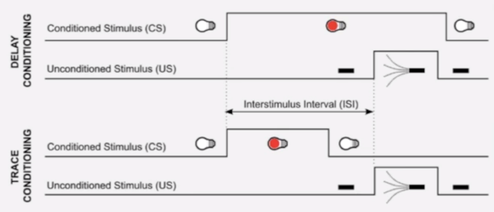

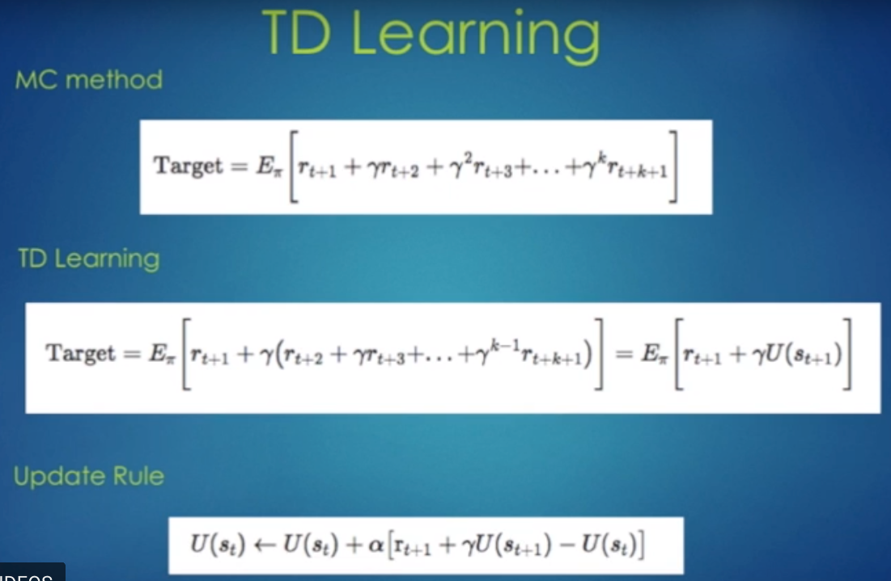

-   Find the Utility matrix using the above update rule

![TD(Å) For each state s at time t we can define et(s) as the eligibility trace: et(s) = 1 ifs st; Here y is the discount rate and 0.11 is a decay parameter called trace-decay or accumulating trace which defines the update weight for each state visited. When I the traces decrease in time. This allow giving a small weight to infrequent states. For we have the TD(O) case, and only the immediately preceding prediction is updated. For we have TD(I) where all the preceding predictions are equally updated. ](media/4.-Model-Free-Learning-image13.png)

# Q-Learning

![Temporal Difference • Calculate average returns using a blending method, similar to a moving average • Relies on (state, action reward, state', action') • a' = argmax( Q(s') ) • V(s) = V(s) + + - V(s) ] • Q(s,a) = Q(s,a) + u [r + Y argmax( Q(s') ) - V(s) ] • Policy is the action with the maximum Q, same as before ](media/4.-Model-Free-Learning-image15.png)

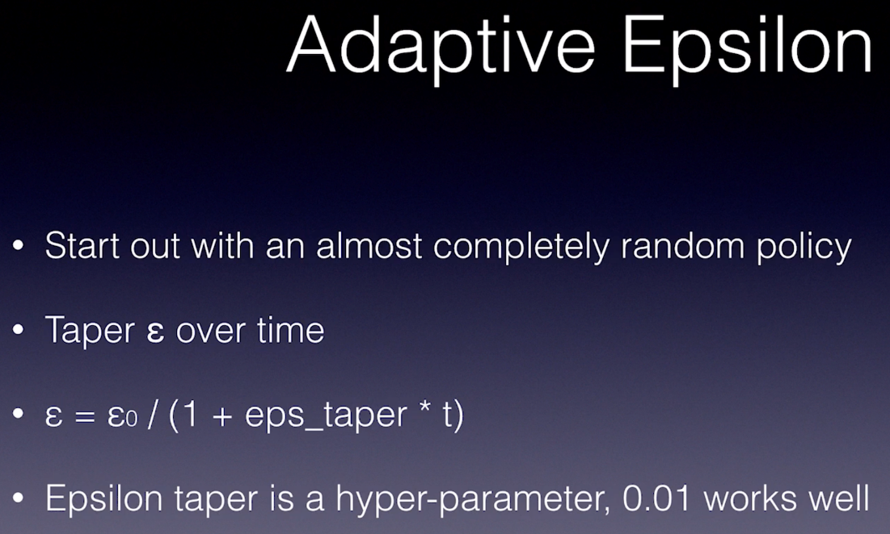

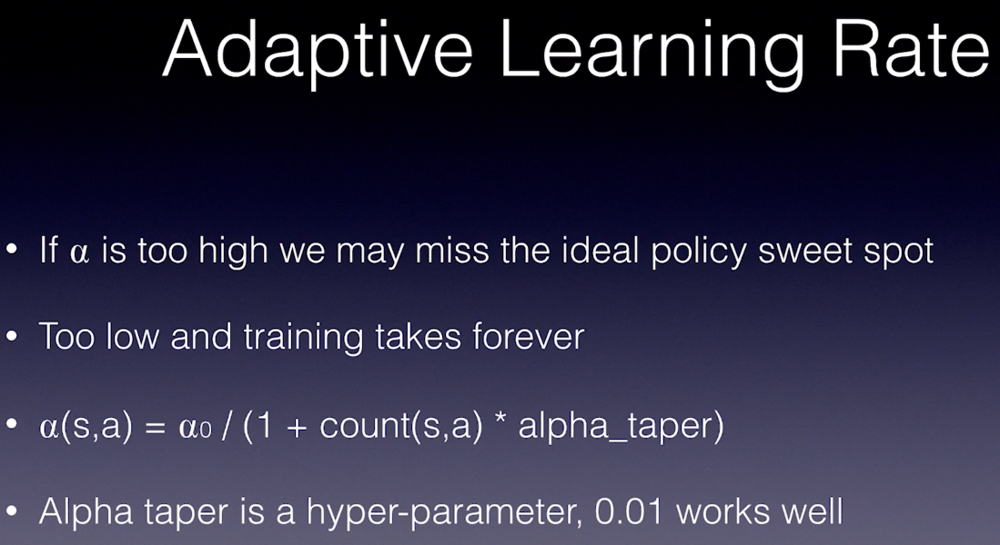

**References**
-   <https://medium.com/deep-math-machine-learning-ai/ch-12-1-model-free-reinforcement-learning-algorithms-monte-carlo-sarsa-q-learning-65267cb8d1b4>
-   Reinforcement Learning: An Introduction, by [Richard S. Sutton](http://incompleteideas.net/index.html)and[Andrew G. Barto](http://www-anw.cs.umass.edu/~barto/)
-   <https://bair.berkeley.edu/blog/2018/04/26/tdm

