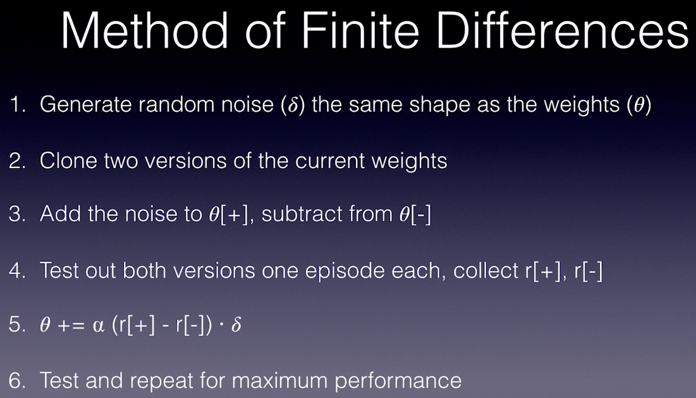
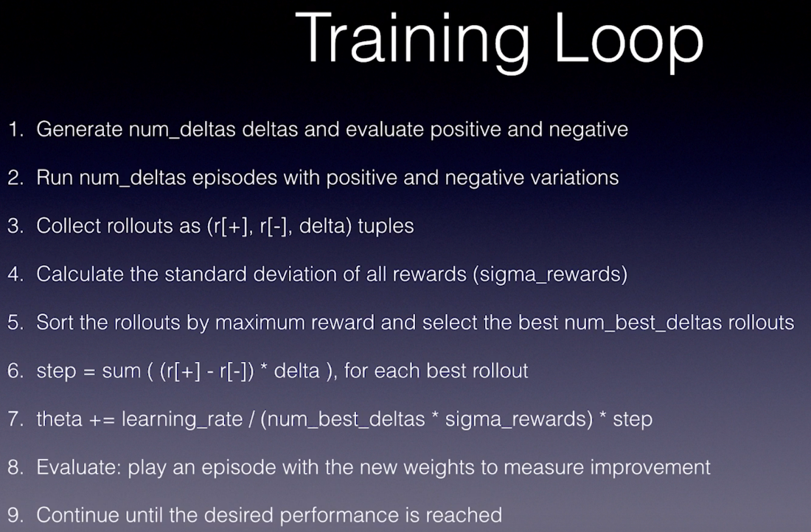

# 5. RL in Continuous Space

# Augmented Random Search (ARS)

- Shallow learning algorithm
- Random noise
- Genetic evolution
- Cutting edge performance on locomotion tasks

# Forward and Inverse Kinematic

## References

<https://github.com/colinskow/move37/tree/master/ars>

<https://github.com/modestyachts/ARS>
