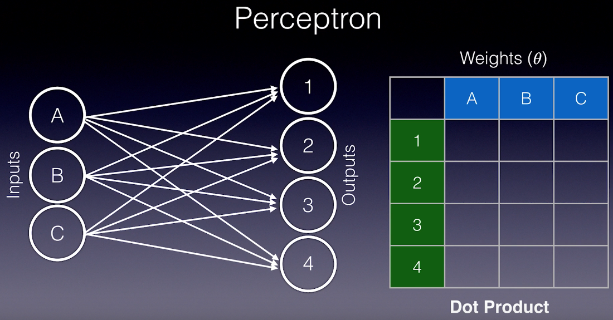
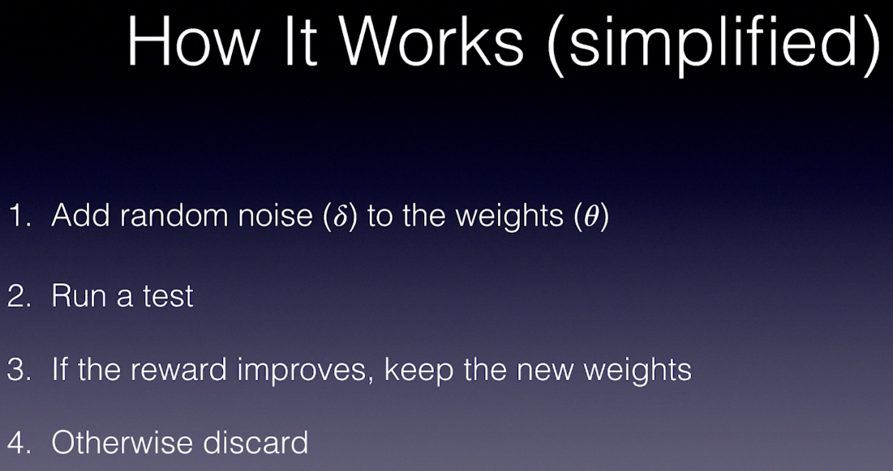
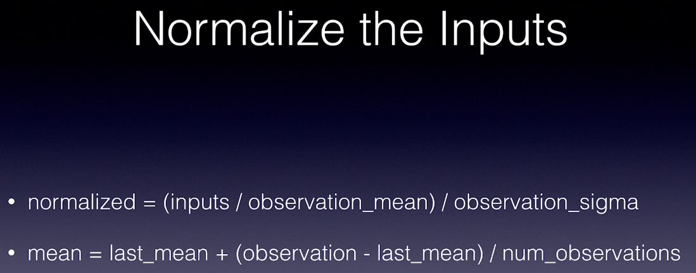

# 5. RL in Continuous Space

Created: 2018-10-10 00:52:56 +0500

Modified: 2018-10-14 14:33:50 +0500

---

# Augmented Random Search (ARS)
-   Shallow learning algorithm
-   Random noise
-   Genetic evolution
-   Cutting edge performance on locomotion tasks

![1. 2. 3. 4. 5. 6. Method of Finite Differences Generate random noise (b) the same shape as the weights (0) Clone two versions of the current weights Add the noise to 0[+], subtract from 0[-] Test out both versions one episode each, collect r[+], r[-] Test and repeat for maximum performance ](media/5.-RL-in-Continuous-Space-image3.png)

![1. 2. 3. 4. 5. 6. 7. 8. 9. Training Loop Generate num_deltas deltas and evaluate positive and negative Run num_deltas episodes with positive and negative variations Collect rollouts as (r[+], r[-], delta) tuples Calculate the standard deviation of all rewards (sigma_rewards) Sort the rollouts by maximum reward and select the best num_best_deltas rollouts step = sum ( (r[+] - r[-]) * delta ), for each best rollout theta += learning_rate / (num_best_deltas * sigma_rewards) * step Evaluate: play an episode with the new weights to measure improvement Continue until the desired performance is reached ](media/5.-RL-in-Continuous-Space-image5.png)

# Forward and Inverse Kinematic

**References**

<https://github.com/colinskow/move37/tree/master/ars>

<https://github.com/modestyachts/ARS>

