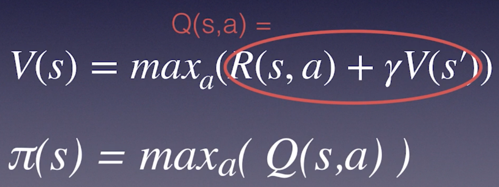

# Q-Learning Algorithms

Created: 2018-09-15 10:26:27 +0500

Modified: 2018-10-03 23:08:32 +0500

---

Q-Learning algorithms are a family of Reinforcement Learning algorithms.

Unlike policy gradient methods, which attempt to learn functions which directly map an observation to an action, Q-Learning attempts to learn the value of being in a given state, and taking a specific action there.

**Policy Gradient Method -** Attempts to learn functions which directly map an observation to an action.

**Q-Learning -** Attempts to learn the value of being in a given state, and taking a specific action there.

Q - Quality

Q - Long term discounted reward we expect from taking action a in state s

The policy for state s is to choose the actual bias Q value.

**Policy -** Policy is a simple lookup table: state -> best action

**Reward -** the reward from our immediate action, plus all discounted future rewards from applying the current policy (Denoted by capital G)

![Algorithm to Calculate Returns 1) Initialize G to 0 2) states_and_returns = [ ] 3) Loop backwards through the list of states_and_rewards (s, r): 4) append(s, G) to states_and_returns 5) G = r + gamma * G 6) reverse states_and_returns to the original order ](media/Q-Learning-Algorithms-image2.png)

