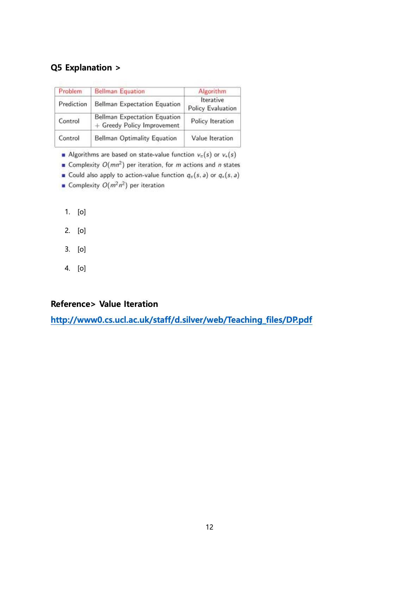

# Quizzes

Created: 2018-09-30 15:21:08 +0500

Modified: 2018-09-30 15:31:01 +0500

---

![#Policy Evaluation actions 0.0 .10 -1.0 -1.0 -1.0 -1.0 -1.0 -1.0 -1.0 -1.0 -1.0 -1.0 -2.0 -2.0 1 4 5 2 6 3 7 on all transitions Undiscounted episodic MDP (y = 1) Nonterminal states 1, . 14 One terminal state (shown twice as shaded squares) Actions leading out of the grid leave state unchanged Reward is ---1 until the terminal state is reached Agent follows uniform random policy Tt(nl•) = Tl(el•) = Tt(sl•) = Tl(wl•) = 0.25 truncate to 1 decimal place t.'k for the Random Policy Greedy Policy w.r.t Vk 0.0 0.0 0.0 00 -1.0 .10 -1.0 0.0 0.0 0.0 0.0 0.0 0.0 0.0 0.0 0.0 0.0 0.0 0.0 0.0 0.0 ra ](media/Quizzes-image1.png)

![QI Explanation> -1.0 -1.0 -1.0 -1.0 *ail -1.0 -1.0 -1.0 -1.0 0.0 -1.7 -2.0 -2.0 -1.7 -20 -2.0 -20 -1.7 oo [o] -2.0 t,'k for the Random Policy Greedy Policy w.r.t 0.0 0.0 0.0 0.0 -1.0 -1.0 -1.0 -2.0 -2.0 -2.0 0.0 0.0 0.0 0.0 0.0 0.0 0.0 0.0 0.0 -1.0 -1.0 -1.0 0.0 0.0 0.0 0.0 1.7 rat po opti 2. 3. 4. --- -1.7 (truncated to one decimal place) v = 1 x 0.25 x (-1 x (-1 + -1) = -1.7 (truncated to one decimal place) v = 1 x 0.25 x (-1 +0) +3 x 0.25 x (-1 + -1) v = 4 x 0.25 X (-1 + -1) [o] same values of -2.0 ](media/Quizzes-image3.png)

