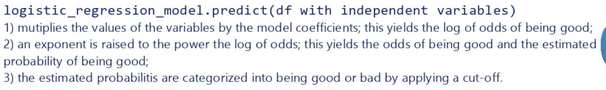

# Commands

---

```python
from sklearn.model_selection import train_test_split

df_inputs_train,df_trains_test,df_targets_train,df_targets_test = train_test_split(df.drop('good_bad',axis=1),df['good_bad'],test_size=0.2,random_state=42)
```



<https://medium.com/analytics-vidhya/your-ultimate-data-mining-machine-learning-cheat-sheet-9fce3fa16>
