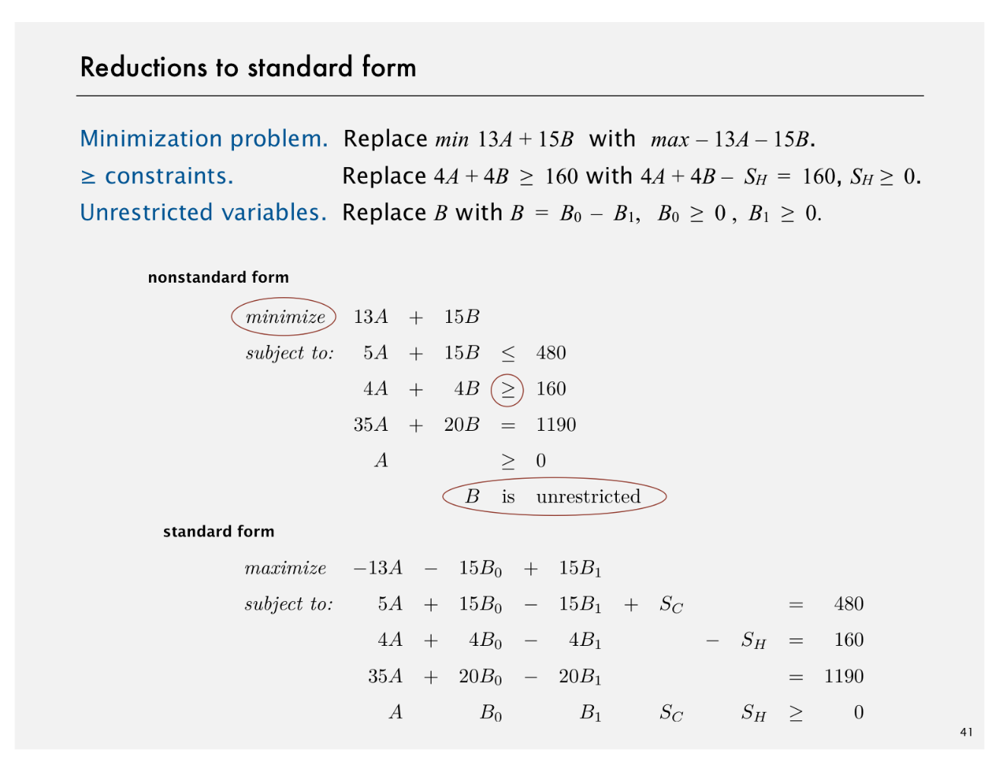
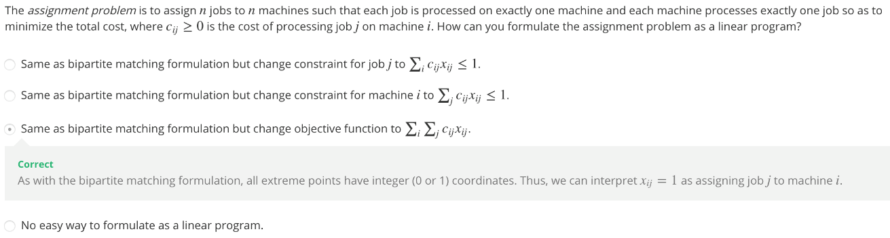

# Linear Programming

Created: 2018-04-19 00:00:52 +0500

Modified: 2019-10-10 11:56:31 +0500

---

The quintessential problem-solving model is known as linear programming, and the simplex method for solving it is one of the most widely used algorithms. In this lecture, we given an overview of this central topic in operations research and describe its relationship to algorithms that we have considered.

# Brewer's Problem

# 

# Simplex Algorithms

# Implementations

# 

# Reductions

## Others

<https://opensourc.es/blog/simplex>

