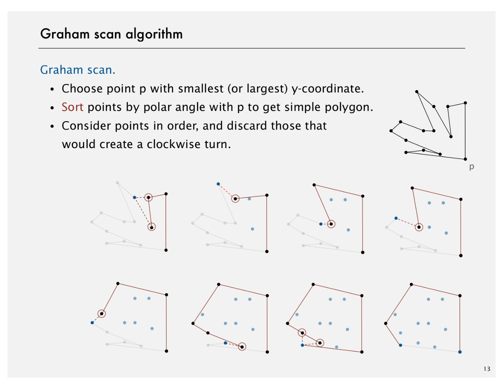

# Reductions

Created: 2018-04-19 00:00:46 +0500

Modified: 2018-12-23 22:47:34 +0500

---

In this lecture our goal is to develop ways to classify problems according to their computational requirements. We introduce the concept of reduction as a technique for studying the relationship among problems. People use reductions to design algorithms, establish lower bounds, and classify problems in terms of their computational requirements.

![Overview: introduction to advanced topics Main topics. [next 3 lectures] • Reduction: design algorithms, establish lower bounds, cl • Linear programming: the ultimate practical problem-solv • Intractability: problems beyond our reach. Shifting gears. • From individual problems to problem-solving models. • From linear/quadratic to polynomial/exponential scale. • From details of implementation to conceptual framework Goals. • Place algorithms we've studied in a larger context. ](media/Reductions-image1.png){width="6.40625in" height="4.947916666666667in"}

Desiderata - Something that is needed or wanted

{width="6.40625in" height="4.947916666666667in"}

{width="6.40625in" height="4.947916666666667in"}

![Reduction Def. Problem X reduces to problem Y if you can use an algor solves Yto help solve X. instance I (of X) Algorithm for Y Algorithm for X solutior [finding the median reduces to sorting] Ex l. To find the median of N items: ](media/Reductions-image4.png){width="6.40625in" height="4.947916666666667in"}

![Reduction Def. Problem X reduces to problem Y if you can use an algor solves Yto help solve X. instance I (of X) Algorithm for Y Algorithm for X solutior Ex 2. [element distinctness reduces to sorting] To solve element distinctness on N items: ](media/Reductions-image5.png){width="6.40625in" height="4.947916666666667in"}

![In the maxflow lecture, we saw that, given a digraph with nonnegative edge weights and two vertices s and t, the finding a mincut reduces to finding a maxflow. What is the cost of the reduction as a function of the number of vertices V and the number of edges E? Correct Given a maxflow, we can compute a mincut by finding the set of vertices that are reachable from the source using either forward edges (that are not full) or backward edges (that are not empty). This can be done via breadth-first search or depth-first search in linear time. We note that there is no simple way to reduce finding maxflow to finding the mincut. v2E ](media/Reductions-image6.png){width="6.166666666666667in" height="3.7291666666666665in"}

# 

# Designing Algorithms

![Reduction: design algorithms Def. Problem X reduces to problem Y if you can use an algor solves Yto help solve X. Design algorithm. Given algorithm for Y, can also solve X. Ex. • 3-collinear reduces to sorting. [assignment] • Finding the median reduces to sorting. • Element distinctness reduces to sorting. • CPM reduces to topological sort. [shortest paths lecture] • Arbitrage reduces to shortest paths. [shortest paths lect • Burrows-Wheeler transform reduces to suffix sort. [assig ](media/Reductions-image7.png){width="6.40625in" height="4.947916666666667in"}

{width="6.40625in" height="4.947916666666667in"}

{width="6.40625in" height="4.947916666666667in"}

{width="6.40625in" height="4.947916666666667in"}

{width="6.40625in" height="4.947916666666667in"}

{width="6.40625in" height="4.947916666666667in"}

SPT Scheduling - Shortest Processing Time Scheduling

{width="6.40625in" height="4.947916666666667in"}

![Given an undirected graph with positive edge weights and two vertices s and t, the undirected mincut problem is to find a cut that separates s and t that has minimum capacity. How would you reduce finding a mincut in an undirected graph to finding a mincut in a directed graph? For each edge e in the directed graph with capacity c e, create one edge in the undirected graph with capacity c e. For each edge e in the undirected graph with capacity c e, create two antiparallel edges in the directed graph, each with capacity c e. Correct Replacing each undirected edge with two antiparallel edges works for the same reason that it does in the corresponding shortest path reduction---at most one of the two antiparallel edges will cross the cut from the s side to the t side. For each edge e in the undirected graph with capacity c e, create two antiparallel edges in the directed graph---one with capacity ce and on w• ity ---c e. None of the above. B i rd' s-•y• view ](media/Reductions-image14.png){width="6.25in" height="1.7604166666666667in"}

# Establishing Lower Bounds

{width="6.40625in" height="4.947916666666667in"}

{width="6.40625in" height="4.947916666666667in"}

![Lower bound for convex hull Proposition. In quadratic decision tree model, any algorithm N integers requires Q(NlogN) steps. allows linear or quadratic t < -y or (Xj---Xi) (Xk---Xi)- Proposition. Sorting linear-time reduces to convex hull. Pf. [see next slide] 1251432 2861534 3988818 4190745 8111033 13546464 89885444 43434213 34435312 effic ](media/Reductions-image17.png){width="6.40625in" height="4.947916666666667in"}

{width="6.40625in" height="4.947916666666667in"}

![Establishing lower bounds: summary Establishing lower bounds through reduction is an important in guiding algorithm design efforts. Q. How to convince yourself no linear-time convex hull algo Al. [hard way] Long futile search for a linear-time algorithff A2. [easy way] Linear-time reduction from sorting. ](media/Reductions-image19.png){width="6.40625in" height="4.947916666666667in"}

![Given an array of n integers, the element distinctness problem is to determine whether any two integers in the array are equal. The element distinctness problem has a Q(n log n) lower bound in the quadratic decision tree model of computation. For which other problems below does a similar lower bound hold? Sorting an array of n integers. Finding the mode (integer that occurs most frequently) in an array of n integers. Finding the closest pair among an array of n integers, where the distance between two integers is the absolute value of their difference. All of the above. Correct • We have already seen that element distinctness linear-time reduces to sorting. • Element distinctness linear-time reduces to finding the mode because if the most frequent integer occurs more than once, then there is a duplicated integer. • Closest pair linear-time reduces to element distinctness because the distance between the closest pair is zero if and only if there is a duplicated integer. ](media/Reductions-image20.png){width="6.1875in" height="1.78125in"}

# 

# Classifying Problems

{width="6.40625in" height="4.947916666666667in"}

{width="6.40625in" height="4.947916666666667in"}

{width="6.40625in" height="4.947916666666667in"}

{width="6.40625in" height="4.947916666666667in"}

{width="6.40625in" height="4.947916666666667in"}

{width="6.40625in" height="4.947916666666667in"}

{width="6.40625in" height="4.947916666666667in"}

{width="6.40625in" height="4.947916666666667in"}

{width="6.40625in" height="4.947916666666667in"}

{width="6.40625in" height="4.947916666666667in"}

{width="6.40625in" height="4.947916666666667in"}

{width="6.40625in" height="4.947916666666667in"}

![2.1416 2.0001 Suppose that you discover a n time algorithm for multiplying two n-by-n matrices and a n lower bound for computing the determinant of an n-by-n matrix. Which of the following can you infer? 21416 algorithm for solving a system of n linear equations and n unknowns. There exists an n There does not exist ann algorithm for multiplying two n-by-n matrices. There does not exist ann algorithm for finding the inverse of a n-by-n matrix. All of the above. Correct All of the problems discussed have the same asymptotic complexity. ](media/Reductions-image33.png){width="6.25in" height="1.6041666666666667in"}

