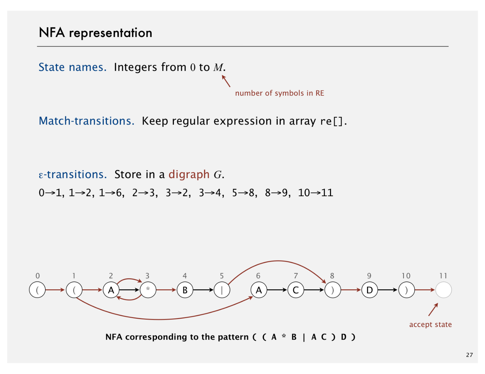
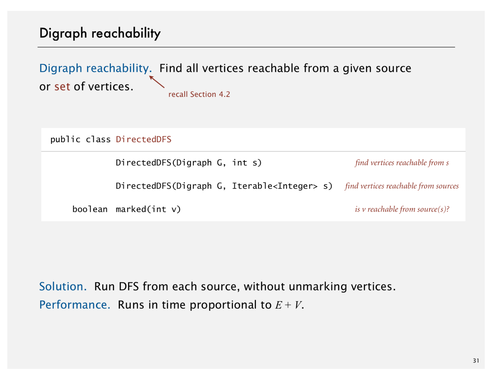
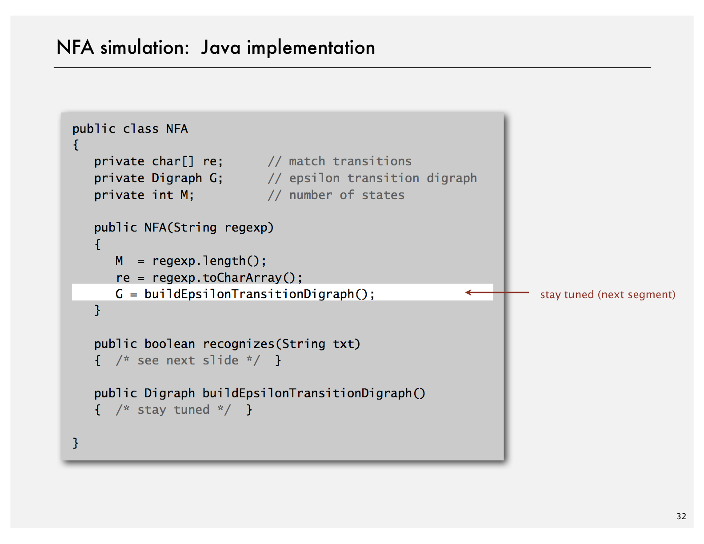

# Regular Expressions

Created: 2018-04-16 22:50:32 +0500

Modified: 2018-12-23 22:47:32 +0500

---

A regular expression is a method for specifying a set of strings. Our topic for this lecture is the famous grep algorithm that determines whether a given text contains any substring from the set. We examine an efficient implementation that makes use of our digraph reachability implementation from Week 1.

Applications

1. Pattern matching in Genomic data

2. Syntax highlighting

3. Scan for virus signatures

4. Process natural language

5. Specify a programming language

6. Access information in digital libraries

7. Search genome using PROSITE patterns

8. Filter text (spam, NetNanny, Carnivore, malware)

9. Validate data-entry fields (dates, email, URL, credit card)

Parse text files

- Compile a java program
- Crawl and index the Web
- Read in data stored in ad hoc input file format
- Create Java documentation from Javadoc comments

# RE and NFAs

# NFA Simulation

# NFA Construction

# Regular Expression Applications

