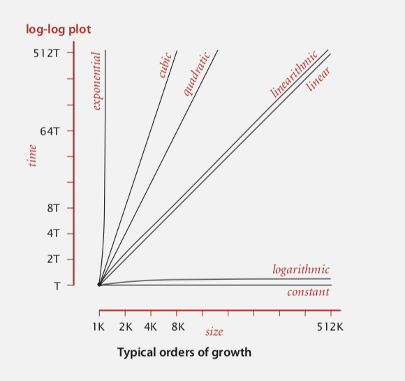

# Time Complexities

Created: 2017-12-13 23:04:13 +0500

Modified: 2021-08-07 10:51:41 +0500

---

Big O notation (with a capital letter O, not a zero), also called **Landau's symbol,** is a symbolism used in complexity theory, computer science, and mathematics to describe the asymptotic behavior of functions. Basically, it tells you how fast a function grows or declines. It describes how the runtime or space requirement of a function grows as the input grows.

Two functions with the same Big-O notation will tend to have the same growth rate and thus have the same relative performance with large inputs.

For example, the bubble sort algorithm has an average time complexity of O(n^2) while merge sort and heap sort both have an average complexity of O(n log n). In average cases, merge sort and heap sort will demonstrate similar performance while they will both outperform bubble sort.

In the table, poly(*x*)=*x^O^*^(1)^, i.e., polynomial in*x*.

<table>
<colgroup>
<col style="width: 20%" />
<col style="width: 13%" />
<col style="width: 16%" />
<col style="width: 14%" />
<col style="width: 34%" />
</colgroup>
<thead>
<tr class="header">
<th><strong>Name</strong></th>
<th><a href="https://en.wikipedia.org/wiki/Complexity_class"><strong>Complexity class</strong></a></th>
<th><strong>Running time (T(n))</strong></th>
<th><strong>Examples of running times</strong></th>
<th><strong>Example algorithms</strong></th>
</tr>
</thead>
<tbody>
<tr>
<td><strong>constant time</strong></td>
<td></td>
<td>O(1)</td>
<td>10</td>
<td>Determining if an integer (represented in binary) is even or odd</td>
</tr>
<tr>
<td><strong><a href="https://en.wikipedia.org/wiki/Inverse_Ackermann_function">inverse Ackermann</a> time</strong></td>
<td></td>
<td>O(alpha(n))</td>
<td></td>
<td><a href="https://en.wikipedia.org/wiki/Amortized_time">Amortized time </a>per operation using a<a href="https://en.wikipedia.org/wiki/Disjoint_set_data_structure"> disjoint set </a>. This function has a value alpha(n) < 5, for any value of n that can be written in this physical universe. So essentially it's a constant time operation</td>
</tr>
<tr>
<td><a href="https://en.wikipedia.org/wiki/Iterated_logarithm">iterated logarithmic</a>time</td>
<td></td>
<td>O(<a href="https://en.wikipedia.org/wiki/Iterated_logarithm">log*</a>n)</td>
<td></td>
<td><a href="https://en.wikipedia.org/wiki/Cole-Vishkin_algorithm">Distributed coloring of cycles</a></td>
</tr>
<tr>
<td><strong>log-logarithmic</strong></td>
<td></td>
<td>O(log logn)</td>
<td></td>
<td>Amortized time per operation using a bounded<a href="https://en.wikipedia.org/wiki/Priority_queue">priority queue</a></td>
</tr>
<tr>
<td><strong>logarithmic time</strong></td>
<td><a href="https://en.wikipedia.org/wiki/DLOGTIME">DLOGTIME</a></td>
<td>O(logn)</td>
<td>logn, log(n2)</td>
<td><a href="https://en.wikipedia.org/wiki/Binary_search">Binary search</a></td>
</tr>
<tr>
<td>polylogarithmic time</td>
<td></td>
<td>poly(logn)</td>
<td>(logn)2</td>
<td></td>
</tr>
<tr>
<td>fractional power (sqrt(n)) (<strong>sublinear polynomials</strong>)</td>
<td></td>
<td>O(nc)where0 `<` c `<` 1</td>
<td>n1/2,n2/3</td>
<td>Integer factorization, Searching in a<a href="https://en.wikipedia.org/wiki/Kd-tree">kd-tree</a>, Grover's algorithm (<a href="https://en.wikipedia.org/wiki/Grover%27s_algorithm">Grover's algorithm</a>is a quantum algorithm for searching an unsorted database of n entries in O(sqrt(n))time.) (String algorithm like longest common prefix, where you do not have to see every data - small oh)</td>
</tr>
<tr>
<td><strong>linear time</strong></td>
<td></td>
<td>O(n)</td>
<td>n</td>
<td>Finding the smallest or largest item in an unsorted<a href="https://en.wikipedia.org/wiki/Array_data_structure">array</a></td>
</tr>
<tr>
<td>"n log star n" time</td>
<td></td>
<td>O(n<a href="https://en.wikipedia.org/wiki/Iterated_logarithm">log*</a>n)</td>
<td></td>
<td><a href="https://en.wikipedia.org/wiki/Raimund_Seidel">Seidel</a>'s <a href="https://en.wikipedia.org/wiki/Polygon_triangulation">polygon triangulation</a>algorithm.</td>
</tr>
<tr>
<td><strong>quasilinear time/linearithmic</strong></td>
<td></td>
<td>O(nlogn)</td>
<td>nlogn, logn!</td>
<td>Fastest possible <a href="https://en.wikipedia.org/wiki/Comparison_sort">comparison sort</a>; <a href="https://en.wikipedia.org/wiki/Fast_Fourier_transform">Fast Fourier transform</a>, Merge Sort</td>
</tr>
<tr>
<td><strong>quadratic time</strong></td>
<td></td>
<td>O(n2)</td>
<td>n2</td>
<td><a href="https://en.wikipedia.org/wiki/Bubble_sort">Bubble sort</a>; <a href="https://en.wikipedia.org/wiki/Insertion_sort">Insertion sort</a>; <a href="https://en.wikipedia.org/wiki/Convolution_theorem">Direct convolution</a> (Check all doubles)</td>
</tr>
<tr>
<td><strong>cubic time</strong></td>
<td></td>
<td>O(n3)</td>
<td>n3</td>
<td>Naive multiplication of twon×nmatrices. Calculating <a href="https://en.wikipedia.org/wiki/Partial_correlation">partial correlation</a>. (Check all triples)</td>
</tr>
<tr>
<td>Pseudo-polynomial time</td>
<td></td>
<td></td>
<td></td>
<td></td>
</tr>
<tr>
<td>polynomial time</td>
<td><a href="https://en.wikipedia.org/wiki/P_(complexity)">P</a></td>
<td>2O(logn)= poly(n)</td>
<td>n,nlogn,n10</td>
<td><a href="https://en.wikipedia.org/wiki/Karmarkar%27s_algorithm">Karmarkar's algorithm </a>for <a href="https://en.wikipedia.org/wiki/Linear_programming">linear programming</a>;<a href="https://en.wikipedia.org/wiki/AKS_primality_test">AKS primality test</a></td>
</tr>
<tr>
<td>quasi-polynomial time</td>
<td>QP</td>
<td>2poly(logn)</td>
<td>nloglogn,nlogn</td>
<td>Best-known O(log2n)-<a href="https://en.wikipedia.org/wiki/Approximation_algorithm">approximation algorithm</a>for the directed<a href="https://en.wikipedia.org/wiki/Steiner_tree_problem">Steiner tree problem</a>.</td>
</tr>
<tr>
<td>
sub-exponential time

(first definition)
</td>
<td>SUBEXP</td>
<td>O(2nε) for allε`>`0</td>
<td>O(2lognlog logn)</td>
<td>Assuming complexity theoretic conjectures,<a href="https://en.wikipedia.org/wiki/Bounded-error_probabilistic_polynomial">BPP</a>is contained in SUBEXP.<a href="https://en.wikipedia.org/wiki/Time_complexity#cite_note-bpp-3">[3]</a></td>
</tr>
<tr>
<td>
sub-exponential time

(second definition)
</td>
<td></td>
<td>2o(n)</td>
<td>2n1/3</td>
<td>Best-known algorithm for<a href="https://en.wikipedia.org/wiki/Integer_factorization">integer factorization</a>and<a href="https://en.wikipedia.org/wiki/Graph_isomorphism_problem">graph isomorphism</a></td>
</tr>
<tr>
<td>
exponential time

(with linear exponent)
</td>
<td><a href="https://en.wikipedia.org/wiki/E_(complexity)">E</a></td>
<td>2O(n)</td>
<td>1.1n, 10n</td>
<td>Solving the<a href="https://en.wikipedia.org/wiki/Traveling_salesman_problem">traveling salesman problem</a>using<a href="https://en.wikipedia.org/wiki/Dynamic_programming">dynamic programming</a></td>
</tr>
<tr>
<td><strong>exponential time</strong></td>
<td><a href="https://en.wikipedia.org/wiki/EXPTIME">EXPTIME</a></td>
<td>2poly(n)</td>
<td>2n, 2n2</td>
<td>Solving<a href="https://en.wikipedia.org/wiki/Matrix_chain_multiplication">matrix chain multiplication</a>via<a href="https://en.wikipedia.org/wiki/Brute-force_search">brute-force search</a> (Exhaustive Search / Check all subsets)</td>
</tr>
<tr>
<td><strong>factorial time</strong></td>
<td></td>
<td>O(n!)</td>
<td>n!</td>
<td>Solving the<a href="https://en.wikipedia.org/wiki/Travelling_salesman_problem">traveling salesman problem</a>via<a href="https://en.wikipedia.org/wiki/Brute-force_search">brute-force search</a></td>
</tr>
<tr>
<td>double exponential time</td>
<td><a href="https://en.wikipedia.org/wiki/2-EXPTIME">2-EXPTIME</a></td>
<td>22poly(n)</td>
<td>22n</td>
<td>Deciding the truth of a given statement in<a href="https://en.wikipedia.org/wiki/Presburger_arithmetic">Presburger arithmetic</a></td>
</tr>
</tbody>
</table>

<https://en.wikipedia.org/wiki/Time_complexity>

## Pseudo-polynomial time

In [computational complexity theory](https://en.wikipedia.org/wiki/Computational_complexity_theory), a numeric algorithm runs inpseudo-polynomial timeif its [running time](https://en.wikipedia.org/wiki/Computation_time) is a [polynomial](https://en.wikipedia.org/wiki/Polynomial) in thenumeric valueof the input (the largest integer present in the input) --- but not necessarily in thelengthof the input (the number of bits required to represent it), which is the case for [polynomial time](https://en.wikipedia.org/wiki/Polynomial_time) algorithms.

In general, the numeric value of the input is exponential in the input length, which is why a pseudo-polynomial time algorithm does not necessarily run in polynomial time with respect to the input length.

<https://en.wikipedia.org/wiki/Pseudo-polynomial_time>
