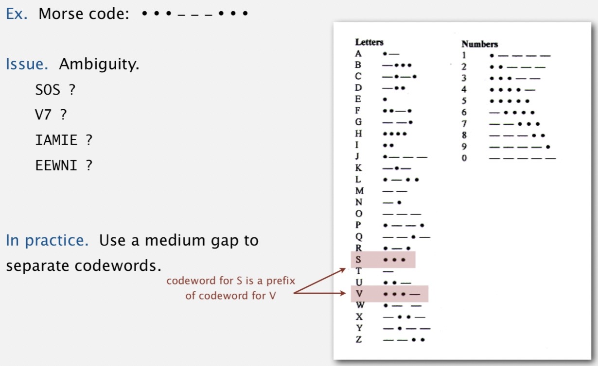

# Huffman Compression

Created: 2018-05-29 13:11:24 +0500

Modified: 2021-11-01 21:39:47 +0500

---

**Variable-length codes**

Use different number of bits to encode different chars

Que: How do we avoid ambiguity?

Ans: Ensure that no condeword is a prefix of another

Ex 1: Fixed-length code

Ex 2: Append special stop char to each codeword

Ex 3: General prefix-free code

**Prefix-free codes: trie representation**

Que: How to represent the prefix-free code?

Ans: A binary trie
-   Chars in leaves
-   Codeword is path from root to leaf

**Compression**
-   Method 1: start at leaf; follow path up to the root; print bits in reverse
-   Method 2: create ST of key-value pairs

**Expansion**
-   Start at root
-   Go left if bit is 0; go right if 1
-   If leaf node, print char and return to root

**Huffman trie node data type**

![pri vate static class Node impl ements Comparable<Node> private final char ch; // used only for leaf nodes private final int freq; // used only for compress private final Node left, right; public Node(char ch, int freq, Node left, Node right) thi s. freq this. left this. right this. ch = ch; = freq; = left; = right; public bool ean isLeaf() { return 1 eft null && right public int compareTo(Node that) { return this. freq - that. freq; null; initializing constructor is Node a leaf? compare Nodes by frequency (stay tuned) ](media/Huffman-Compression-image4.jpg)

**Prefix-free codes: expansion**

Running time: Linear in input size N

**How to transmit**

Que: How to write the trie?

Ans: Write preorder traversal of trie; mark leaf and internal nodes with a bit

Note: If message is long, overhead of transmitting trie is small

Que: How to read in the trie?

Ans: Reconstruct from preorder traversal of trie

**Shannon-Fano codes**

Que: How to find best prefix-free code?

Shannon-Fano algorithm:
-   Partition symbols S into two subsets S~0~ and S~1~ of (roughly) equal freq
-   Codewords for symbols in S~0~ start with 0; for symbols in S~1~ start with 1
-   Recur in S~0~ and S~1~.

Problem 1: How to divide up symbols?

Problem 2: Not optimal

**Huffman codes**

Que: How to find best prefix-free code?

Huffman algorithm:
-   Count frequency freq[i] for each char i in input
-   Start with one node corresponding to each char i (with weight freq[i])
-   Repeat until single trie formed:
    -   Select two tries with min weight freq[i] and freq[j]
    -   merge into single trie with weight freq[i] + freq[j]

**Constructing a Huffman encoding trie: Java implementation**

![private static Node for (char i = 0; buildTrie(int[] freq) Mi pq = new Mi ; if (freq[i] > 0) pq.insert(new Node(i, freq [i] , null, null)); while (pq.size() > 1) Node x = pq.de1Min(); Node y = pq.de1Min(); Node parent = new Node('0' , pq. insert (parent) ; initialize PQ with singleton tries merge two smallest tries x. freq + y. freq, x, return pq.de1Min() ; not used for internal nodes total frequency two subtries ](media/Huffman-Compression-image10.jpg)

**Huffman encoding summary**

Proposition: Huffman algorithm produces an optimal prefix-free code

Implementation:

Pass 1: tabulate char frequencies and build trie

Pass 2: encode file by traversing frie or lookup table

Running time: Using a binary heap => N+R log R

