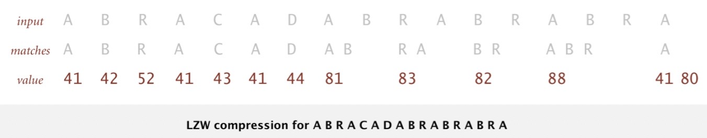
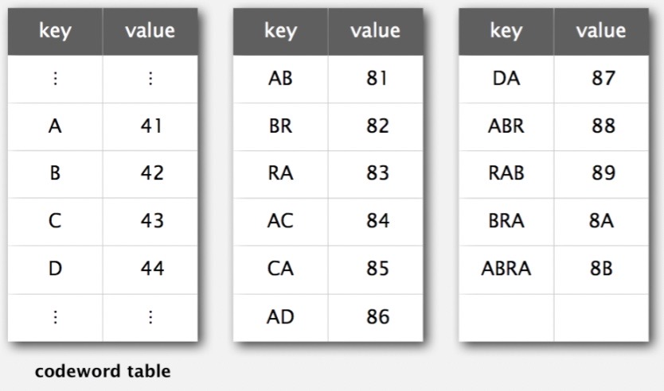
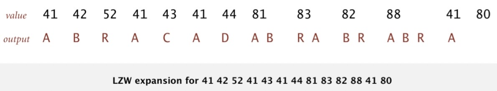
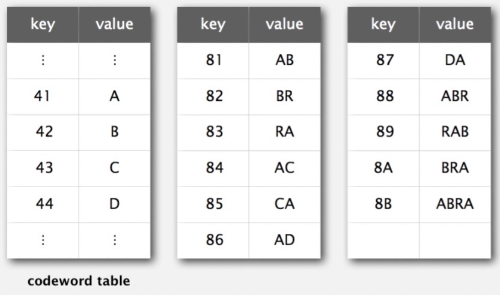
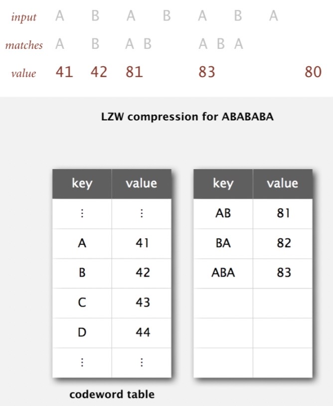
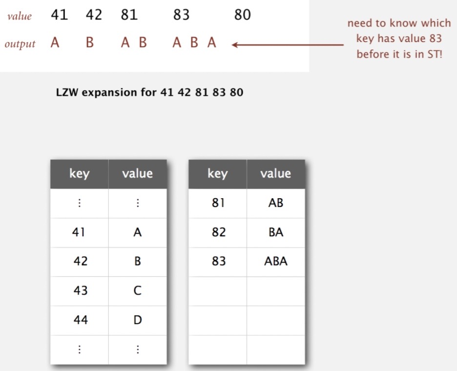

# LZW Compression

Created: 2018-05-29 13:11:47 +0500

Modified: 2021-11-01 21:54:02 +0500

---

LZF belongs to a family of compression codecs called "simple Lempel-Ziv" codecs. Since LZ compression is also the first part ofdeflatecompression (which is used, along with simple framing, forgzip), it can be viewed as "first-part of gzip" (second part being Huffman-encoding of compressed content).

-   Used in Druid

<https://github.com/ning/compress/wiki/LZFFormat>

**Properties**
-   Lossless data compression algorithms
-   Dictionary coders
-   LZ77 maintains a sliding window during compression

**LZW (Abraham Lampel, Jacob Ziv, Terry Welch)**

**Statistical Methods**

1.  **Static model:** Same model for all texts
    -   **Fast**
    -   **Not optimal: different texts have different statistical properties**
    -   **Ex: ASCII, Morse code**

2.  **Dynamic model**: Generate model based on text
    -   **Preliminary pass needed to generate model**
    -   **Must transmit the model**
    -   **Ex: Huffman code**

3.  **Adaptive model:** Progressively learn and update model as you read text
    -   **More accurate modeling produces better compression**
    -   **Decoding must start from beginning**
    -   **Ex: LZW**

**LZW compression example**

{width="6.791666666666667in" height="1.3333333333333333in"}

{width="5.0in" height="2.9479166666666665in"}

**Lempel-Ziv-Welch compression**
-   Create ST associating W-bit codewords with string keys
-   Initialize ST with codewords for single-char keys
-   Find longest string s in ST that is a prefix of unscanned part of input
-   Write the W-bit codeword associated with s
-   Ass s+c to ST, where c is next char in the input

Que: How to represent LZW compression code table?

Ans: A trie to support longest prefix match

**LZW compression: Java Implementation**

![public static void compress() String input = BinaryStdIn. readString() ; TST<Integer> st = new TST<Integer>() ; for (int --- st. put("" + (char) i, int code = R+I; while (input. length() > 0) String s = st. longestPrefixOf(input); BinaryStdOut.wri W) ; int t = s. length(); if (t < input. length() && code < L) st. put(input.substri ng(0, t+l), code++) ; i nput = input. substring(t); BinaryStdOut.write(R, W) ; Bi naryStdOut. close() ; read in input as a string codewords for single- char, radix R keys find longest prefix match s write W-bit codeword for s add new codeword scan past s in input write "stop" codeword and close input stream ](media/LZW-Compression-image3.jpeg){width="5.0in" height="3.34375in"}

**LZW expansion example**

{width="6.645833333333333in" height="1.2083333333333333in"}

{width="5.0in" height="2.9479166666666665in"}

**LZW expansion**
-   Create ST associating string values with W-bit keys
-   Initialize ST to contain single-char values
-   Read a W-bit key
-   Find associated string value in ST and write it out
-   Update ST

Que: How to represent LZW expansion code table?

Ans: An array of size 2^w^.

**LZW example: tricky case**

{width="3.7083333333333335in" height="4.53125in"}

{width="5.0in" height="4.052083333333333in"}

**LZW implementation details**
-   **How big to make ST?**
    -   How long is message?
    -   Whole message similar model?
    -   [many other variations]

-   **What to do when ST fills up?**
    -   Throw away and start over [GIF]
    -   Throw away when not effective [Unix compress]
    -   [many other variations]

-   **Why not put longer substrings in ST?**
    -   [many variations have been developed]

**LZW in the real world**
-   **LZ77**
-   **LZ78**
-   **LZW**
    -   Unix Compress, GIF, TIFF, V.42bis modem

-   **Deflate / zlib = LZ77 variant + Huffman**
    -   zip, 7zip, gzip, jar, png, pdf
    -   iPhone, Sony Playstation 3, Apache HTTP server
-   GIF (PNG)
-   LZMA
-   LZSS

<https://en.wikipedia.org/wiki/LZ77_and_LZ78>

