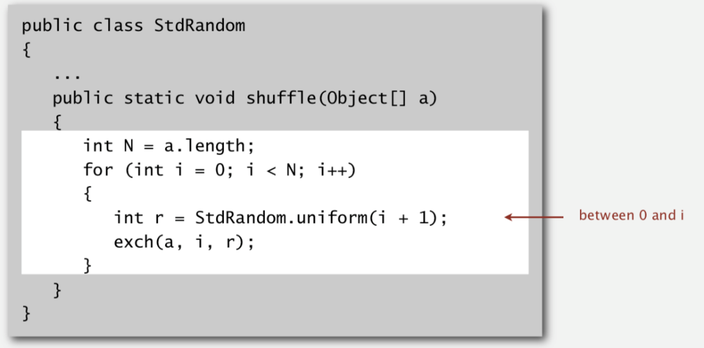

# Knuth Shuffle

Created: 2018-02-02 17:53:55 +0500

Modified: 2018-02-02 17:59:27 +0500

---

Goal: Rearrange array so that the result is a uniformly random permutation in linear time

-   In iteration i, pick integer r between 0 and i uniformly at random.
-   Swap a[i] and a[r]

