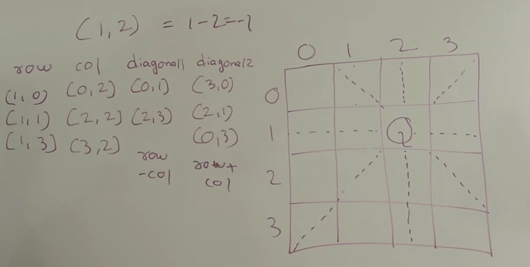
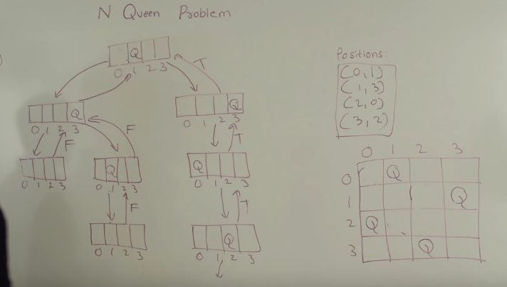
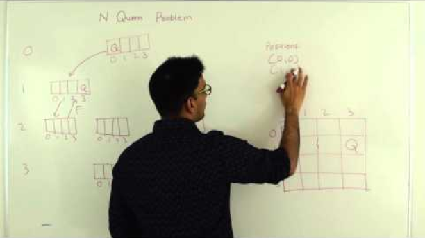

# N Queens Problem

The N Queen is the problem of placing N chess queens on an N×N chessboard so that no two queens attack each other. For example, following is a solution for 4 Queen problem.

## Question Types

- Find any placement of queens that do not attack each other
- Find all placement of queens on the board

## Naive Algorithm

Generate all possible configurations of queens on board and print a configuration that satisfies the given constraints.

while there are untried conflagrations
{
generate the next configuration
if queens don't attack in this configuration then
{
print this configuration;
}
}

## Backtracking Algorithm

The idea is to place queens one by one in different columns, starting from the leftmost column. When we place a queen in a column, we check for clashes with already placed queens. In the current column, if we find a row for which there is no clash, we mark this row and column as part of the solution. If we do not find such a row due to clashes then we backtrack and return false.

1) Start in the leftmost column
2) If all queens are placed
return true
3) Try all rows in the current column. Do following for every tried row.
a) If the queen can be placed safely in this row then mark this [row,
column] as part of the solution and recursively check if placing
queen here leads to a solution.
b) If placing queen in [row, column] leads to a solution then return
true.
c) If placing queen doesn't lead to a solution then umark this [row,
column] (Backtrack) and go to step (a) to try other rows.
3) If all rows have been tried and nothing worked, return false to trigger
backtracking.

- For a board of 4x4, recursion will be 4 level deep
- At 0th level of recursion, we will place 0th queen on 0th row
- At 1st level of recursion, we will place 1st queen on 1st row such that she does not attack the 0th queen
- At 2nd level of recursion, we will place 2nd queen on 2nd row such that she does not attack the 0th queen and 1st queen.

## Time Complexity - Exponential O(n^n / n!)

Space Complexity - n*n

## References

<https://en.wikipedia.org/wiki/Eight_queens_puzzle>

[N Queen Problem Using Backtracking Algorithm](https://www.youtube.com/watch?v=xouin83ebxE)

