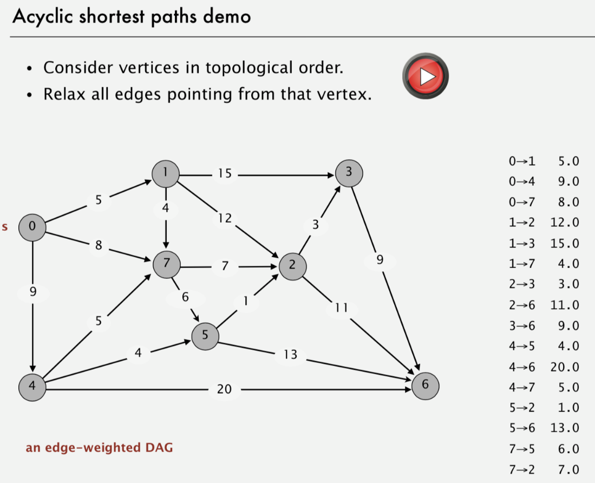

# Acyclic Edge Weighted Digraphs

Created: 2018-05-22 20:12:03 +0500

Modified: 2018-05-22 20:12:25 +0500

---

It is easier to find shortest paths in an edge-weighted digraph that has no directed cycles than general digraph.

![Acyclic shortest paths demo • Consider vertices in topological order. • Relax all edges pointing from that vertex. o 1475236 di st To C] edgeTo C] v 0.0 14.0 17.0 9.0 13.0 25.0 8.0 shortest-paths tree from vertex s ](media/Acyclic-Edge-Weighted-Digraphs-image2.png)

