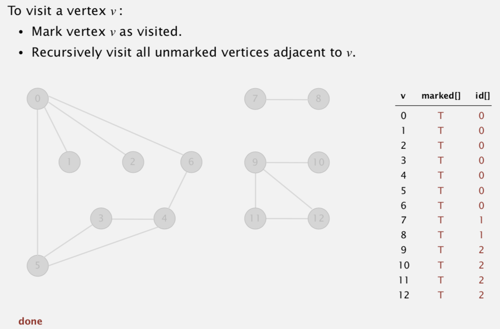

# Connected Components

Created: 2018-02-08 22:22:04 +0500

Modified: 2018-02-08 22:35:56 +0500

---

**Connected Components**

Definition: Vertices v and w are connected if there is a path between them.

Goal: Preprocess graph to answer queries of the form is v connected to w in constant time.

Union-find: Does not answer in constant time

![public class CC pri vate bool ean[] marked • private int[] id; private int count; public CC(Graph G) marked = new boolean [G.V() id = new ; for (int v = O; v < G.V(); v++) if dfs(G, v); count++ ; public int count() public int id(int v) pri vate void dfs(Graph G, id[v] = id of component containing v number of components run DFS from one vertex in each component see next slide int v) ](media/Connected-Components-image4.png)

![public int count() { return count; public int id(int v) { return i d [v] ; private void dfs(Graph G, marked[v] = true • id[v] = count; for (int w : G.adj(v)) if (!marked[w]) dfs (G, w) ; int v) number of components id of component containing v all vertices discovered in same call of dfs have same id ](media/Connected-Components-image5.png)

**Union-Find vs DFS**

The union-find algorithm is best suited for situations where the equivalence relationship is changing, i.e., there are "Union" operations which need to be performed on your set of partitions. Given a fixed undirected graph, you don't have the equivalence relationships changing at all - the edges are all fixed. OTOH, if you have a graph with new edges being added, DFS won't cut it. While DFS is asymptotically faster than union-find, in practice, the likely deciding factor would be the actual problem that you are trying to solve.

**Static graph - DFS**

**Dynamic graph - Union-find**

