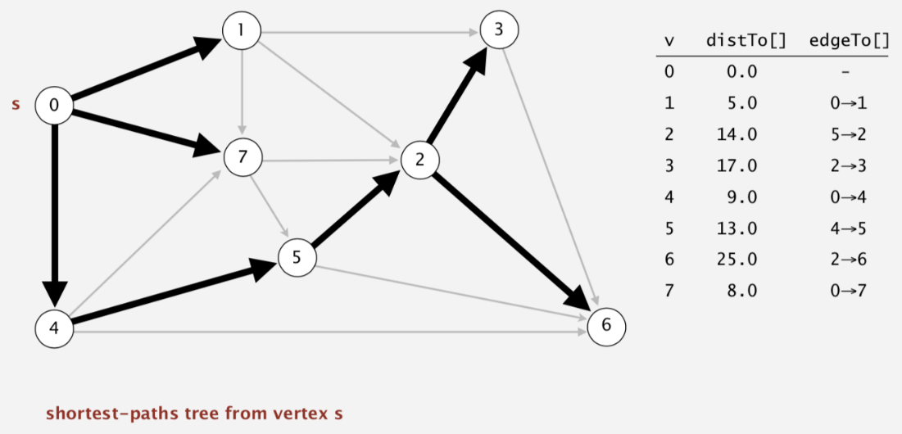

# Dijkstra's Algorithm

Created: 2018-03-11 13:53:49 +0500

Modified: 2019-12-12 00:07:19 +0500

---

**Properties**
-   For directed graphs
-   Single source vertex to all other vertex
-   Non-negative weights
-   Time complexity O(V^2) using adjacency matrix representation
-   Time Complexity O(E log V) using binary heap and adjacency list representation (it takes O(log n) for decrease key operation)
-   Time Complexity O(E + V log V) using Fibonacci heap (it takes O(1) for decrease key operation)
-   Doesn't work for graph with negative weight edges

Dijkstra's algorithm is very similar to[Prim's algorithm for minimum spanning tree](https://www.geeksforgeeks.org/archives/27455). Like Prim's MST, we generate a*SPT (shortest path tree)*with given source as root. We maintain two sets, one set contains vertices included in shortest path tree, other set includes vertices not yet included in shortest path tree. At every step of the algorithm, we find a vertex which is in the other set (set of not yet included) and has minimum distance from source.

![Diikstra's algorithm demo • Consider vertices in increasing order of distance from s (non-tree vertex with the lowest distToC] value). • Add vertex to tree and relax all edges pointing from that vertex. 5.0 9.0 12 12.0 15.0 4.0 3.0 11.0 9.0 4.0 13 20.0 20 5.0 1.0 13.0 an edge-weighted digraph 6.0 7.0 ](media/Dijkstra's-Algorithm-image1.png)

![Diikstra's algorithm: correctness proof Proposition. Dijkstra's algorithm computes a SPT in any edge-weighted digraph with nonnegative weights. • Each edge e = is relaxed exactly once (when v is relaxed), leaving dist To [w] s dist To [v] + e. weight(). • Inequality holds until algorithm terminates because: di stTo [w] cannot increase di stTo[] values are monotone decreasing distToCv] will not change we choose lowest di st To [ ] value at each step (and edge weights are nonnegative) • Thus, upon termination, shortest-paths optimality conditions hold. ](media/Dijkstra's-Algorithm-image3.png)

![public class Di jkstraSP private Di rectedEdge[] edgeTo; private double[] distTo; private IndexMinPQ<Doub1e> pq; public Di jkstraSP(EdgeWeightedDigraph G, edgeTo = new Di ; distTo = new = new IndexMinPQ<Doub1e>(G.V()); pq for (int v = 0; v < G.V(); v++) int s) distTo[v] = Double. POSITIVE_INFINITY; di stTo[s] = 0.0; pq.insert(s, 0.0); while (!pq.isEmpty()) int v = pq.de1Min(); for (Di rectedEdge e . rel ax(e) ; relax vertices in order of distance from s G. adj (v)) ](media/Dijkstra's-Algorithm-image4.png)

![private void relax(Di rectedEdge e) int v = e. from(), w = e.to(); if (di st To [w] > di stTo[v] + e.weight()) distTo[w] = di stTo[v] + e.weight() ; edgeTo [w] = e; if (pq . contains (w)) pq.decreaseKey(w, di st To ; di st To ; update PQ else pq. insert ](media/Dijkstra's-Algorithm-image5.png)

![Diikstra's algorithm: which priority queue? Depends on PQ implementation: V insert, V delete-min, E decrease-key. PQ implementation unordered array binary heap d-way heap (Johnson 1975) Fibonacci heap (Fredman-Tarjan 1984) Bottom line. insert log V logd V delete-min decrease-key log V d logd V log V t log V logd V total E log V E loguv V E+V log v t amortized • Array implementation optimal for dense graphs. • Binary heap much faster for sparse graphs. 4-way heap worth the trouble in performance-critical situations. • Fibonacci heap best in theory, but not worth implementing. ](media/Dijkstra's-Algorithm-image6.png)

1.  Lazy version

2.  Eager version

**Why use Dijkstra's Algorithm if Breadth First Search (BFS) can do the same thing faster?**

Dijkstra allows assigning distances other than 1 for each step. For example, in routing the distances (or weights) could be assigned by speed, cost, preference, etc. The algorithm then gives you the shortest path from your source to every node in the traversed graph.

Meanwhile BFS basically just expands the search by one "step" (link, edge, whatever you want to call it in your application) on every iteration, which happens to have the effect of finding the smallestnumber of stepsit takes to get to any given node from your source ("root").

<https://stackoverflow.com/questions/3818079/why-use-dijkstras-algorithm-if-breadth-first-search-bfs-can-do-the-same-thing>

<https://deployeveryday.com/2019/10/16/dijkstra-algorithm-golang.html>

<https://medium.com/cantors-paradise/dijkstras-shortest-path-algorithm-in-python-d955744c7064>

<https://medium.com/basecs/finding-the-shortest-path-with-a-little-help-from-dijkstra-613149fbdc8e>

