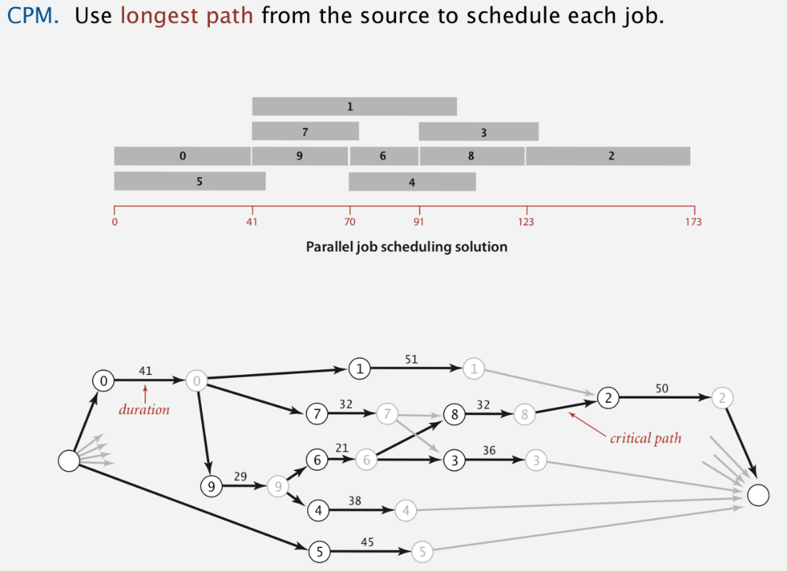

# Longest Path in Edge-Weighted DAGs

Created: 2018-03-13 08:34:39 +0500

Modified: 2018-03-13 08:41:24 +0500

---

![Longest paths in edge-weighted DAGs Formulate as a shortest paths problem in edge-weighted DAGs. 0.35 -0.35 4->7 . 37 4->7 37 5->7 0.28 5->7 -0.28 0.32 -0.32 0.38 -0.38 0.26 -0.26 3->7 0.39 3->7 -0.39 1->3 0.29 1->3 -0.29 7->2 0.34 7->2 -0.34 0. 40 6->2 -0 .40 0.52 -0.52 0.58 -0.58 0.93 -0.93 Negate all weights. • Find shortest paths. Negate weights in result. equivalent: reverse sense of equality in rel ax() longest paths input 5 5->1 3 6 shortest paths input 5 5->1 3 6 s 1 5 7 4 3 6 Key point. Topological sort algorithm works even with negative weights. ](media/Longest-Path-in-Edge-Weighted-DAGs-image1.png)

![Critical path method CPM. To solve a parallel job-scheduling problem, create edge-weighted DAG: 51.0 50.0 36.0 38.0 45.0 21.0 32.0 32.0 29.0 • Source and sink vertices. • Two vertices (begin and end) for each job. • Three edges for each job. begin to end (weighted by duration) --- source to begin (0 weight) end to sink (0 weight) • One edge for each precedence constraint (0 weight). job duration 41.0 must complete before 179 job start 41 duration job finish zero-weigh 1 edge 10 each 101' start 29 51 32 21 38 45 32 36 precedence constraint (zero weight) 50 zero-weigh 1 rolli each jo '_/inish ](media/Longest-Path-in-Edge-Weighted-DAGs-image3.png)

