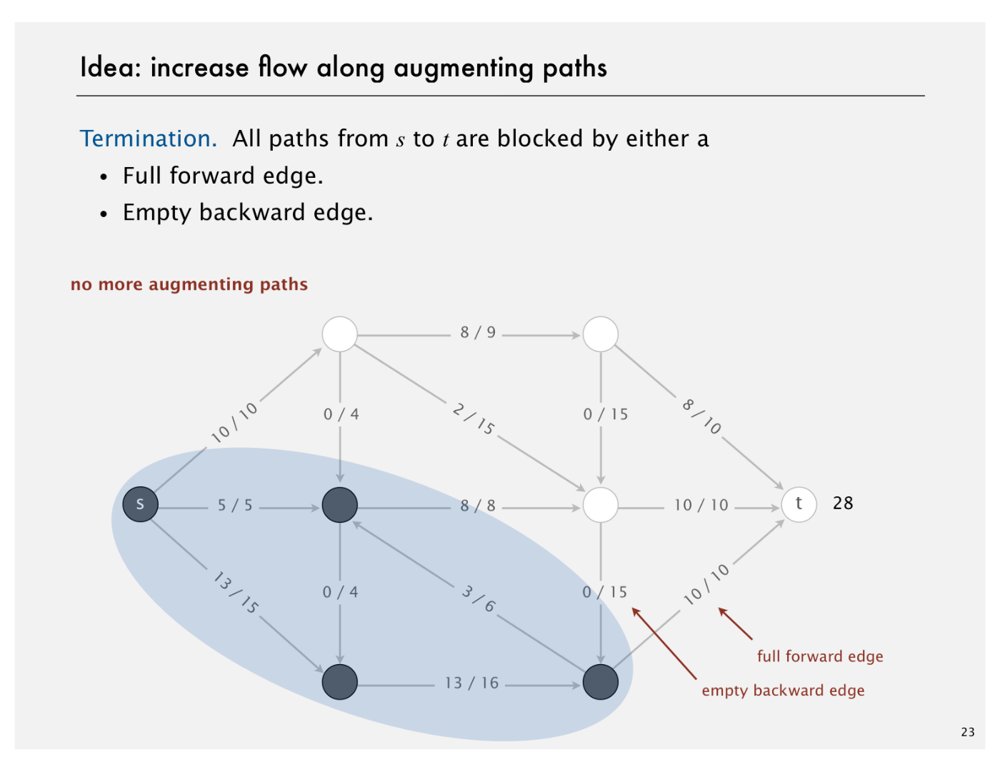
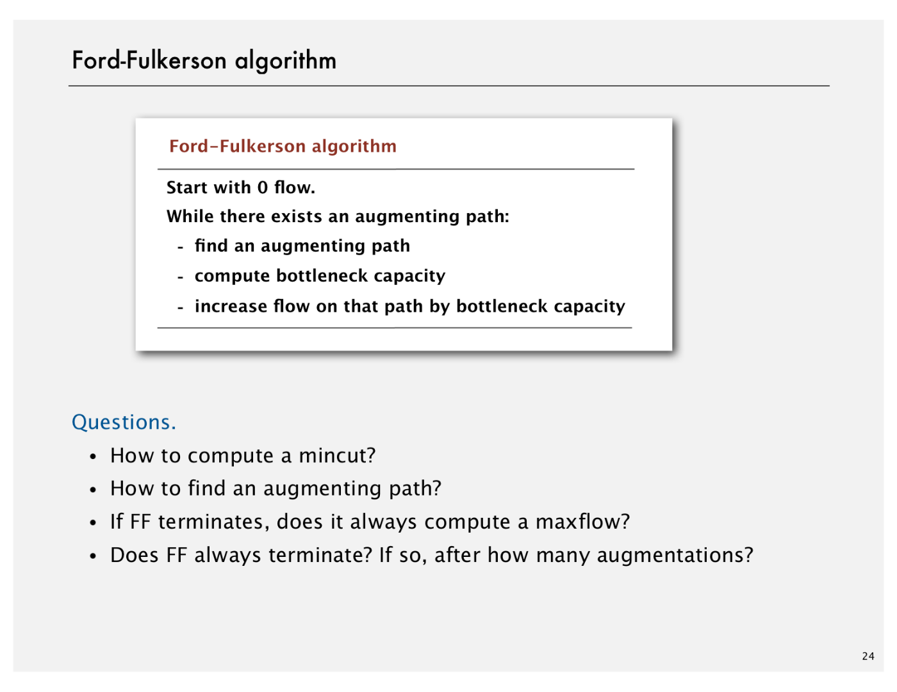
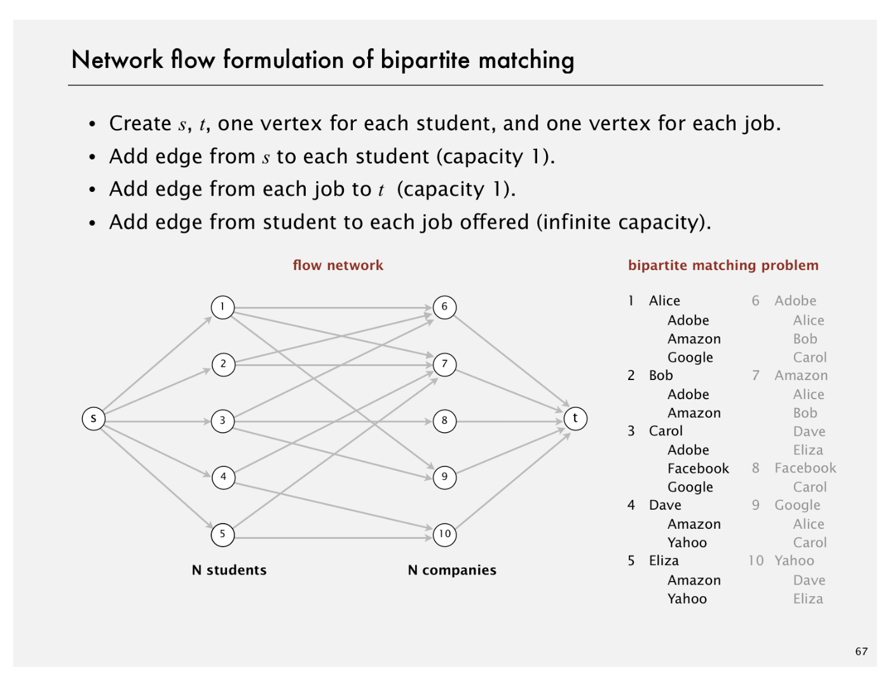
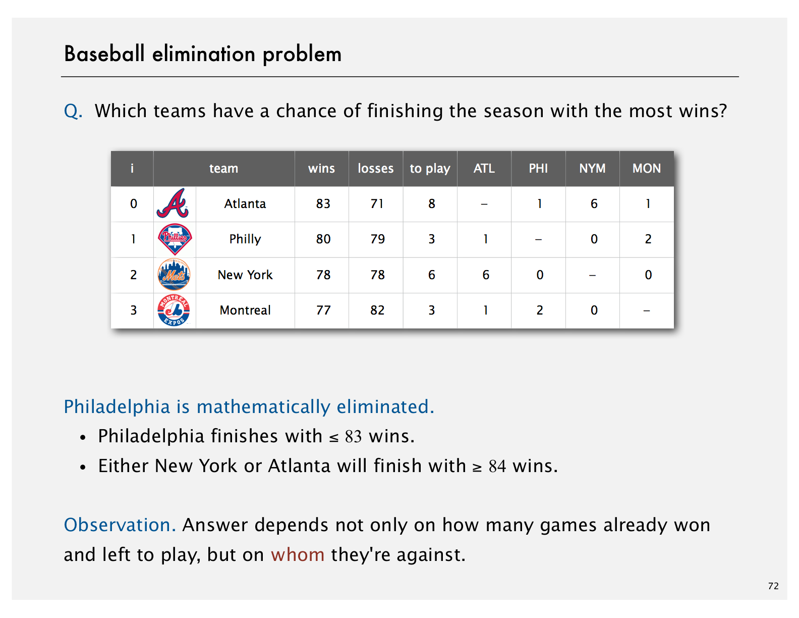

# Maximum Flow and Minimum Cut

1. Introduction to Maxflow

2. Ford-Fulkerson Algorithm using the shortest augmenting path rule

3. Maxflow-Mincut Theorem (bipartite matching & baseball elimination)

4. Running Time Analysis

5. Java Implementation

6. Maxflow Applications

## Mincut problem

Input: An edge-weighted digraph, source vertex s, and target vertext t

Def. A st-cut (cut) is a partition of the vertices into two disjoint sets, with s in one set A and t in the other set B

Def. Its capacity is the sum of the capacities of the edges from A to B

## Maxflow problem

Input: An edge-weighted digraph, source vertex s, and target vertext t

Def. An st-flow (flow) is an assignment of values to the edges such that:

- Capacity constraint: 0 <= edge's flow <= edge's capacity
- Local equilibrium: inflow = outflow at every vertex (except s and t)

Def. The value of a flow is the inflow at t. (We assume no edge points to s from t)

Maximum st-flow (maxflow) problem. Find a flow of maximum value

## Summary

Input: A weighted digraph, source vertex s, and target vertext t

Mincut problem: Find a cut of minimum capacity

Maxflow problem: Find a flow of maximum value

Fact: These two problems are dual

## Create a Residual Graph for finding Augmenting Paths

The maximum amount of flow that we can push through the network does go through the path and find the minimum of either the unused capacity in some forward edge or the available flow in some backward edge. So once we have the bottleneck capacity, then we just go back through the path again and addResidualFlow to every edge in that path.

## Summary

Mincut problem: Find. an st-cut of minimum capacity

Maxflow problem: Find an st-flow of maximum value

Duality: Value of the maxflow = capacity of mincut

Proven successful approaches

- Ford-Fulkerson (various augmenting-path strategies)
- Preflow-push (various versions)

Open research challenges

- Practice: solve real-world maxflow/mincut problems in linear time
- Theory: prove it for worst-case inputs
