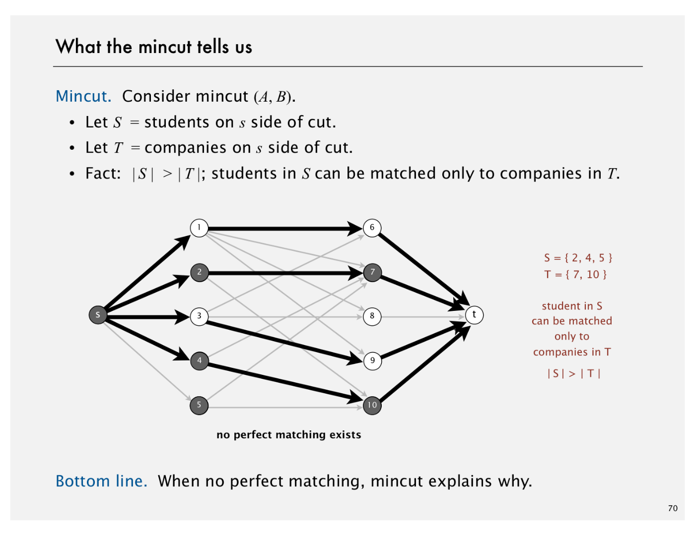

# Maximum Flow and Minimum Cut

Created: 2018-03-20 22:07:52 +0500

Modified: 2021-06-16 19:48:11 +0500

---

1.  Introduction to Maxflow

2.  Ford-Fulkerson Algorithm using the shortest augmenting path rule

3.  Maxflow-Mincut Theorem (bipartite matching & baseball elimination)

4.  Running Time Analysis

5.  Java Implementation

6.  Maxflow Applications

**Mincut problem**

Input: An edge-weighted digraph, source vertex s, and target vertext t

{width="3.4583333333333335in" height="2.3541666666666665in"}

Def. A st-cut (cut) is a partition of the vertices into two disjoint sets, with s in one set A and t in the other set B

Def. Its capacity is the sum of the capacities of the edges from A to B

{width="5.0in" height="2.3645833333333335in"}

{width="5.604166666666667in" height="1.90625in"}

{width="5.604166666666667in" height="2.8854166666666665in"}

**Maxflow problem**

Input: An edge-weighted digraph, source vertex s, and target vertext t

{width="3.53125in" height="2.5833333333333335in"}

Def. An st-flow (flow) is an assignment of values to the edges such that:
-   Capacity constraint: 0 <= edge's flow <= edge's capacity
-   Local equilibrium: inflow = outflow at every vertex (except s and t)

{width="5.0in" height="2.7083333333333335in"}

Def. The value of a flow is the inflow at t. (We assume no edge points to s from t)

{width="5.0in" height="2.0104166666666665in"}

Maximum st-flow (maxflow) problem. Find a flow of maximum value

{width="5.0in" height="2.0104166666666665in"}

**Summary**

Input: A weighted digraph, source vertex s, and target vertext t

Mincut problem: Find a cut of minimum capacity

Maxflow problem: Find a flow of maximum value

{width="5.0in" height="1.7291666666666667in"}

Fact: These two problems are dual

{width="5.0in" height="2.2604166666666665in"}

{width="6.354166666666667in" height="4.90625in"}

{width="6.354166666666667in" height="4.90625in"}

{width="6.354166666666667in" height="4.90625in"}

{width="6.354166666666667in" height="4.90625in"}

{width="6.354166666666667in" height="4.90625in"}

{width="6.354166666666667in" height="4.90625in"}

{width="6.354166666666667in" height="4.90625in"}

{width="6.354166666666667in" height="4.90625in"}

{width="6.354166666666667in" height="4.90625in"}

{width="6.354166666666667in" height="4.90625in"}

{width="6.354166666666667in" height="4.90625in"}

{width="6.354166666666667in" height="4.90625in"}

![Maxfiow-mincut theorem Augmenting path theorem. A flow fis a maxflow iff no augm Maxflow-mincut theorem. Value of the maxflow = capacity oi Pf. The following three conditions are equivalent for any flov i. There exists a cut whose capacity equals the value of the ii. f is a maxflow. iii. There is no augmenting path with respect to f. [i*ii] • Suppose that (A, B) is a cut with capacity equal to the vall • Then, the value of any flow f' capacity of (A, B) = vall • Thus, fis a maxflow. weak duality by assumptio ](media/Maximum-Flow-and-Minimum-Cut-image23.png){width="6.354166666666667in" height="4.90625in"}

![Maxfiow-mincut theorem Augmenting path theorem. A flow fis a maxflow iff no augm Maxflow-mincut theorem. Value of the maxflow = capacity oi Pf. The following three conditions are equivalent for any flov i. There exists a cut whose capacity equals the value of the ii. f is a maxflow. iii. There is no augmenting path with respect to f. [ ii iii] We prove contrapositive: • Suppose that there is an augmenting path with respect • Can improve flow f by sending flow along this path. • Thus, f is not a maxflow. ](media/Maximum-Flow-and-Minimum-Cut-image24.png){width="6.354166666666667in" height="4.90625in"}

![Maxfiow-mincut theorem Augmenting path theorem. A flow fis a maxflow iff no augm Maxflow-mincut theorem. Value of the maxflow = capacity oi Pf. The following three conditions are equivalent for any flov i. There exists a cut whose capacity equals the value of the ii. f is a maxflow. iii. There is no augmenting path with respect to f. Suppose that there is no augmenting path with respect to f. • Let (A, B) be a cut where A is the set of vertices connectec undirected path with no full forward or empty backward ](media/Maximum-Flow-and-Minimum-Cut-image25.png){width="6.354166666666667in" height="4.90625in"}

{width="6.354166666666667in" height="4.90625in"}

{width="6.354166666666667in" height="4.90625in"}

![Ford-Fulkerson algorithm with integer capacities Important special case. Edge capacities are integers betweer flow on each edge is an integer Invariant. The flow is integer-valued throughout Ford-Fulker Pf. [by induction] • Bottleneck capacity is an integer. • Flow on an edge increases/decreases by bottleneck capa Proposition. Number of augmentations the value of the rm Pf. Each augmentation increases the value by at least 1. important for some applications (stay tuned) ](media/Maximum-Flow-and-Minimum-Cut-image28.png){width="6.354166666666667in" height="4.90625in"}

{width="6.354166666666667in" height="4.90625in"}

{width="6.354166666666667in" height="4.90625in"}

{width="6.354166666666667in" height="4.90625in"}

{width="6.354166666666667in" height="4.90625in"}

{width="6.354166666666667in" height="4.90625in"}

{width="6.354166666666667in" height="4.90625in"}

{width="6.354166666666667in" height="4.90625in"}

{width="6.354166666666667in" height="4.90625in"}

{width="6.354166666666667in" height="4.90625in"}

{width="6.354166666666667in" height="4.90625in"}

{width="6.354166666666667in" height="4.90625in"}

{width="6.354166666666667in" height="4.90625in"}

{width="6.354166666666667in" height="4.90625in"}

{width="6.354166666666667in" height="4.90625in"}

{width="6.354166666666667in" height="4.90625in"}

![Flow network: Java implementation public class FlowNetwork private final int V; private adj ; public FlowNetwork(int V) this. V = V; adj --- (Bag<F10wEdge>[]) new Bag [V] ; for (int v = 0; v < V; v++) adj [v] = new ; public void addEdge(F1 owEdge e) int v = e. from(); int w = e.to(); adj [v] . add(e) ; same as but adja owEdc add forv ](media/Maximum-Flow-and-Minimum-Cut-image44.png){width="6.354166666666667in" height="4.90625in"}

![Flow network: adjacency-lists representation Maintain vertex-indexed array of FlowEdge lists (use Bag abstr 2.0 02 3.0 3.0 1.0 1.0 1.0 2.0 3.0 tinyFN . txt 6 8 o 1 1 3 1 4 2 3 2 4 3 5 4 5 adj C] 1 2 3 4 5 references to the Fl owEdge 0b Bac objei ](media/Maximum-Flow-and-Minimum-Cut-image45.png){width="6.354166666666667in" height="4.90625in"}

![Ford-Fulkerson: Java implementation public class FordFu1kerson private boolean[] marked; private FlowEdge[] edgeTo; private double value; // true if s->V path in residual n // last edge on s->V path // value of flow public FordFu1 kerson(F10wNetwork G, int s, int t) value --- 0.0; while (hasAugmenti ngPath(G, s, t)) double bottle = Double. POSITIVE_INFINITY; compul bottlen for (int v = t; v != s; v = edgeTo[v] . other(v)) bottle = Math.min(bottle, edgeTo [v] . residual Capacity T for (int v = t; v != s; v = edgeTo[v] . other(v)) edgeTo[v] .addResi dual Fl owTo(v, bottle) ; value bottle; private boolean hasAugmentingPath(F1 owNetwork G, * See next slide. int s, augmen int t) ](media/Maximum-Flow-and-Minimum-Cut-image46.png){width="6.354166666666667in" height="4.90625in"}

![Finding a shortest augmenting path (cf. breadth-first sea private bool ean hasAugmenti ngPath(F10wNetwork G, int s, int t) edgeTo = new ; marked = new boolean CG.V()]; = new Queue<lnteger>() ; Queue<lnteger> queue queue . enqueue(s) ; marked [s] = true; while (!queue.isEmpty()) int v = queue. dequeue(); for (FlowEdge e : G. adj (v)) int w = e. other(v); found path from s to v in the residual networl if (e. residual CapacityTo(w) > 0 && ! marked [w]) edgeTo [w] marked [w] = true; queue . enqueue (w) ; save last edge on path to mar k w ; add w to the queue ](media/Maximum-Flow-and-Minimum-Cut-image47.png){width="6.354166666666667in" height="4.90625in"}

**Create a Residual Graph for finding Augmenting Paths**

The maximum amount of flow that we can push through the network does go through the path and find the minimum of either the unused capacity in some forward edge or the available flow in some backward edge. So once we have the bottleneck capacity, then we just go back through the path again and addResidualFlow to every edge in that path.

{width="5.875in" height="1.9583333333333333in"}

{width="6.354166666666667in" height="4.90625in"}

{width="6.354166666666667in" height="4.90625in"}

{width="6.354166666666667in" height="4.90625in"}

{width="6.354166666666667in" height="4.90625in"}

{width="6.354166666666667in" height="4.90625in"}

{width="6.354166666666667in" height="4.90625in"}

{width="6.354166666666667in" height="4.90625in"}

![Suppose that you run the Ford-Fulkerson algorithm (using the shortest augmenting path heuristic) to solve a bipartite matching problem with n students and n companies. How many augmenting paths are needed in the worst case? n Correct For general networks, the shortest augmenting path heuristic requires EV augmenting paths to find a maxflow in a network with V vertices and E edges. However, in the bipartite matching reduction, all edge capacities are 1 and the value of the maximum flow is at most n. Thus, at most n augmenting paths are needed (since each augmenting path delivers 1 unit of flow to t). We note that a more refined version of the shortest augmenting path heuristic leads to an overall running time of EN/'V for the bipartite matching problem. 1 2 ](media/Maximum-Flow-and-Minimum-Cut-image56.png){width="6.010416666666667in" height="2.3333333333333335in"}

{width="6.354166666666667in" height="4.90625in"}

{width="6.354166666666667in" height="4.90625in"}

{width="6.354166666666667in" height="4.90625in"}

{width="6.354166666666667in" height="4.90625in"}

![How many vertices and edges, respectively, are there in the flow network that is constructed to determine whether one team is mathematically eliminated from a baseball league containing n teams? Give the orders of growth. 2 n and n 2 n and n Correct 2 games vertices, 1 source, and 1 sink. In the worst case, there are 2 ( There are n --- I team vertices, edges from game vertices to team vertices (2 for 2 each game vertex), (n 21 edges pointing from the source, and n --- I edges pointing to the sink. n n 3 and n 4 and n ](media/Maximum-Flow-and-Minimum-Cut-image61.png){width="5.96875in" height="2.3020833333333335in"}

{width="6.354166666666667in" height="4.90625in"}

![Maximum flow algorithms: practice Warning. Worst-case order-of-growth is generally not useful or comparing maxflow algorithm performance in practice. Push-relabel method with gap relabeling: E Best in practice. On Implementing Push-Relabel Method for the Maximum Flow Problem Boris V. Cherkasskyl and Andrew V. Goldberg2 Central Institute for Economics and Mathematics, Krasikova St. 32, 117418, Moscow, Russia cher@cemi.msk.su 2 Computer Science Department, Stanford University Stanford, CA 94305, USA goldberg@cs.stanford.edu ELSEVIER Eurosran Journal of OFrational Research 97 ( 19 Theory and Methodo Computational investigations of ma Ravindra K. Ahuja a, Murali Kodialam , Ajay ](media/Maximum-Flow-and-Minimum-Cut-image63.png){width="6.354166666666667in" height="4.90625in"}

**Summary**

Mincut problem: Find. an st-cut of minimum capacity

Maxflow problem: Find an st-flow of maximum value

Duality: Value of the maxflow = capacity of mincut

Proven successful approaches
-   Ford-Fulkerson (various augmenting-path strategies)
-   Preflow-push (various versions)

Open research challenges
-   Practice: solve real-world maxflow/mincut problems in linear time
-   Theory: prove it for worst-case inputs

