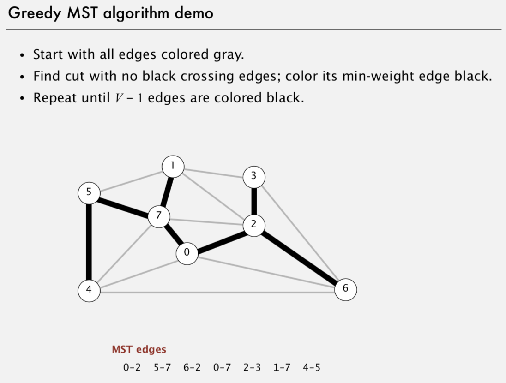

# Minimum Spanning Tree

Created: 2018-05-22 19:26:14 +0500

Modified: 2018-05-22 19:28:49 +0500

---

**Properties of MST**
-   Always have V-1 edges for a graph of V vertices

**Applications**

・Dithering.

・Cluster analysis.

・Max bottleneck paths.

・Real-time face verification.

・LDPC (Low Density Parity Check) codes for error correction.

・Image registration with Renyi entropy.

・Find road networks in satellite and aerial imagery.

・Reducing data storage in sequencing amino acids in a protein.

・Model locality of particle interactions in turbulent fluid flows.

・Autoconfig protocol for Ethernet bridging to avoid cycles in a network.

・Approximation algorithms for NP-hard problems (e.g., TSP, Steiner tree).

・Network design (communication, electrical, hydraulic, computer, road).

**Greedy Algorithm**

![Cut property: correctness proof Def. A cut in a graph is a partition of its vertices into two (nonempty) sets. Def. A crossing edge connects a vertex in one set with a vertex in the other. Cut property. Given any cut, the crossing edge of min weight is in the MST. Pf. Suppose min-weight crossing edge e is not in the MST. • Adding e to the MST creates a cycle. • Some other edge fin cycle must be a crossing edge. • Removing fand adding e is also a spanning tree. • Since weight of e is less than the weight off, that spanning tree is lower weight. • Contradiction. • the MST does not contain e adding e to MST creates a cycle ](media/Minimum-Spanning-Tree-image3.png)

**Implementations**

1.  Kruskal's Algorithm

2.  Prim's Algorithm

3.  Boruvka's Algorithm

