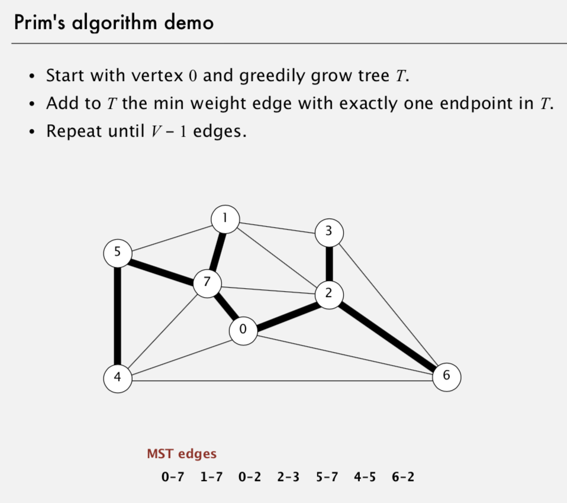

# Prim's Algorithm for MST

Created: 2018-02-22 23:39:31 +0500

Modified: 2018-05-21 22:51:16 +0500

---

**Properties**
-   For Undirected graph

**Implementation -**

1.  Lazy Implementation -

An edge that is absolute (i.e. cannot be added because it will create a cycle in the MST) is left in the priority queue.

2.  Eager Implementation -

Only min weight edge with exactly one endpoint is added

Data Structure Used - Indexed Priority Queue, with decreaseKey API to decrease priority

![Prim's algorithm: proof of correctness Proposition. [Jarnik 1930, Dijkstra 1957, Prim 1959] Prim's algorithm computes the MST. Pf. • • • • Prim's algorithm is a special case of the greedy MST algorithm. Suppose edge e = min weight edge connecting a vertex on the tree to a vertex not on the tree. Cut = set of vertices connected on tree. No crossing edge is black. No crossing edge has lower weight. edge e = 7-5 added to tree 1 3 5 7 2 4 ](media/Prim's-Algorithm-for-MST-image2.png)

![Prim's algorithm: lazy implementation public class LazyPrimMST private boolean C] marked; private Queue<Edge> mst; private Mi pq; // MST verti ces // MST edges // PQ of edges public LazyPri mMST(Wei ghtedGraph G) pq = new Mi ; mst = new Queue<Edge>() ; marked = new boolean [G.V()] ; visit(G, O); while (!pq.isEmpty() && mst.size() < G.V() - 1) Edge e = pq.de1Min(); int v = e. either(), w = e. other(v); if (marked [v] && marked [w]) conti nue; mst. enqueue(e) ; if (!marked[v]) visit(G, v); if (!marked[w]) visit(G, w); assume C is connected repeatedly delete the min weight edge e = from PQ ignore if both endpoints in T add edge e to tree add v or w to tree ](media/Prim's-Algorithm-for-MST-image4.png)

![private void vi si t(Wei ghtedGraph marked [v] = true; for (Edge e : G. adj (v)) if pq. insert(e) ; public mst() { return mst; G, int v) add v to T for each edge e = v---w, add to PQ if w not already in T ](media/Prim's-Algorithm-for-MST-image5.png)

![Indexed priority qt.JeUe Associate an index between 0 and N- I with each key in a priority queue. • Client can insert and delete-the-minimum. • Client can change the key by specifying the index. public class voi d voi d boolean int boolean int IndexMi nPQ<Key extends IndexMi nPQ(int N) insert(int i , Key key) decreaseKey(int i , Key contai ns(int i) del Mi n ( ) i sEmpty() si ze ( ) Comparabl key) create indexed priority queue with indices O, l, ..., N-l associate key with index i decrease the key associated with index i is i an index on the priority queue? remove a minimal key and return its associated index is the priority queue empty? number of entries in the priority queue ](media/Prim's-Algorithm-for-MST-image8.png)

![Indexed priority qveve implementation Implementation. • Start with same code as MinPQ. • Maintain parallel arrays keys[], pq[], and qp[] so that: keys[i] is the priority of i --- pq[i] is the index of the key in heap position i qp[i] is the heap position of the key with index i • Use implement decreaseKey(i , key) • keys [i pq [i] qp [i] o A 1 1 s O 5 2 o 4 3 7 8 1 4 T 2 7 6 5 1 1 6 6 5 7 4 3 8 3 3 1 ](media/Prim's-Algorithm-for-MST-image9.png)

![Prim's algorithm: running time Depends on PQ implementation: V insert, V delete-min, E decrease-key. PQ im plementation array binary heap d---way heap (Johnson 1975) Fibonacci heap (Fredman---Tarjan 1984) Bottom line. insert log V logd V delete-min decrease-key log V d logd V log Vt log V logd V total E log V E logE/V V E+Vlog V t amortized • Array implementation optimal for dense graphs. • Binary heap much faster for sparse graphs. • 4-way heap worth the trouble in performance-critical situations. • Fibonacci heap best in theory, but not worth implementing. ](media/Prim's-Algorithm-for-MST-image10.png)

**Applications -**

1.  Euclidean MST

2.  Clustering (single-link clustering algorithm)

3.  Dendograms of cancers in humans

