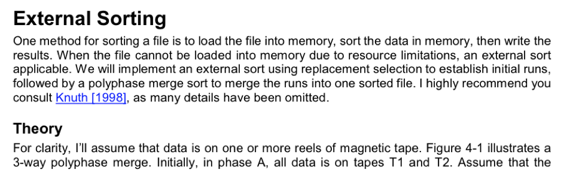
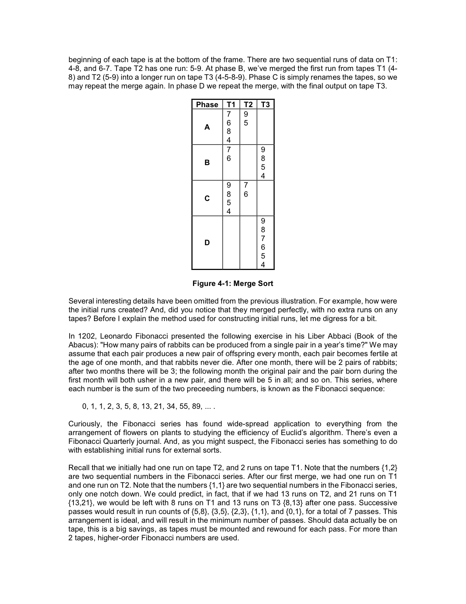

# External Sort

---

## Unix External Sort

Unix Sort uses an External R-Way merge sorting algorithm. It divides the input up into smaller portions (that fit into memory) and then merges each portion together at the end.
