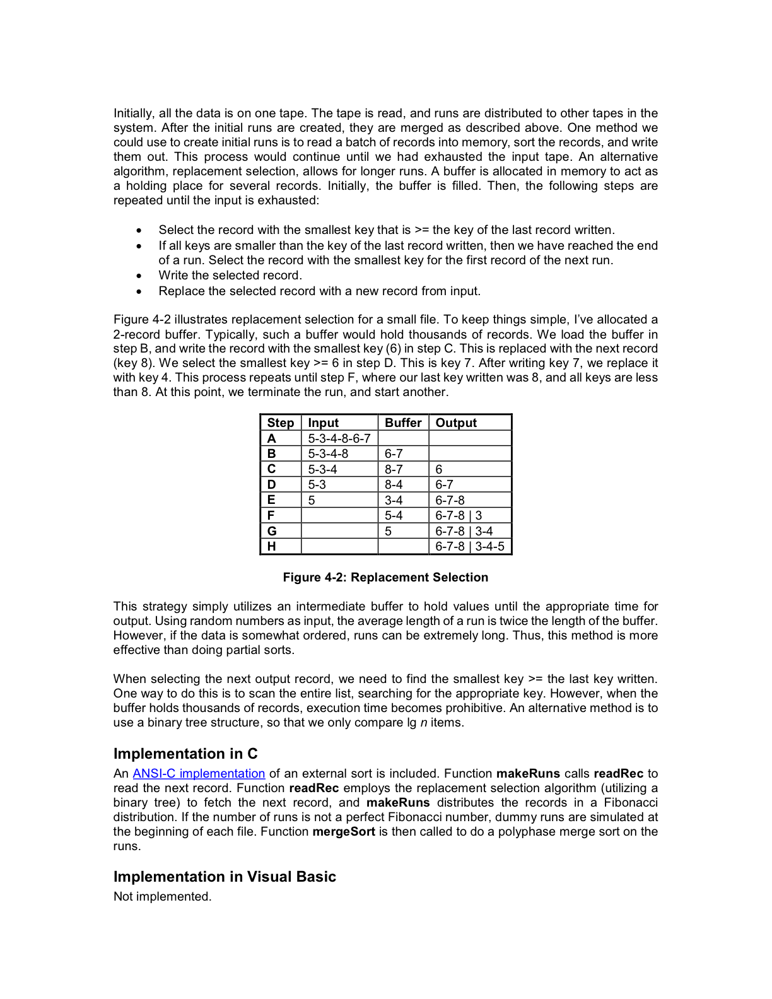

# External Sort

Created: 2018-03-24 13:50:26 +0500

Modified: 2018-09-27 12:48:52 +0500

---

## Unix External Sort

Unix Sort uses an External R-Way merge sorting algorithm. It divides the input up into smaller portions (that fit into memory) and then merges each portion together at the end.

