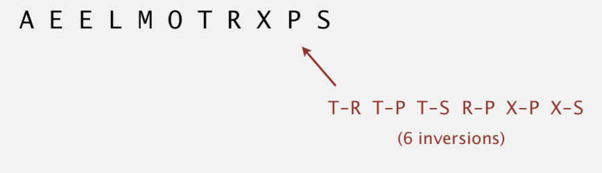

# Insertion Sort

Created: 2018-02-02 10:00:56 +0500

Modified: 2020-06-18 10:48:30 +0500

---

Insertion sorttakes elements of the array sequentially, and maintains a sorted subarray to the left of the current point. It does this by taking an element, finding its correct position in the sorted array, and shifting all following elements by 1, leaving a space for the element to be inserted.

Stability - Yes

-   In iteration i, swap a[i] with each element to its left

![public class Insertion public static void a) int N = a. length; for (int i = for (int j = i, if a[j-l])) exch(a, j, j-l); else break; private static boolean less (Comparable v, Comparable w) / * as before * / private static void / * as before * / a, int i, int j) ](media/Insertion-Sort-image1.png){width="5.0in" height="3.6145833333333335in"}

Proposition - To sort a randomly ordered array with distinct keys, insertion sort uses ~ 1/4 N^2^ compares and ~1/4 N^2^ exchanges on average

Best Case - if the array is in ascending order, insertion sort makes N-1 compares and 0 exchanges

Worst case - If the array is in descending order (and no duplicates), insertion sort makes ~ 1/2 N^2^ compares and ~1/2 N^2^ exchanges

**Inversion -** An inversion is a pair of keys that are out of order

{width="5.0in" height="1.4375in"}

Def. An array is partially sorted if the number of inversions is <= c N.
-   Ex 1. A subarray of size 10 appended to a sorted subarray of size N
-   Ex 2. An array of size N with only 10 entries out of place

Proposition. For partially-sorted arrays, insertion sort runs in linear time.

Pf. Number of exchanges equals the number of inversions.

![Sorting Insertion Sort One Of the Simplest methods to ScYt an array is an insertion Sort An example Of an Insertion Sort occurs in everyday life while playing cards, To sort the cards in your hand you extract a card. shift remaining cards. then insert the extracted Card the correct place. This until cards are the Both average and Mrst-case time ig O(nZ) For hrther consult Theory Stuting near the top Of array in Figure 2-l(a). we extract the 3. Then the are shittff_i dcm•n until we find the correct place to insert the 3, This process repeats in Figure 2-11b) "Sth the next rwmber_ Fülally. 2-I(C), we COnWete the Sort by ngerting 2 the (a) Figure 2-1: Insertion Sort Assuming there are n elements in the array. we must index through n • I entries. For each entry, we may to examine and Shift up to n - Other entries. resulting a algwithm The insertion sort is an in-place sort. That is. we son the array in•place. No extra memory is required. The insertion Sort is also a Stable Sort. Stable Sorts the ordering Of keys keys are present in the input data. Implementation in C An ANSI-C for is Included Type&f T and Ctmparigon operator compGT shouJd be altered reflect the data stored in the table, Implementation in Visual Basic A Visual Basic implementation for is included. ](media/Insertion-Sort-image3.png){width="6.375in" height="8.239583333333334in"}

